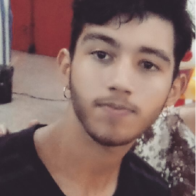

# Termo de Abertura do Projeto

## Histórico de versão

|   Data    | Versão | Descrição            | Autor(es)  |
|   :-:     |  :-:   |  :-:                 |  :-:       |
| 12/09/2020|  0.1   | Criação do Documento | [Rafael Makaha](https://github.com/rafaelmakaha) |
| 15/09/2020 | 1.0 | Término da primeira versão do documento | [João Vítor](https://github.com/joaovitorml) e [Rafael Makaha](https://github.com/rafaelmakaha)

## Sumário

[1. Introdução](#1-introdução)

[2. Descrição do Projeto](#2-descrição-do-projeto)

[3. Propósito e justificativa do projeto](#3-propósito-e-justificativa-do-projeto) 

[4. Objetivos do projeto](#4-objetivos-do-projeto) 

[5. Requisitos de alto nível](#5-requisitos-de-alto-nível)

[6. Resumo do cronograma de marcos](#6-resumo-do-cronograma-de-marcos)

[7. Resumo do orçamento](#7-resumo-do-orçamento) 

[8. Partes interessadas](#8-lista-das-partes-interessadas)

[9. Requisitos para aprovação do projeto](#9-requisitos-para-a-aprovação-do-projeto)

[10. Gerência do projeto](#10-gerência-do-projeto)

[11. Referências](#11-referências-do-projeto)

## 1. Introdução

Este documento tem como objetivo concretizar e acordar o desenvolvimento e gestão do projeto <nome_do_projeto> e definir as relações entre os stakeholders, bem como definir os marcos, orçamento e escopo do projeto.

## 2. Descrição do Projeto

O projeto consiste na criação de uma aplicação que possibilite o scanneamento de plantas, criação de comunidades, criação de tópicos em fóruns de discussão, criação de plantas favoritas, entre outros.

## 3. Propósito e Justificativa do Projeto

O <nome_do_projeto> se dá pelo objetivo de unificar e facilitar a troca de conhecimentos entre os cultivadores de plantas ao redor do mundo.

Alguns dos principais problemas atuais dos cultivadores de plantas é de identificação da planta que possui em casa, ou seja, há o cultivo da mesma, mas sem mais informações específicas a respeito desta espécime.

Outro problema muito comum é a falta de colaboração entre estes cultivadores, pois não existem atualmente muitos locais de troca de informação com essa temática.

O aplicativo do <nome_do_projeto> virá para sanar esses problemas recorrentes.

## 4. Objetivos do Projeto

O objetivo da aplicação é melhorar a integração da sociedade com uma área carente de um meio onde é possível a troca de ideias e informações, que é a botânica.

## 5. Requisitos de Alto Nível

* O design será simples e a aplicação será de fácil uso;
* Os  usuários poderão scannear as plantas que encontrarem para descobrir informações obre a mesma;
* Os usuários poderão postar tópicos nos fóruns das plantas;
* Os usuários poderão criar e entrar em comunidades;

## 6. Resumo do Cronograma de Marcos

Os principais marcos do projeto serão 2 Releases, sendo a primeira a entrega da documentação de gestão e da aplicação e a segunda entrega a aplicação finalizada em sua versão 1.0 na play store.

| Marco     | Data       |
|-----------|------------|
| Release 1 | 08/10/2020 |
| Release 2 | 10/12/2020 |

## 7. Resumo do Orçamento

Calculamos o tempo total do projeto com 16 semanas e é estimado que cada um dos 10 integrantes do grupo trabalhará por pelo  menos 10 horas semanais no projeto.

Os recursos físicos necessários para o desenvolvimento do projeto é que cada um dos envolvidos com o projeto tenha seu próprio notebook, a equipe de desenvolvimento necessita de máquinas que sejam capazes de suportar o seu ambiente de desenvolvimento com pelo menos os requisitos mínimos para desenvolver aplicativos na plataforma Android, os gestores também necessitam de notebooks compatíveis com suas responsabilidades. Dadas as necessidades dos notebooks um preço médio foi levantado de R$ 2.500,00.

| **Descrição**           | **Unidade de Medida** | **Quantidade** | **Custo Unitário (R$)** | **Subtotal**     |
|-------------------------|-----------------------|----------------|-------------------------|------------------|
| Computador/Notebook     | Unidade               | 10             | R$ 2.500,00             | R$ 25.000,00     |
| Dispositivo móvel       | Unidade               | 10             | R$ 1.000,00             | R$ 10.000,00     |
| Internet 25 Mbps        | Mês                   | 4              | R$ 190,00               | R$ 760,00        |
| Hospedagem de Aplicação | Mês                   | 12             | R$ 38,00                | R$ 456,00        |
| Membro da Equipe        | Pessoa                | 10             | R$ 3.200,00             | R$ 32.000,00     |
| **Total de Aquisição**  |                       |                |                         | **R$ 68.216,00** |
| **Reserva (15%)**       |                       |                |                         | **R$ 10.232,40**     |
| **Total**               |                       |                |                         | **R$ 78.448,40** |

## 8. Lista das Partes Interessadas

* Estusiastas da botânica e/ou da agronomia.
* Equipe de Gerência de Projetos e Portfólios de Software.
* A equipe de Engenharia de Produto de Software (EPS) é composta por alunos da disciplina de mesmo nome da Universidade de Brasília campus gama, responsáveis pela gerência do projeto.
* Equipe de Desenvolvimento de Software.
* A equipe de desenvolvimento de software é composta pelos alunos da disciplina Métodos de Desenvolvimento de Software da Universidade de Brasília campus Gama.

| Foto | Nome | Email | GitHub |
|:----:|:------------------------:|:-----:|:------:|
|  | Arthur Manuel Florêncio Sena | senaarth@gmail.com | [senaarth](https://github.com/senaarth) |
|  | Marcos Felipe de Almeida Souza | marofelipe@live.com | [Marofelipe](https://github.com/Marofelipe) |
|  | Marcos Gabriel Tavares | marcosgabriel.ro@hotmail.com | [marcosgtavares](https://github.com/marcosgtavares) |
|  | Antonio Ruan Moura Barreto | ruanmoura13@outlook.com | [RuanMoura](https://github.com/RuanMoura) |
|  | Victor Hugo Siqueira Costa | vitao.hugo@hotmail.com | [V100K](https://github.com/V100K) |
|  | Victor Samuel dos Santos Lucas  | victor.samuelsantoss@gmail.com | [victordsantoss](https://github.com/victordsantoss) |
|  | Vinícius Vieira de Souza | vd.souza1999@gmail.com | [faco400](https://github.com/faco400) |

## 9. Requisitos para a aprovação do projeto
Para aprovação do projeto todos os requisitos levantados devem ser finalizados de acordo com os critérios de aceitação e mostrado a versão final da aplicação para validação final com o Product Owner ([Guilherme de Lyra](https://github.com/guilhermedelyra)).

## 10. Gerência do projeto

O projeto será gerido pela equipe de Engenharia de Produto de Software, disciplina do curso de Engenharia de Software da Faculdade UnB do Gama (FGA), os integrantes da equipe são:

| Foto | Nome | Email | GitHub |
|:----:|:------------------------:|:-----:|:------:|
|  | Rafael Makaha | rafael.makaha@gmail.com | [rafaelmakaha](https://github.com/rafaelmakaha) |
|  | João Vitor Morandi | joao.lemos4000@gmail.com | [joaovitorml](https://github.com/joaovitorml) |
|  | Guilherme de Lyra | joao.lemos4000@gmail.com | [guilhermedelyra](https://github.com/guilhermedelyra) |

## 11. Referências do Projeto

> PMI. Um guia do conhecimento em gerenciamento de projetos. Guia PMBOK 5a. ed. - EUA: Project Management Institute, 2013.

> Relatório de Gestão 2016, Universidade de Brasília. Disponível em [DPO UnB](http://www.dpo.unb.br/index.php?option=com_phocadownload&view=category&download=558:relatorio-2016&id=1:relatorio-de-gestao&Itemid=675). Acesso em 15 de setembro de 2020 às 22:13.