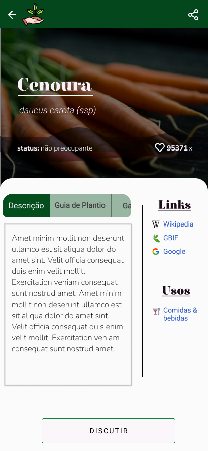
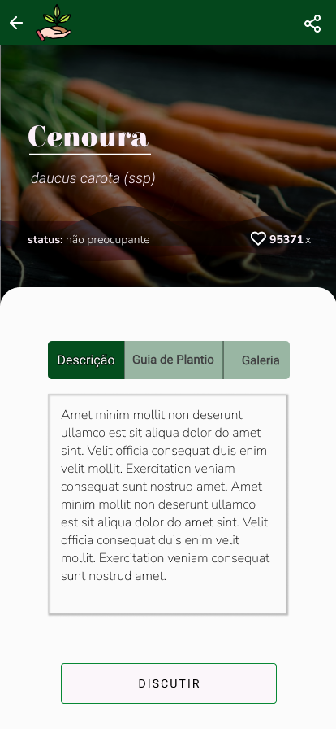
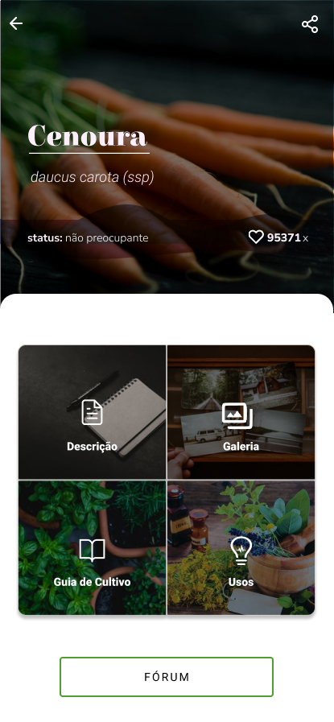
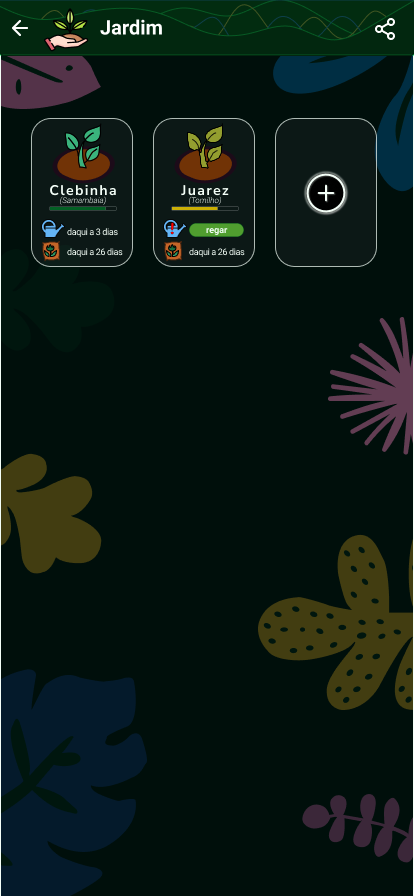
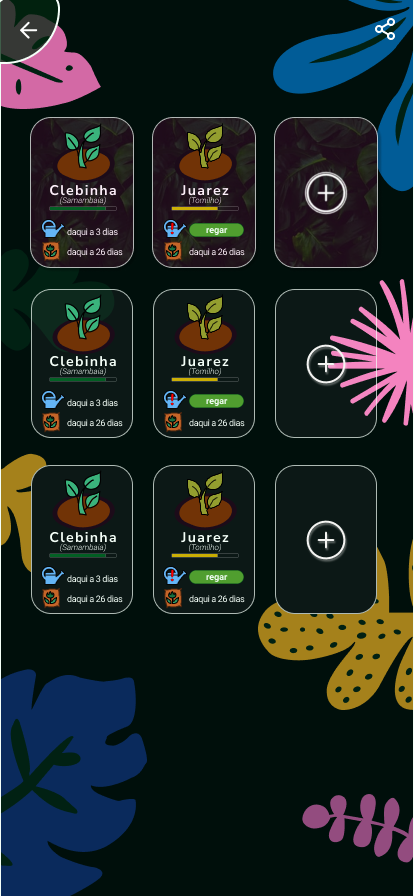
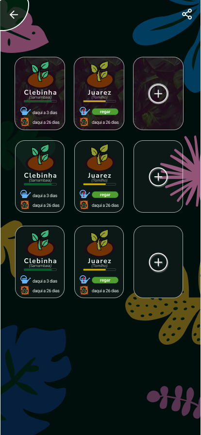

# Documentação do protótipo

| versao |                                             autor                                              |                                      link                                      |                mudanças feitas                 |
| :----: | :--------------------------------------------------------------------------------------------: | :----------------------------------------------------------------------------: | :--------------------------------------------: |
|  0.1   |                     [@guilhermedelyra](https://github.com/guilhermedelyra)                     |                     https://cloud.protopie.io/p/9ab2318f51                     |           adicionando tela de login            |
|  0.2   |                     [@guilhermedelyra](https://github.com/guilhermedelyra)                     |                     https://cloud.protopie.io/p/3d26a66b0c                     |  adicionando tela de cadastro & mudando icone  |
|  0.3   |                     [@guilhermedelyra](https://github.com/guilhermedelyra)                     |             https://builderx.io/app/hlufjlxrbyg44sc0ckgg8gkgs0soo4             | adicionando tela Home & migrando para builderx |
| 0.4.1  | [@guilhermedelyra](https://github.com/guilhermedelyra), [@faco400](https://github.com/faco400) | https://www.figma.com/file/0c2pVNNqCLmdmpmhnuco3Y/card-de-planta?node-id=1%3A2 |           tela Card de Planta, figma           |
| 0.4.2  | [@guilhermedelyra](https://github.com/guilhermedelyra), [@faco400](https://github.com/faco400) | https://www.figma.com/file/0c2pVNNqCLmdmpmhnuco3Y/card-de-planta?node-id=1%3A2 |               tela Jardim, figma               |

# Descrição

Nas versões 0.1 e 0.2 foram utilizadas as ferramentas [Adobe XD](https://www.adobe.com/products/xd.html) e [Protopie](https://www.protopie.io);
Na versão 0.3, após outras pesquisas, foi decidido migrar para o [BuilderX](https://builderx.io), que é capaz de converter o protótipo em código React Native.
Na versão 0.4, o BuilderX foi descartado por conta da pouca impractibilidade de se desenvolver o protótipo neste e, também, pela qualidade dúbia de código gerado pelo mesmo.

## 0.1

## 0.2

## 0.3

### Explicando o Header

#### Linha principal

1. **home** -> feed de noticias, incluindo topicos mais comentados nas comunidades e subreddits q vc segue
1. **meu jardim (pote)** -> local p manusear tuas plantas, setar notificaçao nelas etc
1. **procurar (lupa)** -> procurar plantas pelo nome, com alguns cards embaixo ajudando a filtrar categorias por ex
1. **mercado (sacola)** -> local onde vc pode pesquisar produtos organicos, com a facilidade de comprar igual à do ifood por ex (de ja pagar no cartao de credito etc)
1. **menu (sanduiche)** -> coisas da sua conta, gerenciar perfil, seus favoritos, etc

#### Linha secundária

1. **carrinho** = carrinho de compras...
1. **sino** = notificaçoes, seja de threads de topicos q vc ta seguindo, seja de seus posts etc

## 0.4.1

|                opção 1                 |                opção 2                 |                opção 3                 |                opção 4                 |
| :------------------------------------: | :------------------------------------: | :------------------------------------: | :------------------------------------: |
|  |  |  |  |

## 0.4.2

|                opção 1                 |                opção 2                 |                opção 3                 |                opção 4                 |                opção 5                 |                 opção 6                 |
| :------------------------------------: | :------------------------------------: | :------------------------------------: | :------------------------------------: | :------------------------------------: | :-------------------------------------: |
|  |  |  |  |  |  |
