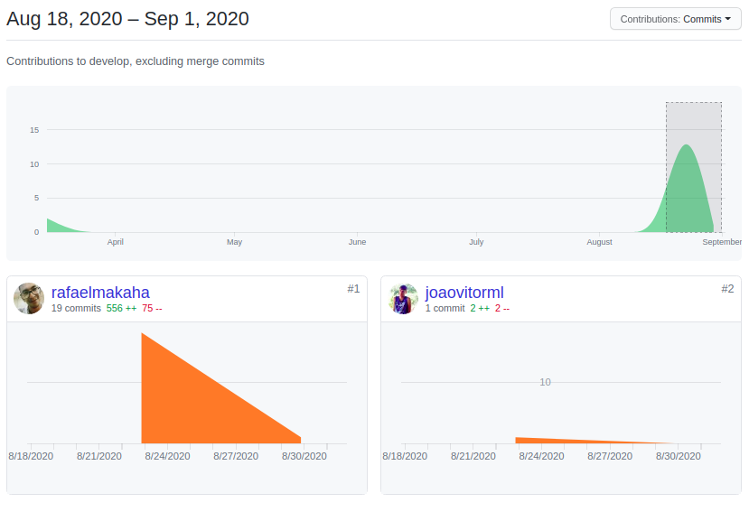
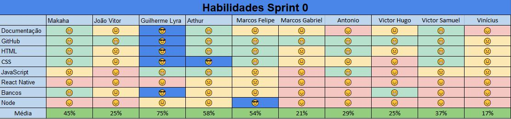

# Resultados da Sprint 0
------

[1. Indicadores de Qualidade do Processo](#1-indicadores-de-qualidade-do-processo)

- [# Resultados da Sprint 0](#h1-idresultados-da-sprint-0-460resultados-da-sprint-0h1)
- [1. Indicadores de Qualidade do Processo](#1-indicadores-de-qualidade-do-processo)
  - [1.1 Fechamento da _Sprint_](#11-fechamento-da-sprint)
  - [1.2 _Burndown_](#12-burndown)
  - [1.3 Gráfico de _commits_](#13-gráfico-de-commits)
  - [1.4 _Velocity_](#14-velocity)
  - [1.5 Quadro de Horas](#15-quadro-de-horas)
  - [1.6 Quadro de Conhecimento](#16-quadro-de-conhecimento)
  - [1.7 Custos](#17-custos)
    - [Valor Planejado x Custo Real x Valor Agregado](#valor-planejado-x-custo-real-x-valor-agregado)
    - [Variação de Custos x Variação de Prazos](#variação-de-custos-x-variação-de-prazos)
    - [Índices de Desempenho !Imgur](#índices-de-desempenho-img-srchttpsiimgurcomptc9mo6png-altimgur)
  - [1.8 Análise do Tracker](#18-análise-do-tracker)
  - [1.9 Revisão da _Sprint_](#19-revisão-da-sprint)
  - [2 Retrospectiva](#2-retrospectiva)
  - [2.1 Análise do _Scrum Master_](#21-análise-do-scrum-master)

[2. Análise do _Scrum Master_](#2-análise-do-scrum-master)  

------

## 1. Indicadores de Qualidade do Processo

### 1.1 Fechamento da _Sprint_
| Issue       | Pontos     | Status     |
| :------------- | :----------: | -----------: |
| [Dockerize Repository](https://github.com/fga-eps-mds/2020.1-Grupo2-wiki/issues/1) | - | 
Concluído
 |
[Create Mkdoc Wiki](https://github.com/fga-eps-mds/2020.1-Grupo2-wiki/issues/3) | - | Concluído 
[Create repository Politics](https://github.com/fga-eps-mds/2020.1-Grupo2-wiki/issues/6) | - | Concluído |
[Product Backlog](https://github.com/fga-eps-mds/2020.1-Grupo2-wiki/issues/8) | - | Em andamento |
[Update Branch politics](https://github.com/fga-eps-mds/2020.1-Grupo2-wiki/issues/11) | - | Concluído |
[Vision Document](https://github.com/fga-eps-mds/2020.1-Grupo2-wiki/issues/4) | - | Em andamento |
[Roles Roadmap](https://github.com/fga-eps-mds/2020.1-Grupo2-wiki/issues/12) | - | Concluído |[Product Roadmap](https://github.com/fga-eps-mds/2020.1-Grupo2-wiki/issues/12) | - | Em andamento |
| Pontos entregues | 20 |  |

 

Dos 30 pontos planejados, 20 foram entregues. Algumas issues não foram fechadas, pois estão incompletas e serão adicionadas como dívidas técnicas para a próxima sprint.

### 1.2 _Burndown_

### 1.3 Gráfico de _commits_

Abaixo segue o gráfico de _commits_ referente a wiki do projeto.

### 1.4 _Velocity_

Por ser a sprint inicial, não há comparativos.

### 1.5 Quadro de Horas

Ainda não há controle de horas nessa sprint.

### 1.6 Quadro de Conhecimento

### 1.7 Custos

#### Valor Planejado x Custo Real x Valor Agregado

#### Variação de Custos x Variação de Prazos

#### Índices de Desempenho 

### 1.8 Análise do Tracker
Na décima Sprint foram planejados 31 pontos, além dos 23 pontos adicionados, no entanto foram feitos apenas  40 pontos. Na visão do cliente, o projeto deveria estar com 73,33% do projeto inteiro, como não foram entregues todos os pontos, foram entregues apenas 73,15%. Para ver EVM completa acesse o link: [evm](https://docs.google.com/spreadsheets/d/1UhuJbHicONbdPg4TTNmiDS6sEkknskACSvgKSooy36A/edit#gid=0)

### 1.9 Revisão da _Sprint_

Nessa _Sprint_ houve dois problemas:

* O Travis, no backend, não estava funcionando corretamente, pois não conseguia rodas as migrations e isso atrasou a análise dos PRs. Porém o Luis conseguiu arrumar.
* Dificuldades para gerar o APK que atrasou a história do Rômulo e da Sara, pois eles não conseguiram testar a aplicação no celular. O Luis conseguiu gerar o APK e os ajudou a gerá-lo.

### 2 Retrospectiva

### 2.1 Análise do _Scrum Master_

Essa foi uma boa _Sprint_, em relação as anteriores. O _Velocity_ voltou a subir e isso foi possível pela quebra das histórias, porém os membros ainda estão trabalhando muitas horas, o que mostra que a produtividade ainda está baixa.

Finalmente nessa _Sprint_ o Benchmark foi entregue e o deploy do backend está funcionando (faltando apenas automatizá-lo e configurar o deploy do front). Essas entregas foram possíveis graças a um empenho maior do Luis para entregá-las.

Nas próximas _Sprints_ é necessário dar mais atenção a Julliana, porque ela está um pouco perdida no projeto e isso se dá, principalmente, pela falta de participação nos eventos da _Sprint_.

