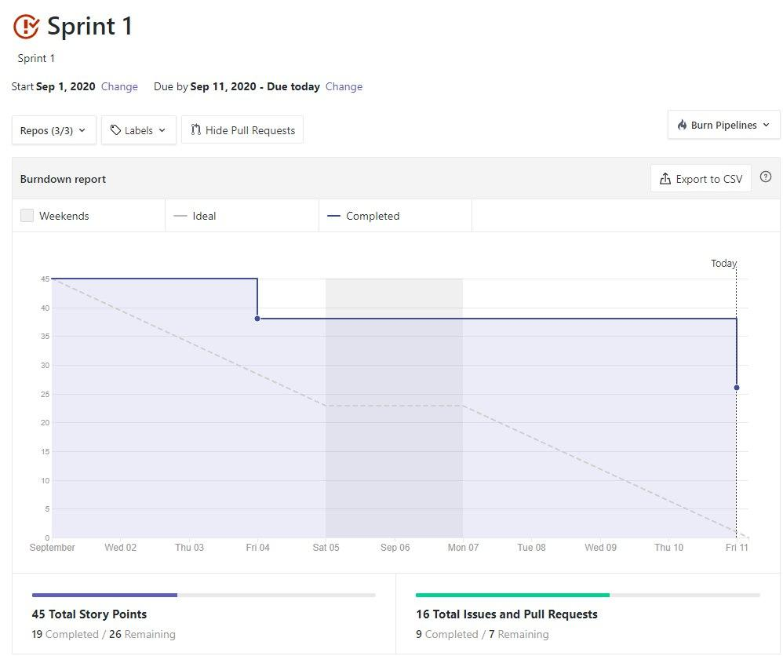
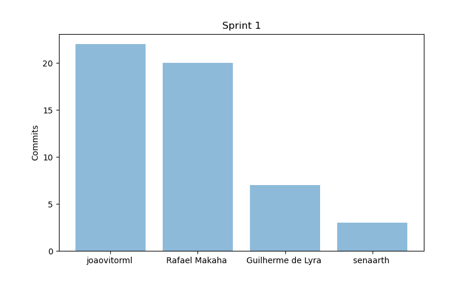
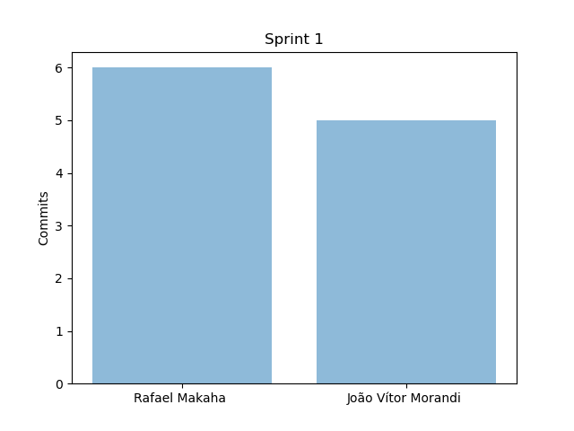
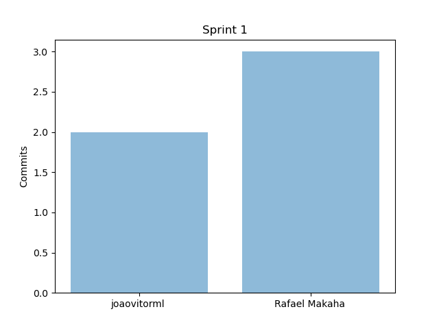
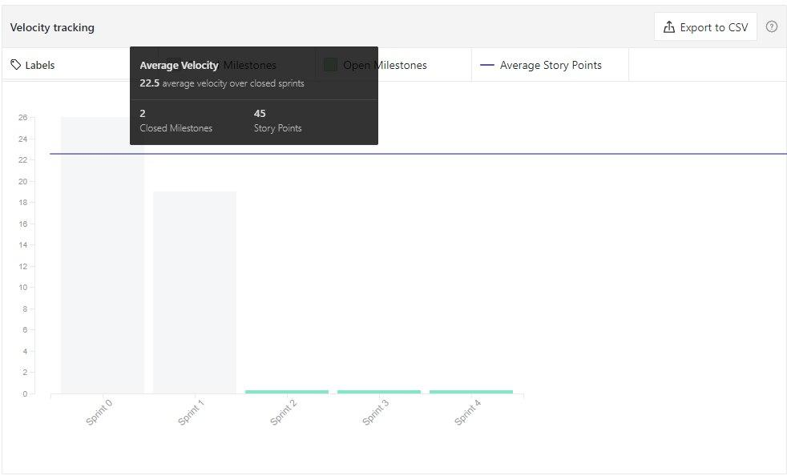
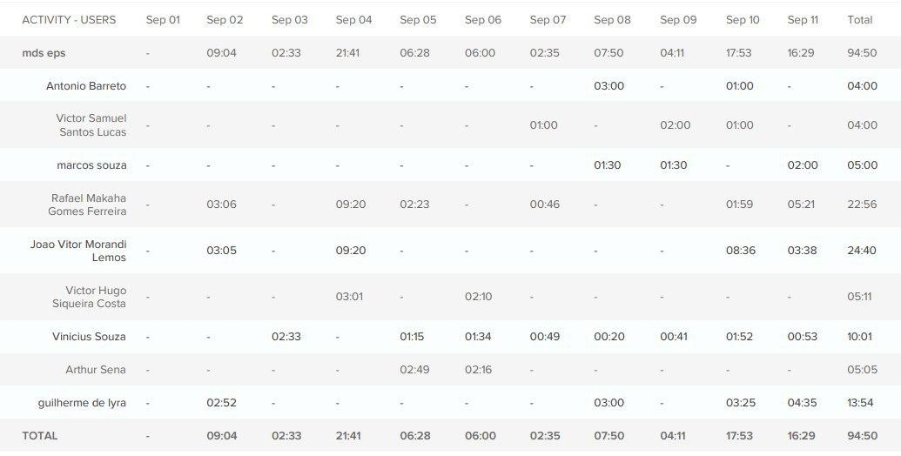
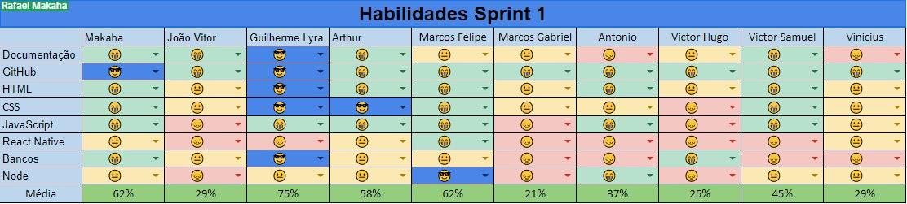
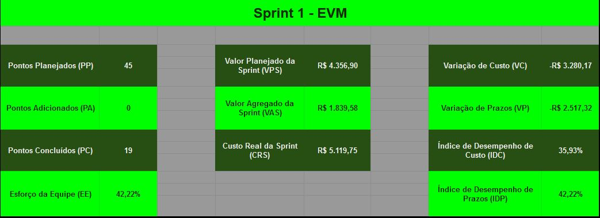

# Resultados da Sprint 1

[1. Indicadores de Qualidade do Processo](#1-indicadores-de-qualidade-do-processo)
  - [1.1 Fechamento da _Sprint_](#11-fechamento-da-sprint)
  - [1.2 _Burndown_](#12-burndown)
  - [1.3 Gráfico de _commits_](#13-gráfico-de-commits)
  - [1.4 _Velocity_](#14-velocity)
  - [1.5 Quadro de Horas](#15-quadro-de-horas)
  - [1.6 Quadro de Conhecimento](#16-quadro-de-conhecimento)
  - [1.7 EVM](#17-evm)
  - [1.8 Revisão da _Sprint_](#18-revisão-da-sprint)
  
[2 Retrospectiva](#2-retrospectiva)
  - [2.1 Análise do _Scrum Master_](#21-análise-do-scrum-master) 

------

## 1. Indicadores de Qualidade do Processo

### 1.1 Fechamento da _Sprint_
| Issue       | Pontos     | Status     |
| :------------- | :----------: | -----------: |
| [Issue 15 - Update Product Backlog](https://github.com/fga-eps-mds/2020.1-Grupo2-wiki/issues/15)| 5 | Não Concluído
|[Issue 17 - Project Opening Term](https://github.com/fga-eps-mds/2020.1-Grupo2-wiki/issues/17) | 5 | Não Concluído 
[Issue 18 - Burndown](https://github.com/fga-eps-mds/2020.1-Grupo2-wiki/issues/18) | 5 | Concluído |
[Issue 3 (frontend) - Start Frontend Project](https://github.com/fga-eps-mds/2020.1-Grupo2-frontend/issues/3) | 1 | Concluído |
[Issue 20 - Start Prototype](https://github.com/fga-eps-mds/2020.1-Grupo2-wiki/issues/20) | 3 | Concluído |
[Issue 21 - Training Node](https://github.com/fga-eps-mds/2020.1-Grupo2-wiki/issues/21) | 5 | Concluído |
[Issue 22 - Training React Native](https://github.com/fga-eps-mds/2020.1-Grupo2-wiki/issues/22) | 8 | Em andamento |
[Issue 23 - Training Tests](https://github.com/fga-eps-mds/2020.1-Grupo2-wiki/issues/23) | 3 | Não Concluído |
[Issue 24 - Architecture Document](https://github.com/fga-eps-mds/2020.1-Grupo2-wiki/issues/12) | 5 | Não Concluído |
[Issue 25 - Dockerize](https://github.com/fga-eps-mds/2020.1-Grupo2-wiki/issues/25) | 2 | Concluído |
[Issue 26 - Start Backend Project](https://github.com/fga-eps-mds/2020.1-Grupo2-wiki/issues/26) | 1 | Concluído |
[Issue 27 - Velocity Template](https://github.com/fga-eps-mds/2020.1-Grupo2-wiki/issues/12) | 2 | Concluído |
| Pontos Totais | 45 | |
| Pontos entregues | 19 |  |

 

Dos 40 pontos planejados, x foram entregues. Algumas issues não foram fechadas, pois estão incompletas e serão adicionadas como dívidas técnicas para a próxima sprint.

### 1.2 _Burndown_

### 1.3 Gráfico de _commits_

Abaixo segue o gráfico de _commits_ referente a wiki do projeto.

Abaixo segue o gráfico de _commits_ referente ao backend do projeto.

Abaixo segue o gráfico de _commits_ referente ao frontend do projeto.

### 1.4 _Velocity_

### 1.5 Quadro de Horas

### 1.6 Quadro de Conhecimento

### 1.7 EVM

### 1.8 Revisão da _Sprint_

Nessa _Sprint_ houveram os problemas:

* Não houve verificação de atividades durante a sprint dos membros. Ex: houve teste de outras disciplinas 
* Computador de um dos membros estragou 
* Dificuldade em conciliar outas disciplinas
* Demora para encerramento do Backlog
* Não fechamento dos treinos de testes e react-native
* Iniciar projeto de Front-end levou bem mais tempo do que o planejado

## 2 Retrospectiva

| Pontos Positivos | Pontos Negativos |
| :------------- | :----------: |
| Animação de MDS | Mal planejamento de pontos |
| Inicio das dailies | Pouca comunicação entre EPS e MDS |
| Avanço do protótipo |  |
| Esclarecimento sobre a visão do produto |  |

 

### 2.1 Análise do _Scrum Master_

Esta sprint não foi tão produtiva quanto a anterior 
devido ao planejamento de muitos pontos, onde quase 
metade dos mesmo não foram entregues.

EPS e MDS não mantiveram uma comunicação muito contínua 
devido ao pouco que se programou para ser realizado em 
conjunto.

O product backlog ainda não foi fechado. Isto está deixando o 
escopo muito em aberto e gerando muitas dúvidas a respeito do 
caminho que se deve tomar para o andamento do projeto. O 
documento de arquitetura também foi um ponto em que se deixou 
a desejar.

Na reunião de resultado da sprint e planejamento, MDS se demonstrou 
ainda muito tímido e pouco conversativo. EPS está tentando fazer uma 
melhor comunicação, mas o resultado depende de ambas as partes.