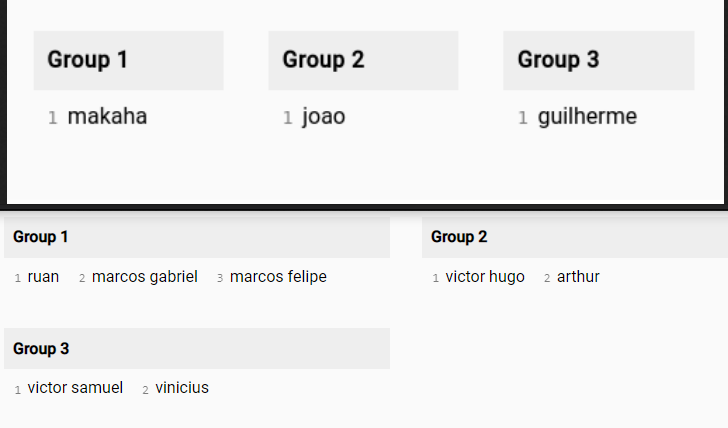
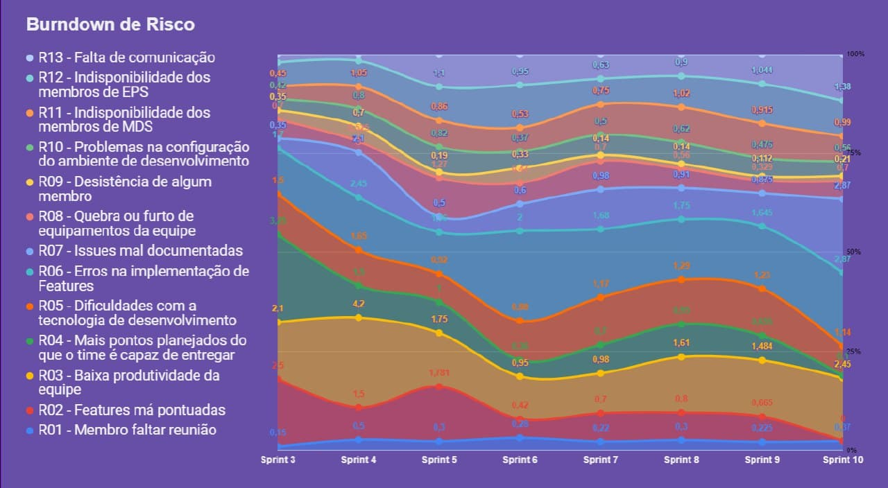

# Planejamento da Sprint 10

**Data de Início:** 05/11/2020  

**Data de Término:** 12/11/2020

**Duração:** * 7 dias

**Pontos Planejados**: 0

**Pontos Adicionados**: 125

**Pontos Totais**: 0

-------

- [Planejamento da Sprint 10](#planejamento-da-sprint-10)
  - [1. Pareamentos](#1-pareamentos)
  - [2. Objetivos da _Sprint_](#2-objetivos-da-sprint)
  - [3. Mudanças](#3-mudanças)
  - [4. Burndown de Risco](#4-burndown-de-risco)
  - [5. Issues da _Sprint_ e Pontuação](#5-issues-da-sprint-e-pontuação)
    - [5.1 Dívidas técnicas](#51-dívidas-técnicas)
    - [5.2 Novas issues](#52-novas-issues)

-------

## 1. Pareamentos

## 2. Objetivos da _Sprint_

Esta sprint terá foco em eliminar dívidas técnicas

## 3. Mudanças

Não há mudanças para essa sprint

## 4. Burndown de Risco

## 5. Issues da _Sprint_ e Pontuação

### 5.1 Dívidas técnicas

| Issue       | Pontos     | 
| :------------- | :----------: | 
[US04 - Cadastrar minha conta no aplicativo (FrontEnd)](https://github.com/fga-eps-mds/2020.1-Grupo2-FrontEnd/issues/4) | 5 pontos | 
[US07 - Fazer login no aplicativo (Frontend)](https://github.com/fga-eps-mds/2020.1-Grupo2-FrontEnd/issues/5) | 5 pontos | 
[US08 - Fazer logout no aplicativo (FrontEnd)](https://github.com/fga-eps-mds/2020.1-Grupo2-FrontEnd/issues/6) | 5 pontos | 
[US11 - Alterar os dados cadastrados na minha conta (FrontEnd)](https://github.com/fga-eps-mds/2020.1-Grupo2-BackEnd/issues/9) | 5 pontos | 
[US12 - Deletar minha conta (FrontEnd)](https://github.com/fga-eps-mds/2020.1-Grupo2-FrontEnd/issues/7) | 5 pontos | 
[Refatorar critérios de aceitação](https://github.com/fga-eps-mds/2020.1-Grupo2-wiki/issues/96) | 3 pontos | 
[US03 - Visualizar informações da Minha Planta (backend)](https://github.com/fga-eps-mds/2020.1-Grupo2-BackEnd/issues/85) | 3 pontos | 
[Testes](https://github.com/fga-eps-mds/2020.1-GaiaDex-BackEnd/issues/113) | 5 pontos | 
[US16 - Editar tópico criado por mim (frontend)](https://github.com/fga-eps-mds/2020.1-GaiaDex-FrontEnd/issues/86) | 3 pontos | 
[US17 - Deletar o tópico criado por mim (frontend)](https://github.com/fga-eps-mds/2020.1-GaiaDex-FrontEnd/issues/87) | 2 pontos | 
[Refatorar docs pro novo frontend e backend]() | 13 pontos | 
[Testes exploratórios](https://github.com/fga-eps-mds/2020.1-GaiaDex-wiki/issues/)| 5 pontos | 
[Configurar CI/CD](https://github.com/fga-eps-mds/2020.1-GaiaDex-wiki/issues/) | 13 pontos | 
[US01 - Scannear planta (frontend)](https://github.com/fga-eps-mds/2020.1-GaiaDex-FrontEnd/issues/) | 5 pontos | 
[US02 - Visualizar minha coleção (frontend)](https://github.com/fga-eps-mds/2020.1-GaiaDex-FrontEnd/issues/) | 5 pontos | 
[US03 - Visualizar informações da Minha Planta (frontend)](https://github.com/fga-eps-mds/2020.1-GaiaDex-FrontEnd/issues/) | 8 pontos | 
[US27 - Alterar informações da minha planta (frontend)](https://github.com/fga-eps-mds/2020.1-GaiaDex-FrontEnd/issues/) | 5 pontos | 
[Finalizar Protótipo](https://github.com/fga-eps-mds/2020.1-GaiaDex-wiki/issues/) | 13 pontos | 
[US27 - Alterar informações da minha planta (backend)](https://github.com/fga-eps-mds/2020.1-GaiaDex-BackEnd/issues/) | 3 pontos | 
[US19 - Criar comentário em um tópico (frontend)](https://github.com/fga-eps-mds/2020.1-GaiaDex-FrontEnd/issues/) | 8 pontos | 
[US20 - Editar comentário que fiz em um tópico (frontend)](https://github.com/fga-eps-mds/2020.1-GaiaDex-FrontEnd/issues/) | 3 pontos | 
[US21 - Remover um comentário que fiz em um tópico (frontend)](https://github.com/fga-eps-mds/2020.1-GaiaDex-FrontEnd/issues/) | 2 pontos | 
[US22 - Upvote e downvote em um comentário (frontend)](https://github.com/fga-eps-mds/2020.1-GaiaDex-FrontEnd/issues/) | 1 pontos | 

### 5.2 Novas issues

Não há novas issues. Apenas dívidas técnicas.
