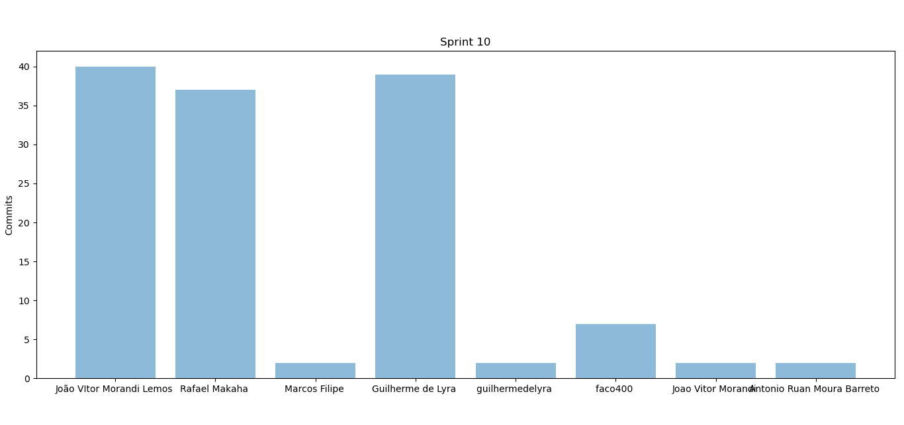
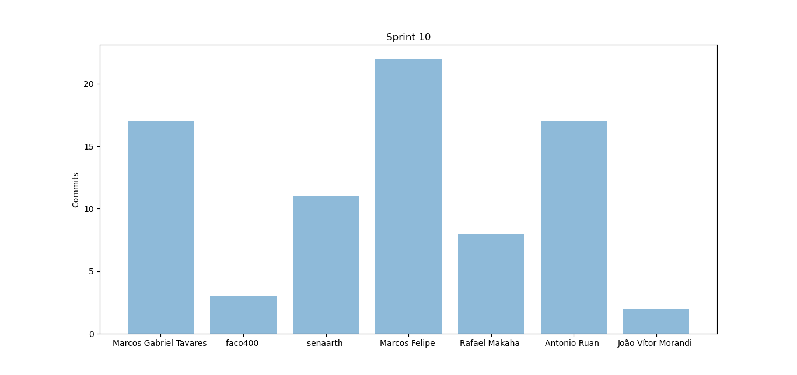
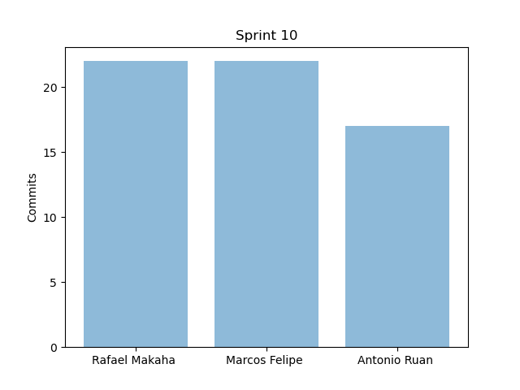
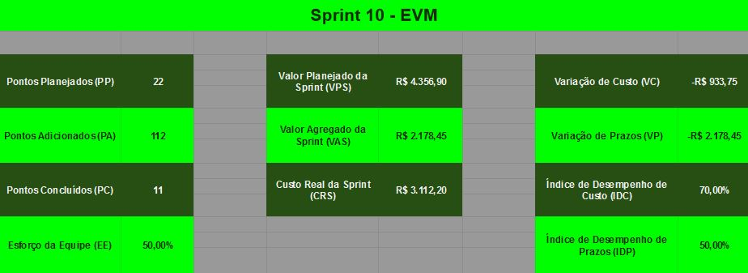
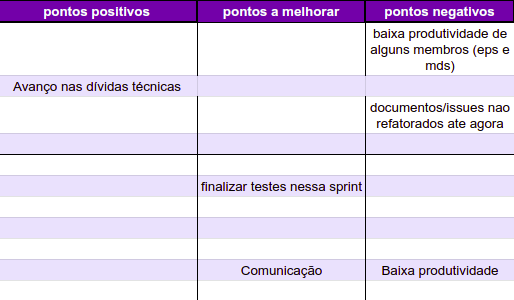

# Resultados da Sprint 10

- [Resultados da Sprint 10](#resultados-da-sprint-10)
  - [1. Indicadores de Qualidade do Processo](#1-indicadores-de-qualidade-do-processo)
    - [1.1 Fechamento da _Sprint_](#11-fechamento-da-sprint)
    - [1.2 _Burndown_](#12-burndown)
    - [1.3 Gráfico de _commits_](#13-gráfico-de-commits)
    - [1.4 _Velocity_](#14-velocity)
    - [1.5 Quadro de Horas](#15-quadro-de-horas)
    - [1.6 Quadro de Conhecimento](#16-quadro-de-conhecimento)
    - [1.7 EVM](#17-evm)
    - [1.8 Revisão da _Sprint_](#18-revisão-da-sprint)
  - [2 Retrospectiva](#2-retrospectiva)
    - [2.1 Análise do _Scrum Master_](#21-análise-do-scrum-master)
  
- [2 Retrospectiva](#2-retrospectiva)
  - [2.1 Análise do _Scrum Master_](#21-análise-do-scrum-master)

------

## 1. Indicadores de Qualidade do Processo

### 1.1 Fechamento da _Sprint_

| Issue       | Pontos     | Status |
| :------------- | :----------: | :----------: |
[US04 - Cadastrar minha conta no aplicativo (FrontEnd)](https://github.com/fga-eps-mds/2020.1-Grupo2-FrontEnd/issues/4) | 5 pontos |  Em andamento |
[US07 - Fazer login no aplicativo (Frontend)](https://github.com/fga-eps-mds/2020.1-Grupo2-FrontEnd/issues/5) | 5 pontos |  Em andamento |
[US08 - Fazer logout no aplicativo (FrontEnd)](https://github.com/fga-eps-mds/2020.1-Grupo2-FrontEnd/issues/6) | 5 pontos |  Em andamento |
[US11 - Alterar os dados cadastrados na minha conta (FrontEnd)](https://github.com/fga-eps-mds/2020.1-Grupo2-BackEnd/issues/9) | 5 pontos | Em andamento  |
[US12 - Deletar minha conta (FrontEnd)](https://github.com/fga-eps-mds/2020.1-Grupo2-FrontEnd/issues/7) | 5 pontos | Em andamento |
[Refatorar critérios de aceitação](https://github.com/fga-eps-mds/2020.1-Grupo2-wiki/issues/96) | 3 pontos | Não Concluído |
[US03 - Visualizar informações da Minha Planta (backend)](https://github.com/fga-eps-mds/2020.1-Grupo2-BackEnd/issues/85) | 3 pontos | Concluído |
[Testes](https://github.com/fga-eps-mds/2020.1-GaiaDex-BackEnd/issues/113) | 5 pontos | Em andamento | 
[US16 - Editar tópico criado por mim (frontend)](https://github.com/fga-eps-mds/2020.1-GaiaDex-FrontEnd/issues/86) | 3 pontos | Em andamento |
[US17 - Deletar o tópico criado por mim (frontend)](https://github.com/fga-eps-mds/2020.1-GaiaDex-FrontEnd/issues/87) | 2 pontos | Em andamento |
[Testes exploratórios](https://github.com/fga-eps-mds/2020.1-GaiaDex-wiki/issues/)| 5 pontos | Não Concluído |
[Configurar CI/CD](https://github.com/fga-eps-mds/2020.1-GaiaDex-wiki/issues/) | 13 pontos | Em andamento |
[US01 - Scannear planta (frontend)](https://github.com/fga-eps-mds/2020.1-GaiaDex-FrontEnd/issues/) | 5 pontos | Concluído |
[US02 - Visualizar minha coleção (frontend)](https://github.com/fga-eps-mds/2020.1-GaiaDex-FrontEnd/issues/) | 5 pontos | Não Concluído |
[US03 - Visualizar informações da Minha Planta (frontend)](https://github.com/fga-eps-mds/2020.1-GaiaDex-FrontEnd/issues/) | 8 pontos | Não Concluído |
[US27 - Alterar informações da minha planta (frontend)](https://github.com/fga-eps-mds/2020.1-GaiaDex-FrontEnd/issues/) | 5 pontos | Não Concluído |
[Finalizar Protótipo](https://github.com/fga-eps-mds/2020.1-GaiaDex-wiki/issues/) | 13 pontos | Não Concluído |
[US27 - Alterar informações da minha planta (backend)](https://github.com/fga-eps-mds/2020.1-GaiaDex-BackEnd/issues/) | 3 pontos | Concluído |
[US19 - Criar comentário em um tópico (frontend)](https://github.com/fga-eps-mds/2020.1-GaiaDex-FrontEnd/issues/) | 8 pontos | Em andamento |
[US20 - Editar comentário que fiz em um tópico (frontend)](https://github.com/fga-eps-mds/2020.1-GaiaDex-FrontEnd/issues/) | 3 pontos | Em andamento |
[US21 - Remover um comentário que fiz em um tópico (frontend)](https://github.com/fga-eps-mds/2020.1-GaiaDex-FrontEnd/issues/) | 2 pontos | Em andamento |
[US22 - Upvote e downvote em um comentário (frontend)](https://github.com/fga-eps-mds/2020.1-GaiaDex-FrontEnd/issues/) | 1 pontos | Em andamento |

Dos 112 pontos planejados, 11 foram entregues. Algumas issues não foram fechadas, pois estão incompletas e serão adicionadas como dívidas técnicas para a próxima sprint.

### 1.2 _Burndown_

Não há burndown de risco pois nenhuma issue nova foi definida nessa sprint.

### 1.3 Gráfico de _commits_

Abaixo segue o gráfico de _commits_ referente a wiki do projeto.

Abaixo segue o gráfico de _commits_ referente ao backend do projeto.

Abaixo segue o gráfico de _commits_ referente ao frontend do projeto.

### 1.4 _Velocity_

### 1.5 Quadro de Horas

### 1.6 Quadro de Conhecimento

### 1.7 EVM

Como nessa sprint não haviam sido definidos novos pontos, foi colocado no EVM que eram esperados pelo menos 22 pontos concluídos oriundos de dívidas técnicas.

### 1.8 Revisão da _Sprint_

Nessa _Sprint_:

- Não houve nenhum acontecimento marcante a relatar

## 2 Retrospectiva

### 2.1 Análise do _Scrum Master_

A sprint foi pouco produtiva, com poucas dívidas técnicas resolvidas, apesar de não terem sido adicionadas novas issues.

O time de MDS produziu bastante, porém o time de EPS não revisou os PRs, resultando assim na baixa produtividade do time como um todo.
