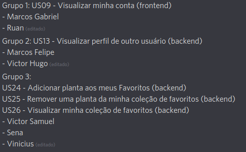
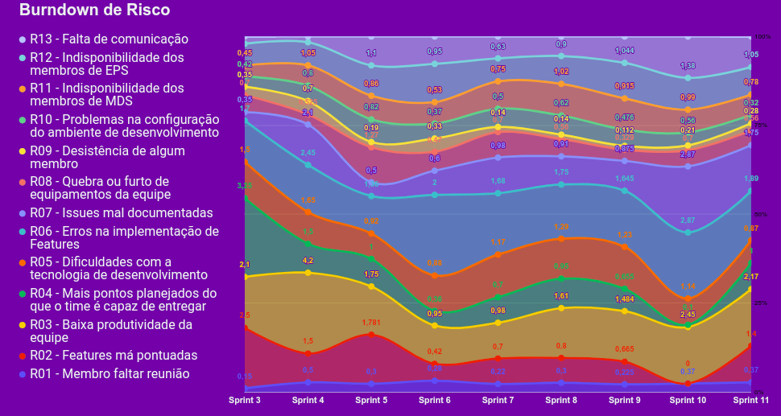
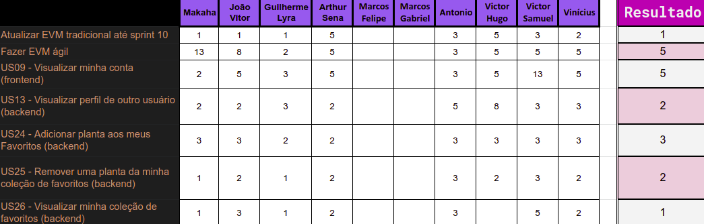

# Planejamento da Sprint 11

**Data de Início:** 12/11/2020  

**Data de Término:** 19/11/2020

**Duração:** * 7 dias

**Pontos Planejados**: 19

**Pontos Adicionados**: 96

**Pontos Totais**: 115

-------

- [Planejamento da Sprint 11](#planejamento-da-sprint-11)
  - [1. Pareamentos](#1-pareamentos)
  - [2. Objetivos da _Sprint_](#2-objetivos-da-sprint)
  - [3. Mudanças](#3-mudanças)
  - [4. Burndown de Risco](#4-burndown-de-risco)
  - [5. Issues da _Sprint_ e Pontuação](#5-issues-da-sprint-e-pontuação)
    - [5.1 Dívidas técnicas](#51-dívidas-técnicas)
    - [5.2 Novas issues](#52-novas-issues)
    <!-- - [5.3 Issues pós reunião](#53-issues-pós-reunião) -->

-------

## 1. Pareamentos

## 2. Objetivos da _Sprint_

- Sanar dívidas técnicas e concluir revisão de vários PRs
## 3. Mudanças

- Mudanças nos papéis de EPS: agora João Vítor é o Scrum Master, Rafael Makaha é o Devops e todos são arquitetos.

## 4. Burndown de Risco

## 5. Issues da _Sprint_ e Pontuação

### 5.1 Dívidas técnicas

| Issue       | Pontos     | Status |
| :------------- | :----------: | :----------: |
[US04 - Cadastrar minha conta no aplicativo (FrontEnd)](https://github.com/fga-eps-mds/2020.1-Grupo2-FrontEnd/issues/4) | 5 pontos |  Em andamento |
[US07 - Fazer login no aplicativo (Frontend)](https://github.com/fga-eps-mds/2020.1-Grupo2-FrontEnd/issues/5) | 5 pontos |  Em andamento |
[US08 - Fazer logout no aplicativo (FrontEnd)](https://github.com/fga-eps-mds/2020.1-Grupo2-FrontEnd/issues/6) | 5 pontos |  Em andamento |
[US11 - Alterar os dados cadastrados na minha conta (FrontEnd)](https://github.com/fga-eps-mds/2020.1-Grupo2-BackEnd/issues/9) | 5 pontos | Em andamento  |
[US12 - Deletar minha conta (FrontEnd)](https://github.com/fga-eps-mds/2020.1-Grupo2-FrontEnd/issues/7) | 5 pontos | Em andamento |
[Refatorar critérios de aceitação](https://github.com/fga-eps-mds/2020.1-Grupo2-wiki/issues/96) | 3 pontos | Não Concluído |
[Testes](https://github.com/fga-eps-mds/2020.1-GaiaDex-BackEnd/issues/113) | 5 pontos | Em andamento | 
[US16 - Editar tópico criado por mim (frontend)](https://github.com/fga-eps-mds/2020.1-GaiaDex-FrontEnd/issues/86) | 3 pontos | Revisar PR |
[US17 - Deletar o tópico criado por mim (frontend)](https://github.com/fga-eps-mds/2020.1-GaiaDex-FrontEnd/issues/87) | 2 pontos | Revisar PR |
[Testes exploratórios](https://github.com/fga-eps-mds/2020.1-GaiaDex-wiki/issues/)| 5 pontos | Não Concluído |
[Configurar CI/CD](https://github.com/fga-eps-mds/2020.1-GaiaDex-wiki/issues/) | 13 pontos | Em andamento |
[US02 - Visualizar minha coleção (frontend)](https://github.com/fga-eps-mds/2020.1-GaiaDex-FrontEnd/issues/) | 5 pontos | Não Concluído |
[US03 - Visualizar informações da Minha Planta (frontend)](https://github.com/fga-eps-mds/2020.1-GaiaDex-FrontEnd/issues/) | 8 pontos | Não Concluído |
[Finalizar Protótipo](https://github.com/fga-eps-mds/2020.1-GaiaDex-wiki/issues/) | 13 pontos | Não Concluído |
[US19 - Criar comentário em um tópico (frontend)](https://github.com/fga-eps-mds/2020.1-GaiaDex-FrontEnd/issues/) | 8 pontos | Em andamento |
[US20 - Editar comentário que fiz em um tópico (frontend)](https://github.com/fga-eps-mds/2020.1-GaiaDex-FrontEnd/issues/) | 3 pontos | Em andamento |
[US21 - Remover um comentário que fiz em um tópico (frontend)](https://github.com/fga-eps-mds/2020.1-GaiaDex-FrontEnd/issues/) | 2 pontos | Em andamento |
[US22 - Upvote e downvote em um comentário (frontend)](https://github.com/fga-eps-mds/2020.1-GaiaDex-FrontEnd/issues/) | 1 pontos | Em andamento |

### 5.2 Novas issues

1. [Atualizar EVM tradicional até sprint 10](https://github.com/fga-eps-mds/2020.1-GaiaDex-wiki/issues/124) - 1
2. [Fazer EVM ágil](https://github.com/fga-eps-mds/2020.1-GaiaDex-wiki/issues/125) - 5
3. [US09 - Visualizar minha conta (frontend)](https://github.com/fga-eps-mds/2020.1-GaiaDex-FrontEnd/issues/) - 5
4. [US13 - Visualizar perfil de outro usuário (backend)](https://github.com/fga-eps-mds/2020.1-GaiaDex-BackEnd/issues/)- 2
5. [US24 - Adicionar planta aos meus Favoritos (backend)](https://github.com/fga-eps-mds/2020.1-GaiaDex-BackEnd/issues/) - 3
6. [US25 - Remover uma planta da minha coleção de favoritos (backend)](https://github.com/fga-eps-mds/2020.1-GaiaDex-BackEnd/issues/) - 1
7. [US26 - Visualizar minha coleção de favoritos (backend)](https://github.com/fga-eps-mds/2020.1-GaiaDex-BackEnd/issues/) - 2

