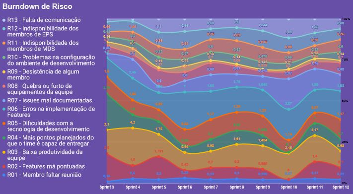
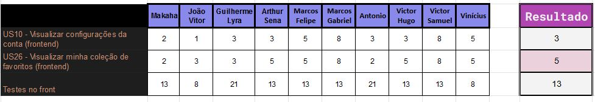

# Planejamento da Sprint 12

**Data de Início:** 19/11/2020  

**Data de Término:** 26/11/2020

**Duração:** 7 dias

**Pontos Planejados**: 22

**Pontos Adicionados**: 108

**Pontos Totais**: 130

-------

- [Planejamento da Sprint 12](#planejamento-da-sprint-12)
  - [1. Pareamentos](#1-pareamentos)
  - [2. Objetivos da _Sprint_](#2-objetivos-da-sprint)
  - [3. Mudanças](#3-mudanças)
  - [4. Burndown de Risco](#4-burndown-de-risco)
  - [5. Issues da _Sprint_ e Pontuação](#5-issues-da-sprint-e-pontuação)
    - [5.1 Dívidas técnicas](#51-dívidas-técnicas)
    - [5.2 Novas issues](#52-novas-issues)
    <!-- - [5.3 Issues pós reunião](#53-issues-pós-reunião) -->

-------

## 1. Pareamentos

- Grupo 1: Marcos Felipe e Ruan
- Grupo 2: Sena, Victor Samuel e Vinicius
- Grupo 3: Marcos Gabriel e Victor Hugo

As issues que cada grupo irá desenvolver estão relatadas no tópico [5.2 Novas issues](#52-novas-issues)

## 2. Objetivos da _Sprint_

## 3. Mudanças

- Foco maior no frontend, que é a parte que mais está atrasada do projeto

## 4. Burndown de Risco

## 5. Issues da _Sprint_ e Pontuação

### 5.1 Dívidas técnicas

| Issue       | Pontos     | Status     |
| :------------- | :----------: | -----------: |
| [Fazer EVM ágil](https://github.com/fga-eps-mds/2020.1-GaiaDex-wiki/issues/125) | 5 | Não Concluído |
| [US09 - Visualizar minha conta (frontend)](https://github.com/fga-eps-mds/2020.1-GaiaDex-FrontEnd/issues/) | 5 | Em andamento |
| [Fazer EVM ágil](https://github.com/fga-eps-mds/2020.1-GaiaDex-wiki/issues/125) | 5 | Não Concluído |
| [US13 - Visualizar perfil de outro usuário (backend)](https://github.com/fga-eps-mds/2020.1-GaiaDex-BackEnd/issues/) | 2 | Em andamento |
[US04 - Cadastrar minha conta no aplicativo (FrontEnd)](https://github.com/fga-eps-mds/2020.1-Grupo2-FrontEnd/issues/4) | 5 pontos |  Em andamento |
[US07 - Fazer login no aplicativo (Frontend)](https://github.com/fga-eps-mds/2020.1-Grupo2-FrontEnd/issues/5) | 5 pontos |  Em andamento |
[US08 - Fazer logout no aplicativo (FrontEnd)](https://github.com/fga-eps-mds/2020.1-Grupo2-FrontEnd/issues/6) | 5 pontos |  Em andamento |
[US11 - Alterar os dados cadastrados na minha conta (FrontEnd)](https://github.com/fga-eps-mds/2020.1-Grupo2-BackEnd/issues/9) | 5 pontos | Em andamento  |
[US12 - Deletar minha conta (FrontEnd)](https://github.com/fga-eps-mds/2020.1-Grupo2-FrontEnd/issues/7) | 5 pontos | Em andamento |
[Refatorar critérios de aceitação](https://github.com/fga-eps-mds/2020.1-Grupo2-wiki/issues/96) | 3 pontos | Não Concluído |
[Testes no back](https://github.com/fga-eps-mds/2020.1-GaiaDex-BackEnd/issues/113) | 5 pontos | Em andamento | 
[US16 - Editar tópico criado por mim (frontend)](https://github.com/fga-eps-mds/2020.1-GaiaDex-FrontEnd/issues/86) | 3 pontos | Em andamento |
[US17 - Deletar o tópico criado por mim (frontend)](https://github.com/fga-eps-mds/2020.1-GaiaDex-FrontEnd/issues/87) | 2 pontos | Em andamento |
[Configurar CI/CD](https://github.com/fga-eps-mds/2020.1-GaiaDex-wiki/issues/) | 13 pontos | Em andamento |
[US02 - Visualizar minha coleção (frontend)](https://github.com/fga-eps-mds/2020.1-GaiaDex-FrontEnd/issues/) | 5 pontos | Não Concluído |
[US03 - Visualizar informações da Minha Planta (frontend)](https://github.com/fga-eps-mds/2020.1-GaiaDex-FrontEnd/issues/) | 8 pontos | Não Concluído |
[Finalizar Protótipo](https://github.com/fga-eps-mds/2020.1-GaiaDex-wiki/issues/) | 13 pontos | Não Concluído |
[US19 - Criar comentário em um tópico (frontend)](https://github.com/fga-eps-mds/2020.1-GaiaDex-FrontEnd/issues/) | 8 pontos | Em andamento |
[US20 - Editar comentário que fiz em um tópico (frontend)](https://github.com/fga-eps-mds/2020.1-GaiaDex-FrontEnd/issues/) | 3 pontos | Em andamento |
[US21 - Remover um comentário que fiz em um tópico (frontend)](https://github.com/fga-eps-mds/2020.1-GaiaDex-FrontEnd/issues/) | 2 pontos | Em andamento |
[US22 - Upvote e downvote em um comentário (frontend)](https://github.com/fga-eps-mds/2020.1-GaiaDex-FrontEnd/issues/) | 1 pontos | Em andamento |

### 5.2 Novas issues

1. [US10 - Visualizar configurações da conta (frontend)](https://github.com/fga-eps-mds/2020.1-GaiaDex-FrontEnd/issues/) - 3 (Grupo 1: Marcos Felipe, Ruan)
2. [US26 - Visualizar minha coleção de favoritos (frontend)](https://github.com/fga-eps-mds/2020.1-GaiaDex-FrontEnd/issues/) - 5 (Grupo 2: Sena, Victor Samuel e Vinicius)
3. [Testes no front](https://github.com/fga-eps-mds/2020.1-GaiaDex-FrontEnd/issues/) - 13 (Grupo 3: Marcos Gabriel, Victor Hugo)

Votação:

