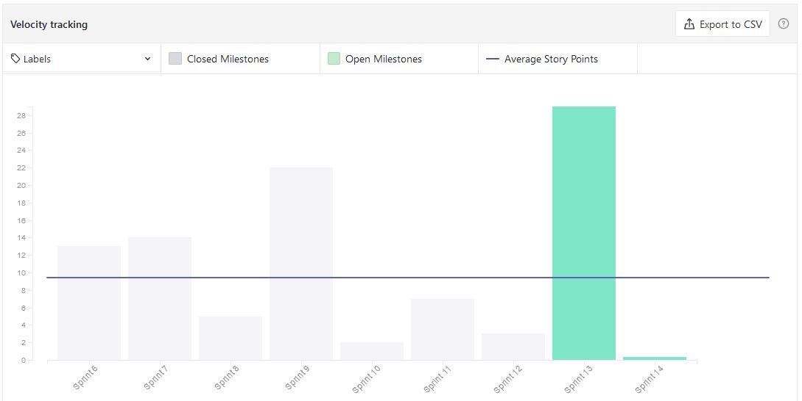
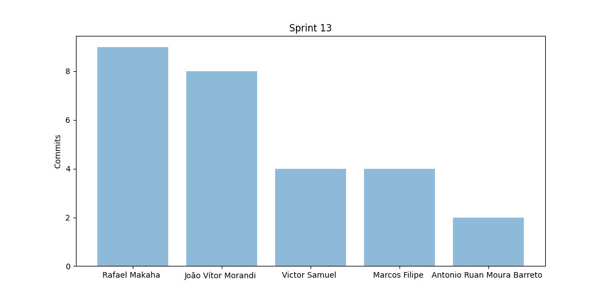
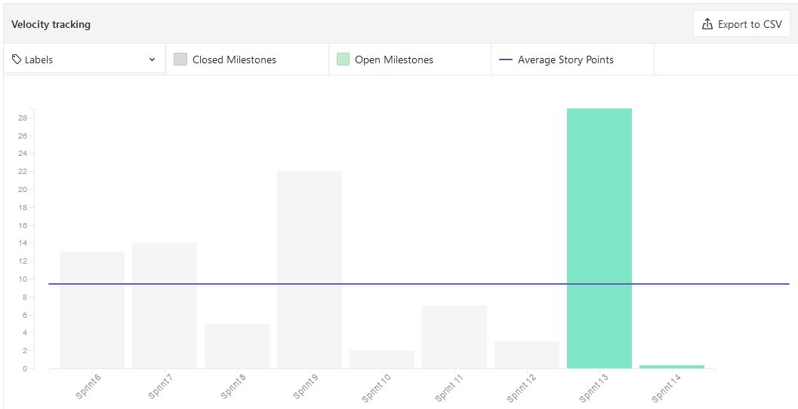
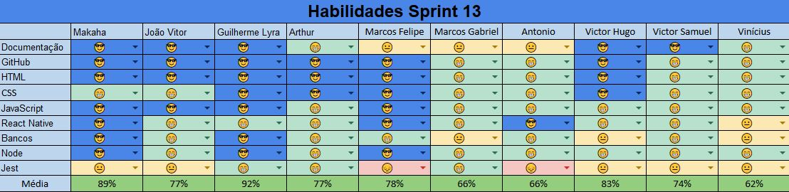
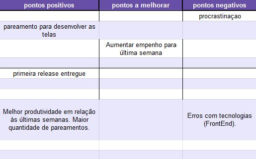

# Resultados da Sprint 13

- [Resultados da Sprint 13](#resultados-da-sprint-13)
  - [1. Indicadores de Qualidade do Processo](#1-indicadores-de-qualidade-do-processo)
    - [1.1 Fechamento da _Sprint_](#11-fechamento-da-sprint)
    - [1.2 _Burndown_](#12-burndown)
    - [1.3 Gráfico de _commits_](#13-gráfico-de-commits)
    - [1.4 _Velocity_](#14-velocity)
    - [1.5 Quadro de Horas](#15-quadro-de-horas)
    - [1.6 Quadro de Conhecimento](#16-quadro-de-conhecimento)
    - [1.7 Revisão da _Sprint_](#17-revisão-da-sprint)
  - [2 Retrospectiva](#2-retrospectiva)
    - [2.1 Análise do _Scrum Master_](#21-análise-do-scrum-master)
  
- [2 Retrospectiva](#2-retrospectiva)
  - [2.1 Análise do _Scrum Master_](#21-análise-do-scrum-master)

------

## 1. Indicadores de Qualidade do Processo

### 1.1 Fechamento da _Sprint_

| Issue       | Pontos     | Status     |
| :------------- | :----------: | -----------: |
| [Fazer EVM ágil](https://github.com/fga-eps-mds/2020.1-GaiaDex-wiki/issues/125) | 5 | Não Concluído |
| [US09 - Visualizar minha conta (frontend)](https://github.com/fga-eps-mds/2020.1-GaiaDex-FrontEnd/issues/) | 5 | Concluído |
| [Fazer EVM ágil](https://github.com/fga-eps-mds/2020.1-GaiaDex-wiki/issues/125) | 5 | Não Concluído |
| [US13 - Visualizar perfil de outro usuário (backend)](https://github.com/fga-eps-mds/2020.1-GaiaDex-BackEnd/issues/) | 2 | Em andamento |
[US04 - Cadastrar minha conta no aplicativo (FrontEnd)](https://github.com/fga-eps-mds/2020.1-Grupo2-FrontEnd/issues/4) | 5 |  Concluído |
[US07 - Fazer login no aplicativo (Frontend)](https://github.com/fga-eps-mds/2020.1-Grupo2-FrontEnd/issues/5) | 5 |  Concluído |
[US08 - Fazer logout no aplicativo (FrontEnd)](https://github.com/fga-eps-mds/2020.1-Grupo2-FrontEnd/issues/6) | 5 |  Concluído |
[US11 - Alterar os dados cadastrados na minha conta (FrontEnd)](https://github.com/fga-eps-mds/2020.1-Grupo2-BackEnd/issues/9) | 5  | Concluído  |
[US12 - Deletar minha conta (FrontEnd)](https://github.com/fga-eps-mds/2020.1-Grupo2-FrontEnd/issues/7) | 5 | Concluído |
[Refatorar critérios de aceitação](https://github.com/fga-eps-mds/2020.1-Grupo2-wiki/issues/96) | 3 | Não Concluído |
[Testes no back](https://github.com/fga-eps-mds/2020.1-GaiaDex-BackEnd/issues/113) | 5 | Em andamento | 
[US16 - Editar tópico criado por mim (frontend)](https://github.com/fga-eps-mds/2020.1-GaiaDex-FrontEnd/issues/86) | 3 | Concluído |
[US17 - Deletar o tópico criado por mim (frontend)](https://github.com/fga-eps-mds/2020.1-GaiaDex-FrontEnd/issues/87) | 2 | Concluído |
[Configurar CI/CD](https://github.com/fga-eps-mds/2020.1-GaiaDex-wiki/issues/) | 13 | Em andamento |
[US02 - Visualizar minha coleção (frontend)](https://github.com/fga-eps-mds/2020.1-GaiaDex-FrontEnd/issues/) | 5 | Não Concluído |
[US03 - Visualizar informações da Minha Planta (frontend)](https://github.com/fga-eps-mds/2020.1-GaiaDex-FrontEnd/issues/) | 8 | Não Concluído |
[Finalizar Protótipo](https://github.com/fga-eps-mds/2020.1-GaiaDex-wiki/issues/) | 13 | Não Concluído |
[US19 - Criar comentário em um tópico (frontend)](https://github.com/fga-eps-mds/2020.1-GaiaDex-FrontEnd/issues/) | 8 | Concluído |
[US20 - Editar comentário que fiz em um tópico (frontend)](https://github.com/fga-eps-mds/2020.1-GaiaDex-FrontEnd/issues/) | 3 | Concluído |
[US21 - Remover um comentário que fiz em um tópico (frontend)](https://github.com/fga-eps-mds/2020.1-GaiaDex-FrontEnd/issues/) | 2 | Concluído |
[US22 - Upvote e downvote em um comentário (frontend)](https://github.com/fga-eps-mds/2020.1-GaiaDex-FrontEnd/issues/) | 1 | Concluído |
[US10 - Visualizar configurações da conta (frontend)](https://github.com/fga-eps-mds/2020.1-GaiaDex-FrontEnd/issues/) | 3 | Em andamento |
[US26 - Visualizar minha coleção de favoritos (frontend)](https://github.com/fga-eps-mds/2020.1-GaiaDex-FrontEnd/issues/) | 5 | Em andamento |
[Testes no front](https://github.com/fga-eps-mds/2020.1-GaiaDex-FrontEnd/issues/) | 13 | Em andamento |
| [Adicionar Sonarqube ao projeto](https://github.com/fga-eps-mds/2020.1-GaiaDex-wiki/issues/) | 21 | Em andamento
| [US24 - Adicionar planta aos meus Favoritos (frontend)](https://github.com/fga-eps-mds/2020.1-GaiaDex-FrontEnd/issues/) | 5 | Em andamento |
| [US25 - Remover uma planta da minha coleção de favoritos (frontend)](https://github.com/fga-eps-mds/2020.1-GaiaDex-FrontEnd/issues/) | 3 | Em andamento

Dos 158 pontos planejados, 49 foram entregues. Algumas issues não foram fechadas, pois estão incompletas e serão adicionadas como dívidas técnicas para a próxima sprint.

### 1.2 _Burndown_

### 1.3 Gráfico de _commits_

Abaixo segue o gráfico de _commits_ referente a wiki do projeto.

Abaixo segue o gráfico de _commits_ referente ao backend do projeto.

Abaixo segue o gráfico de _commits_ referente ao frontend do projeto.

### 1.4 _Velocity_

### 1.5 Quadro de Horas

### 1.6 Quadro de Conhecimento

### 1.7 Revisão da _Sprint_

Nessa _Sprint_:

- O CI/CD teve diversos problemas para ser desenvolvido por erros no Github Actions e outros meios utilizados. Nós de EPS estamos trabalhando fortemente para resolver essa dificuldade.

## 2 Retrospectiva

### 2.1 Análise do _Scrum Master_

A equipe de MDS, liderada por Marcos Felipe, se reuniu diversas vezes para fechar as telas que estavam atrasadas no frontend, e com isso conseguiram bater recorde de produtividade.