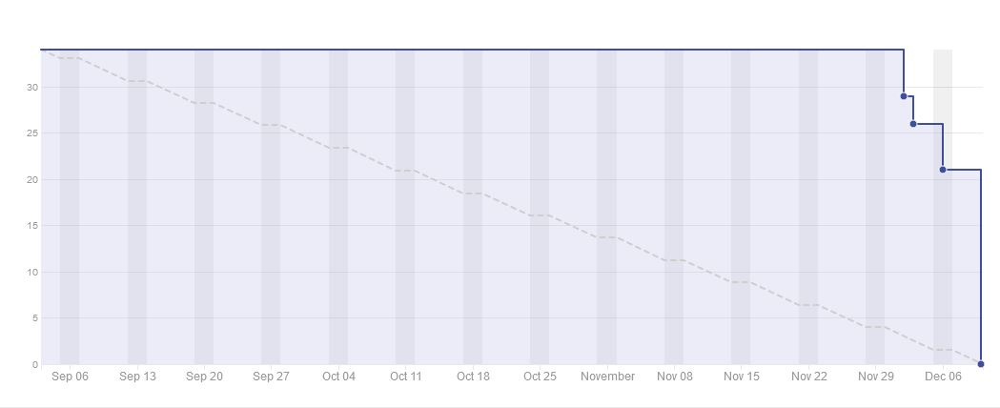

# Planejamento da Sprint 14

**Data de Início:** DD/MM/2020  

**Data de Término:** DD/MM/2020

**Duração:** * 7 dias

**Pontos Planejados**: 0

**Pontos Adicionados**: 0

**Pontos Totais**: 0

-------

- [Planejamento da Sprint 14](#planejamento-da-sprint-14)
  - [1. Pareamentos](#1-pareamentos)
  - [2. Objetivos da _Sprint_](#2-objetivos-da-sprint)
  - [3. Mudanças](#3-mudanças)
  - [4. Burndown de Risco](#4-burndown-de-risco)
  - [5. Issues da _Sprint_ e Pontuação](#5-issues-da-sprint-e-pontuação)
    - [5.1 Dívidas técnicas](#51-dívidas-técnicas)
    - [5.2 Novas issues](#52-novas-issues)
    <!-- - [5.3 Issues pós reunião](#53-issues-pós-reunião) -->

-------

## 1. Pareamentos

## 2. Objetivos da _Sprint_

## 3. Mudanças

- Aqui há uma alteração que será feita durante a sprint

## 4. Burndown de Risco

## 5. Issues da _Sprint_ e Pontuação

### 5.1 Dívidas técnicas

[Issue N](https://github.com/fga-eps-mds/2020.1-GaiaDex-)

### 5.2 Novas issues

1. [US05 - Cadastrar/fazer login com conta Facebook (backend)](https://github.com/fga-eps-mds/2020.1-GaiaDex-BackEnd/issues/) - X
1. [US06 - Cadastrar/fazer login com conta Google (backend)](https://github.com/fga-eps-mds/2020.1-GaiaDex-BackEnd/issues/) - X
1. [US05 - Cadastrar/fazer login com conta Facebook (frontend)](https://github.com/fga-eps-mds/2020.1-GaiaDex-FrontEnd/issues/) - X
1. [US06 - Cadastrar/fazer login com conta Google (frontend)](https://github.com/fga-eps-mds/2020.1-GaiaDex-FrontEnd/issues/) - X

