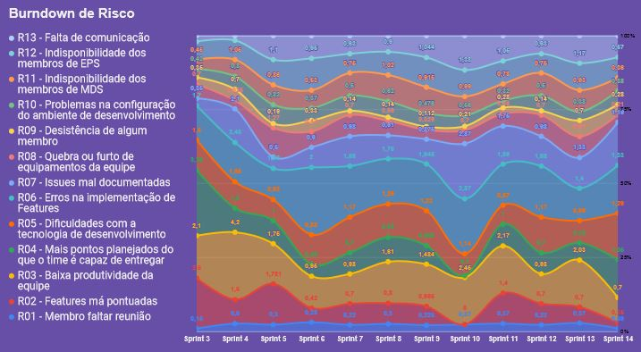

# Planejamento da Sprint 14

**Data de Início:** 03/12/2020  

**Data de Término:** 10/12/2020

**Duração:** 7 dias

**Pontos Planejados**: 70 (dos adicionados)

**Pontos Adicionados**: 109

**Pontos Totais**: 109

-------

- [Planejamento da Sprint 14](#planejamento-da-sprint-14)
  - [1. Pareamentos](#1-pareamentos)
  - [2. Objetivos da _Sprint_](#2-objetivos-da-sprint)
  - [3. Mudanças](#3-mudanças)
  - [4. Burndown de Risco](#4-burndown-de-risco)
  - [5. Issues da _Sprint_ e Pontuação](#5-issues-da-sprint-e-pontuação)
    - [5.1 Dívidas técnicas](#51-dívidas-técnicas)
    - [5.2 Novas issues](#52-novas-issues)
    <!-- - [5.3 Issues pós reunião](#53-issues-pós-reunião) -->

-------

## 1. Pareamentos

Como não há novas issues, não houve escolha de novos pareamentos nessa sprint.

## 2. Objetivos da _Sprint_

O objetivo dessa sprint é finalizar todas as divídas técnicas, gerar o entregável final e organizar o vídeo de apresentação da Release 2.

## 3. Mudanças

- Não há nenhuma mudança significativa para essa sprint

## 4. Burndown de Risco

## 5. Issues da _Sprint_ e Pontuação

### 5.1 Dívidas técnicas

| Issue       | Pontos     | Status     |
| :------------- | :----------: | -----------: |
| [Fazer EVM ágil](https://github.com/fga-eps-mds/2020.1-GaiaDex-wiki/issues/125) | 5 | Não Concluído |
| [US13 - Visualizar perfil de outro usuário (backend)](https://github.com/fga-eps-mds/2020.1-GaiaDex-BackEnd/issues/) | 2 | Em andamento |
[Refatorar critérios de aceitação](https://github.com/fga-eps-mds/2020.1-Grupo2-wiki/issues/96) | 3 | Não Concluído |
[Testes no back](https://github.com/fga-eps-mds/2020.1-GaiaDex-BackEnd/issues/113) | 5 | Em andamento | 
[Configurar CI/CD](https://github.com/fga-eps-mds/2020.1-GaiaDex-wiki/issues/) | 13 | Em andamento |
[US02 - Visualizar minha coleção (frontend)](https://github.com/fga-eps-mds/2020.1-GaiaDex-FrontEnd/issues/) | 5 | Não Concluído |
[US03 - Visualizar informações da Minha Planta (frontend)](https://github.com/fga-eps-mds/2020.1-GaiaDex-FrontEnd/issues/) | 8 | Não Concluído |
[Finalizar Protótipo](https://github.com/fga-eps-mds/2020.1-GaiaDex-wiki/issues/) | 13 | Não Concluído |
[US10 - Visualizar configurações da conta (frontend)](https://github.com/fga-eps-mds/2020.1-GaiaDex-FrontEnd/issues/) | 3 | Em andamento |
[US26 - Visualizar minha coleção de favoritos (frontend)](https://github.com/fga-eps-mds/2020.1-GaiaDex-FrontEnd/issues/) | 5 | Em andamento |
[Testes no front](https://github.com/fga-eps-mds/2020.1-GaiaDex-FrontEnd/issues/) | 13 | Em andamento|
| [Adicionar Sonarqube ao projeto](https://github.com/fga-eps-mds/2020.1-GaiaDex-wiki/issues/) | 21 | Em andamento
| [US24 - Adicionar planta aos meus Favoritos (frontend)](https://github.com/fga-eps-mds/2020.1-GaiaDex-FrontEnd/issues/) | 5 | Em andamento |
| [US25 - Remover uma planta da minha coleção de favoritos (frontend)](https://github.com/fga-eps-mds/2020.1-GaiaDex-FrontEnd/issues/) | 3 | Em andamento

### 5.2 Novas issues

Não há novas issues, pois o objetivo dessa última sprint é fechar em definitivo todas as dívidas técnicas e se preparar para a R2.