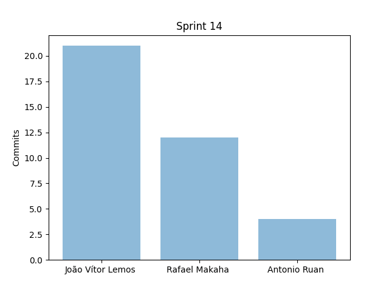
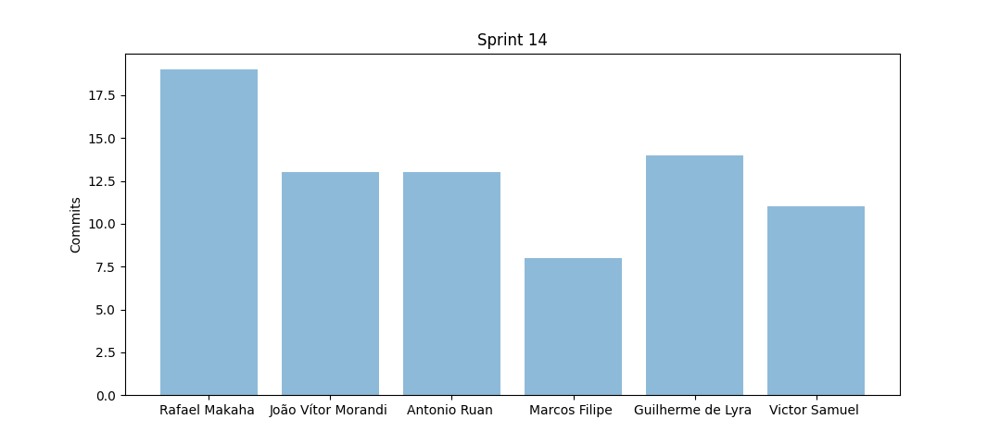
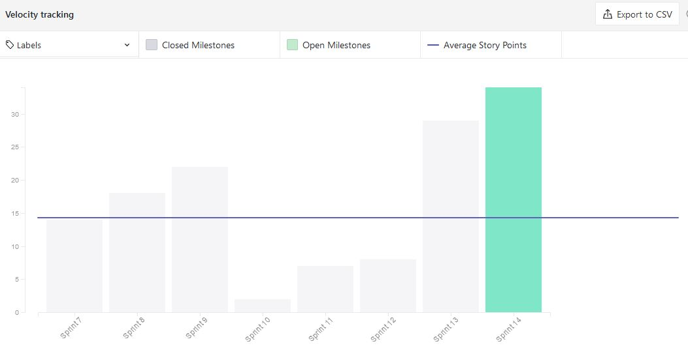
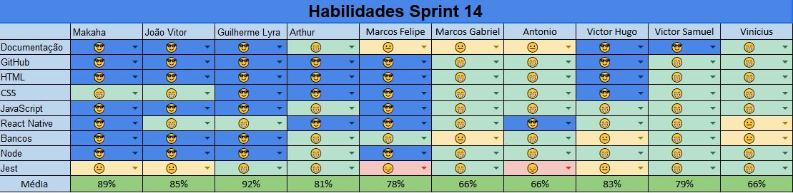
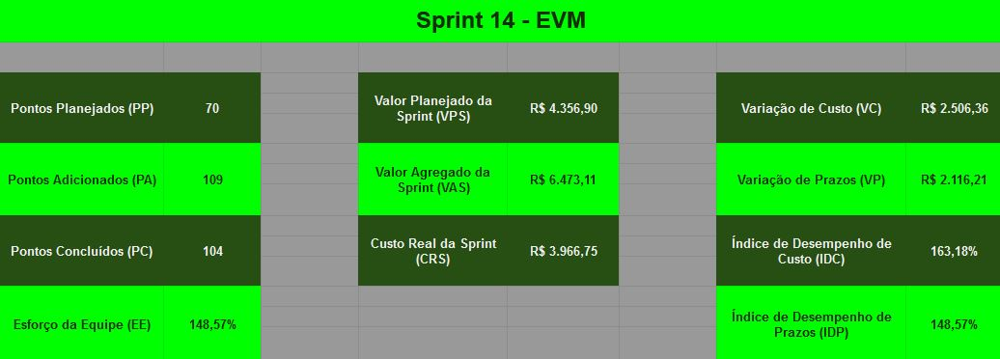

# Resultados da Sprint 14

- [Resultados da Sprint 14](#resultados-da-sprint-14)
  - [1. Indicadores de Qualidade do Processo](#1-indicadores-de-qualidade-do-processo)
    - [1.1 Fechamento da _Sprint_](#11-fechamento-da-sprint)
    - [1.2 _Burndown_](#12-burndown)
    - [1.3 Gráfico de _commits_](#13-gráfico-de-commits)
    - [1.4 _Velocity_](#14-velocity)
    - [1.5 Quadro de Horas](#15-quadro-de-horas)
    - [1.6 Quadro de Conhecimento](#16-quadro-de-conhecimento)
    - [1.7 EVM](#17-evm)
    - [1.8 Revisão da _Sprint_](#18-revisão-da-sprint)
  - [2 Retrospectiva](#2-retrospectiva)
    - [2.1 Análise do _Scrum Master_](#21-análise-do-scrum-master)
  
- [2 Retrospectiva](#2-retrospectiva)
  - [2.1 Análise do _Scrum Master_](#21-análise-do-scrum-master)

------

## 1. Indicadores de Qualidade do Processo

### 1.1 Fechamento da _Sprint_

| Issue       | Pontos     | Status     |
| :------------- | :----------: | -----------: |
| [Fazer EVM ágil](https://github.com/fga-eps-mds/2020.1-GaiaDex-wiki/issues/125) | 5 | Concluído |
| [US13 - Visualizar perfil de outro usuário (backend)](https://github.com/fga-eps-mds/2020.1-GaiaDex-BackEnd/issues/) | 2 | Cancelado |
[Refatorar critérios de aceitação](https://github.com/fga-eps-mds/2020.1-Grupo2-wiki/issues/96) | 3 | Cancelado|
[Testes no back](https://github.com/fga-eps-mds/2020.1-GaiaDex-BackEnd/issues/113) | 5 | Concluído | 
[Configurar CI/CD](https://github.com/fga-eps-mds/2020.1-GaiaDex-wiki/issues/) | 13 | Concluído |
[US02 - Visualizar minha coleção (frontend)](https://github.com/fga-eps-mds/2020.1-GaiaDex-FrontEnd/issues/) | 5 | Concluído |
[US03 - Visualizar informações da Minha Planta (frontend)](https://github.com/fga-eps-mds/2020.1-GaiaDex-FrontEnd/issues/) | 8 | Concluído |
[Finalizar Protótipo](https://github.com/fga-eps-mds/2020.1-GaiaDex-wiki/issues/) | 13 | Concluído |
[US10 - Visualizar configurações da conta (frontend)](https://github.com/fga-eps-mds/2020.1-GaiaDex-FrontEnd/issues/) | 3 | Concluído|
[US26 - Visualizar minha coleção de favoritos (frontend)](https://github.com/fga-eps-mds/2020.1-GaiaDex-FrontEnd/issues/) | 5 | Concluído |
[Testes no front](https://github.com/fga-eps-mds/2020.1-GaiaDex-FrontEnd/issues/) | 13 | Concluído|
| [Adicionar Sonarqube ao projeto](https://github.com/fga-eps-mds/2020.1-GaiaDex-wiki/issues/) | 21 | Concluído
| [US24 - Adicionar planta aos meus Favoritos (frontend)](https://github.com/fga-eps-mds/2020.1-GaiaDex-FrontEnd/issues/) | 5 | Concluído |
| [US25 - Remover uma planta da minha coleção de favoritos (frontend)](https://github.com/fga-eps-mds/2020.1-GaiaDex-FrontEnd/issues/) | 3 | Concluído

Dos 109 pontos planejados, 104 foram entregues e 5 foram cancelados. Algumas issues não foram fechadas, pois estão incompletas e serão adicionadas como dívidas técnicas para a próxima sprint.

### 1.2 _Burndown_

### 1.3 Gráfico de _commits_

Abaixo segue o gráfico de _commits_ referente a wiki do projeto.

Abaixo segue o gráfico de _commits_ referente ao backend do projeto.

Abaixo segue o gráfico de _commits_ referente ao frontend do projeto.

### 1.4 _Velocity_

### 1.5 Quadro de Horas

### 1.6 Quadro de Conhecimento

### 1.7 EVM

### 1.8 Revisão da _Sprint_

Nessa _Sprint_:

- Houve uma reunião para realizar o pós-mortem, mas ela foi adiada na metade por falta de tempo
- A homologação do back quebrou devido a branch de testes ter sido aceita

## 2 Retrospectiva

### 2.1 Análise do _Scrum Master_

A sprint foi muito boa no quesito produtividade, nós de EPS fechamos os documentos necessários e MDS conseguiu fechar as últimas telas do front e os testes.

A maioria do time se empenhou para terminar tudo o que precisava.

Todas a telas foram entregues, e todas as issues concluídas, com exceção de algumas descartadas e a de critérios de aceitação, que serão mantidos.
