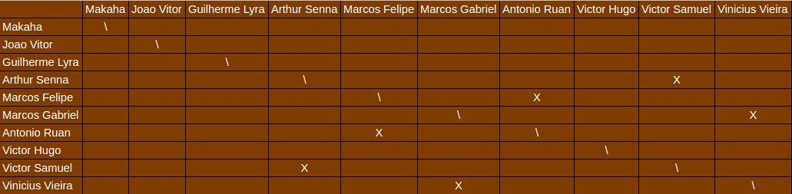

# Planejamento da Sprint 2

**Data de Início:** 11/09/2020  

**Data de Término:** 17/09/2020

**Duração:** 6 dias

**Pontos Planejados**: 59

**Pontos Adicionados**: 26

**Pontos Totais**: 85

-------

- [Planejamento da Sprint 2](#planejamento-da-sprint-2)
  - [1. Pareamentos](#1-pareamentos)
  - [2. Mudanças](#2-mudanças)
  - [3. Issues da _Sprint_ e Pontuação](#3-issues-da-sprint-e-pontuação)
    - [3.1 Dívidas técnicas](#31-dívidas-técnicas)
    - [3.2 Novas issues](#32-novas-issues)

-------

## 1. Pareamentos

## 2. Mudanças

Não haverá dockerização no front-end 

Inicio dos pareamentos

## 3. Issues da _Sprint_ e Pontuação

EPS:
* Critérios de Aceitação
* Plano de gerenciamento de riscos
* Plano de comunicação
* Documento Suplementar

Todos
* Evolução do Protótipo

MDS

Dupla 1: Arthur e Victor Santos

* US05 - Cadastrar minha conta no aplicativo
* US08 - Alterar os dados cadastrados na minha conta
* US09 - Deletar minha conta

Dupla 2: Marcos Gabriel e Vinicius

* US06 - Fazer login no aplicativo
* US07 - Fazer logout no aplicativo
 
Dupla 3: Marcos Felipe e Antonio Ruan

* US28 - Visualizar informações sobre a planta
* Popular banco com PlantNet

Extra: Victor Hugo

### 3.1 Dívidas técnicas

[Issue 15 - Update Product Backlog](https://github.com/fga-eps-mds/2020.1-Grupo2-wiki/issues/15) - 5 

[Issue 17 - Project Opening Term](https://github.com/fga-eps-mds/2020.1-Grupo2-wiki/issues/17) - 5

[Issue 23 - Treinamento de teste](https://github.com/fga-eps-mds/2020.1-Grupo2-wiki/issues/23) - 3

[Issue 24 - Architecture Document](https://github.com/fga-eps-mds/2020.1-Grupo2-wiki/issues/24) - 5

[Issue 22 -Treinamento react-native](https://github.com/fga-eps-mds/2020.1-Grupo2-wiki/issues/22) - 8

### 3.2 Novas issues

[Issue 36 - Critérios de Aceitação](https://github.com/fga-eps-mds/2020.1-Grupo2-wiki/issues/36)

* João Vítor - 8
* Makaha - 5
* Lyra - 8
* Ruan - 5
* Victor Hugo - X
* Vinícius - 3
* Arthur - 
* Marcos Felipe - 8
* Victor Santos - 3
* Marcos Gabriel - 8

Resultado Final - 8

[issue 37 - Plano de gerenciamento de riscos](https://github.com/fga-eps-mds/2020.1-Grupo2-wiki/issues/37)

Não houve votação para essa issue. Assumimos a pontuação. 

Resultado Final - 5

[Issue 38 - Plano de comunicação](https://github.com/fga-eps-mds/2020.1-Grupo2-wiki/issues/38)

* João Vítor - 2
* Makaha - 1
* Lyra - 1
* Ruan - 2
* Victor Hugo - X
* Vinícius - 3
* Arthur - 2
* Marcos Felipe - 2
* Victor Santos - 5 
* Marcos Gabriel - 2
* 
Resultado Final - 2

[Issue 39 - Documento Suplementar](https://github.com/fga-eps-mds/2020.1-Grupo2-wiki/issues/39)

* João Vítor - 5
* Makaha - 2
* Lyra - 3
* Ruan - 8
* Victor Hugo - X
* Vinícius - 3
* Arthur - 3
* Marcos Felipe - 3
* Victor Santos - 3
* Marcos Gabriel - 8
  
Resultado Final - 3

[Issue 40 - Evolução do Protótipo](https://github.com/fga-eps-mds/2020.1-Grupo2-wiki/issues/40)

* João Vítor - 13
* Makaha - 5
* Lyra - 13
* Ruan - 5
* Victor Hugo - X
* Vinícius - 5
* Arthur - 8
* Marcos Felipe - 8
* Victor Santos - 8
* Marcos Gabriel - 8
  
Resultado Final - 8

Issue 05 - US05 - Cadastrar minha conta no aplicativo[Backend](https://github.com/fga-eps-mds/2020.1-Grupo2-BackEnd/issues/5)[Frontend](https://github.com/fga-eps-mds/2020.1-Grupo2-FrontEnd/issues/4)

* João Vítor - 5
* Makaha - 5
* Lyra - 13
* Ruan - 5
* Victor Hugo - X
* Vinícius - 5
* Arthur - 5
* Marcos Felipe - 5
* Victor Santos - 5
* Marcos Gabriel - 8
  
Resultado Final - 5

US06 - Fazer login no aplicativo [Backend](US06 - Fazer login no aplicativo) [Frontend](https://github.com/fga-eps-mds/2020.1-Grupo2-FrontEnd/issues/5)

* João Vítor - 3
* Makaha - 3
* Lyra - 8
* Ruan - 5
* Victor Hugo - X 
* Vinícius - 5
* Arthur - 5
* Marcos Felipe - 5
* Victor Santos - 5
* Marcos Gabriel - 5
  
Resultado Final - 5

US07 - Fazer logout no aplicativo [Backend](https://github.com/fga-eps-mds/2020.1-Grupo2-BackEnd/issues/7) [FrontEnd](https://github.com/fga-eps-mds/2020.1-Grupo2-FrontEnd/issues/6)

* João Vítor - 2
* Makaha - 2
* Lyra - 1
* Ruan - 2
* Victor Hugo - X
* Vinícius - 5
* Arthur - 3
* Marcos Felipe - 3
* Victor Santos - 3
* Marcos Gabriel - 5
  
Resultado Final - 3

US08 - Alterar os dados cadastrados na minha conta [Backend](https://github.com/fga-eps-mds/2020.1-Grupo2-BackEnd/issues/8) [FrontEnd](https://github.com/fga-eps-mds/2020.1-Grupo2-BackEnd/issues/9)

* João Vítor - 3
* Makaha - 2
* Lyra - 1
* Ruan - 2
* Victor Hugo - X
* Vinícius - 3
* Arthur - 2
* Marcos Felipe - 2
* Victor Santos - 3
* Marcos Gabriel - 5
  
Resultado Final - 2

US09 - Deletar minha conta [Backend](https://github.com/fga-eps-mds/2020.1-Grupo2-BackEnd/issues/10) [Frontend](https://github.com/fga-eps-mds/2020.1-Grupo2-FrontEnd/issues/7)

* João Vítor - 2
* Makaha - 2
* Lyra - 1
* Ruan - 2
* Victor Hugo - X
* Vinícius - 2
* Arthur - 2
* Marcos Felipe - 1
* Victor Santos - 2
* Marcos Gabriel - 3
  
Resultado Final - 2

US28 - Visualizar informações sobre a planta [Backend](https://github.com/fga-eps-mds/2020.1-Grupo2-BackEnd/issues/11) [Frontend](https://github.com/fga-eps-mds/2020.1-Grupo2-FrontEnd/issues/8)

* João Vítor - 8
* Makaha - 8
* Lyra - 21
* Ruan - 5
* Victor Hugo - 
* Vinícius - 5
* Arthur - 8
* Marcos Felipe - 8
* Victor Santos - 8
* Marcos Gabriel - 8

Resultado Final - 8

[Issue 12 - Popular banco com PlantNet](https://github.com/fga-eps-mds/2020.1-Grupo2-BackEnd/issues/12)

* João Vítor - 8
* Makaha - 5
* Lyra - 8
* Ruan - 5
* Victor Hugo - 
* Vinícius - 5
* Arthur - 8
* Marcos Felipe - 5
* Victor Santos - 8
* Marcos Gabriel - 8

Resultado Final - 8
