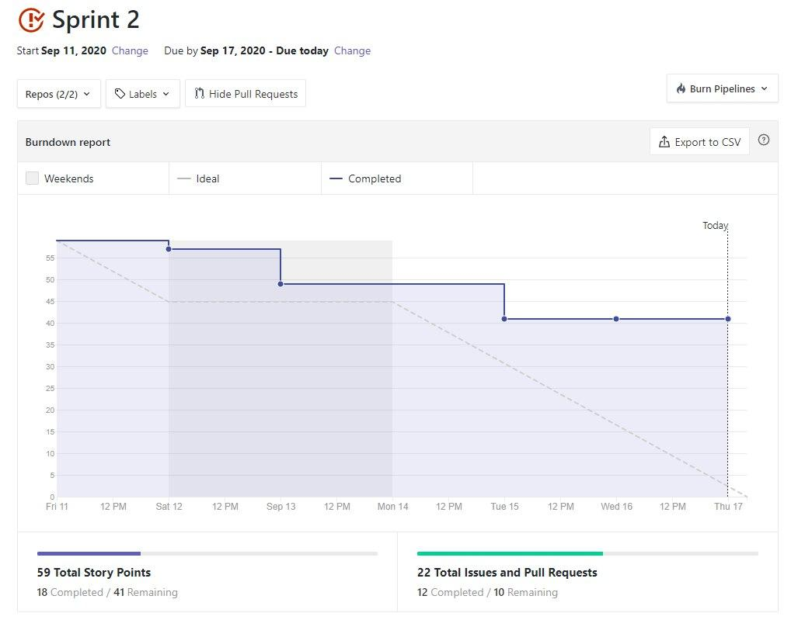
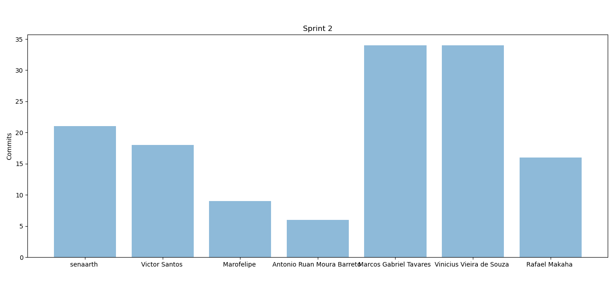
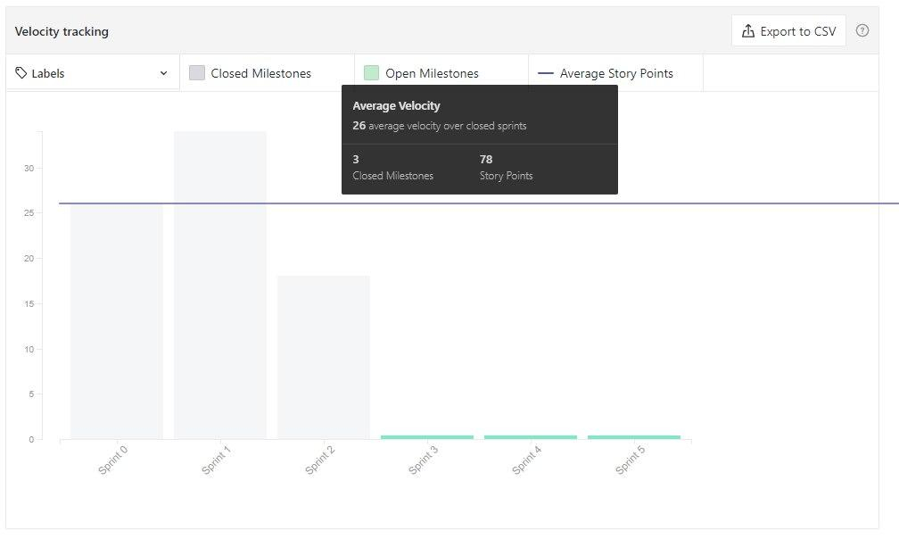
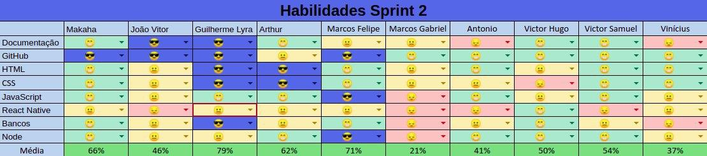

# Resultados da Sprint 2

[1. Indicadores de Qualidade do Processo](#1-indicadores-de-qualidade-do-processo)
  - [1.1 Fechamento da _Sprint_](#11-fechamento-da-sprint)
  - [1.2 _Burndown_](#12-burndown)
  - [1.3 Gráfico de _commits_](#13-gráfico-de-commits)
  - [1.4 _Velocity_](#14-velocity)
  - [1.5 Quadro de Horas](#15-quadro-de-horas)
  - [1.6 Quadro de Conhecimento](#16-quadro-de-conhecimento)
  - [1.7 EVM](#17-evm)
  - [1.8 Revisão da _Sprint_](#18-revisão-da-sprint)
  
[2 Retrospectiva](#2-retrospectiva)
  - [2.1 Análise do _Scrum Master_](#21-análise-do-scrum-master) 

------

## 1. Indicadores de Qualidade do Processo

### 1.1 Fechamento da _Sprint_
| Issue       | Pontos     | Status     |
| :------------- | :----------: | -----------: |
| [Issue 15 - Update Product Backlog](https://github.com/fga-eps-mds/2020.1-Grupo2-wiki/issues/15)| 5 | Concluído|
| [Issue 17 - Project Opening Term](https://github.com/fga-eps-mds/2020.1-Grupo2-wiki/issues/17)| 5 | Concluído|
| [Issue 23 - Treinamento de teste](https://github.com/fga-eps-mds/2020.1-Grupo2-wiki/issues/23)| 3 | Cancelado |
| [Issue 24 - Architecture Document](https://github.com/fga-eps-mds/2020.1-Grupo2-wiki/issues/24)| 5 | Concluído|
| [Issue 22 -Treinamento react-native](https://github.com/fga-eps-mds/2020.1-Grupo2-wiki/issues/22)| 8 | Cancelado|
| [Issue 36 - Critérios de Aceitação](https://github.com/fga-eps-mds/2020.1-Grupo2-wiki/issues/36)| 8 | Concluído |
| [Issue 37 - Plano de gerenciamento de riscos](https://github.com/fga-eps-mds/2020.1-Grupo2-wiki/issues/37)| 5 | Concluído|
| [Issue 38 - Plano de comunicação](https://github.com/fga-eps-mds/2020.1-Grupo2-wiki/issues/38)| 2 | Concluído|
| [Issue 39 - Documento Suplementar](https://github.com/fga-eps-mds/2020.1-Grupo2-wiki/issues/39)| 3 | Concluído|
| [Issue 40 - Evolução do Protótipo](https://github.com/fga-eps-mds/2020.1-Grupo2-wiki/issues/40)| 8 | Em Andamento|
| [Issue 05 (backend) - US04 - Cadastrar minha conta no aplicativo(Backend)](https://github.com/fga-eps-mds/2020.1-Grupo2-BackEnd/issues/5)| 5 | Em Andamento|
| [Issue 06 (backend) - US07 - Fazer login no aplicativo (Backend)](https://github.com/fga-eps-mds/2020.1-Grupo2-FrontEnd/issues/6)| 5 | Em Andamento|
| [Issue 07 (backend) - US08 - Fazer logout no aplicativo (Backend)](https://github.com/fga-eps-mds/2020.1-Grupo2-BackEnd/issues/7)| 3 | Em Andamento|
| [Issue 08 (backend) - US11 - Alterar os dados cadastrados na minha conta (Backend)](https://github.com/fga-eps-mds/2020.1-Grupo2-BackEnd/issues/8) | 2 | Em Andamento|
| [Issue 10 (backend) - US12 - Deletar minha conta (Backend)](https://github.com/fga-eps-mds/2020.1-Grupo2-BackEnd/issues/10)| 2 | Em Andamento|
| [Issue 11 (backend) - US23 - Visualizar informações sobre a planta (Backend)](https://github.com/fga-eps-mds/2020.1-Grupo2-BackEnd/issues/11)| 8 | Em Andamento|
| [Issue 12 (backend) - Popular banco com PlantNet](https://github.com/fga-eps-mds/2020.1-Grupo2-BackEnd/issues/12)| 8 | Em Andamento|
| Pontos Totais | 85 | |
| Pontos entregues | 33 |  |

 

Dos 85 pontos planejados, 33 foram entregues. Algumas issues não foram fechadas, pois estão incompletas e serão adicionadas como dívidas técnicas para a próxima sprint.

### 1.2 _Burndown_

### 1.3 Gráfico de _commits_

Abaixo segue o gráfico de _commits_ referente a wiki do projeto.

Abaixo segue o gráfico de _commits_ referente ao backend do projeto.

### 1.4 _Velocity_

### 1.5 Quadro de Horas

### 1.6 Quadro de Conhecimento

 

### 1.7 EVM

### 1.8 Revisão da _Sprint_

Nessa _Sprint_ houveram os problemas:

* Dificuldade com Git rebase
* Dificuldade em manter o registro de hora
* Dificuldade com tecnologias
* Evolução do Protótipo não avançou
* Problema na instalação do ambiente docker
* Atraso na configuração de ambiente backend
* ScrumPoker caiu durante a votação

## 2 Retrospectiva

| Pontos Positivos | Pontos Negativos |
| :------------- | :----------: |
| Bons pareamentos entre EPS e MDS | Não saber o que é Revisão e retrospectiva |
| Documentação planejada entregue | Pontuação extremamente alta |
| Evolução grande nos conhecimentos em NodeJS | Decisão de estrutura de pastas lenta |
| Pareamentos Eficientes |  |

 

### 2.1 Análise do _Scrum Master_

Esta _Sprint_ foi bem produtiva para EPS. Todos os pontos planejados foram entregues e, também, pontos de dívidas técnicas foram finalizados. Porém, em MDS, nnhum ponto foi entregue,. Isso se deu a dificuldade com a utilização da tecnologia NodeJS e, também, pela divergência no padrão de organização de arquivos internos ao projeto adotada por cada dupla de pareamento.

Mesmo com MDS não entregando seus pontos, eles demonstraram grande evolução de conhecimentos com a tecnologia. As dívidas técnicas não serão problemas para a _Sprint_ seguinte, pois já estão quase todos finalizados.

Nesta _Sprint_ dois membros de EPS trabalharam muito para o andamento da parte de gerência poder funcionar, bem como parear com MDS para ajudá-los com conhecimentos e dúvidas. Gostaria de parabenizar o [João Vitor Morandi](http://github.com/joaovitorml) e [Rafael Makaha](http://github.com/rafaelmakaha) pelo grande esforço realizado nesta sprint.

