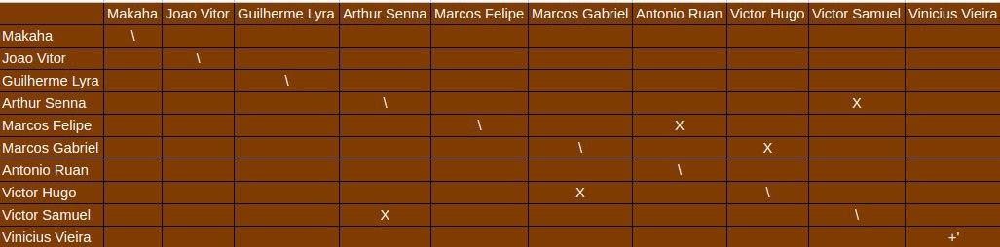
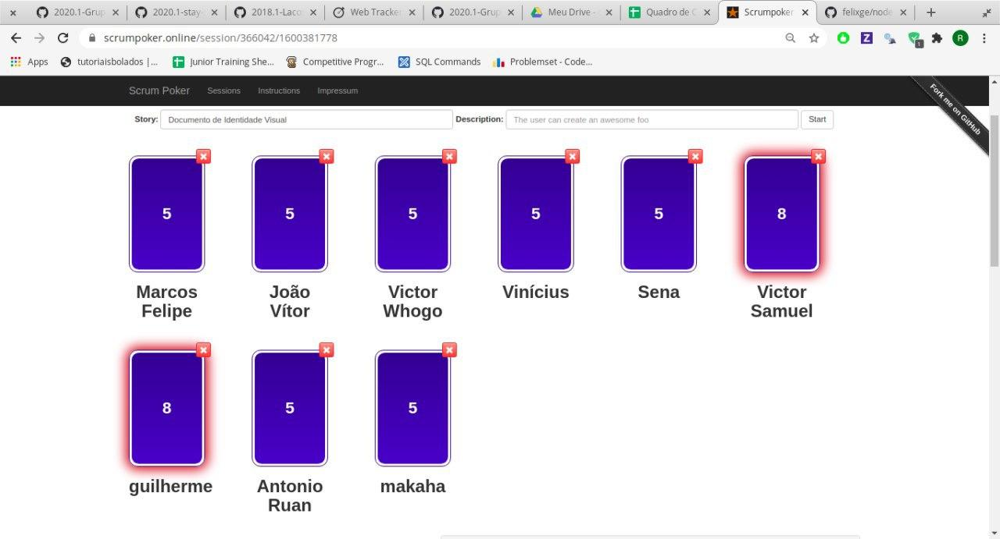
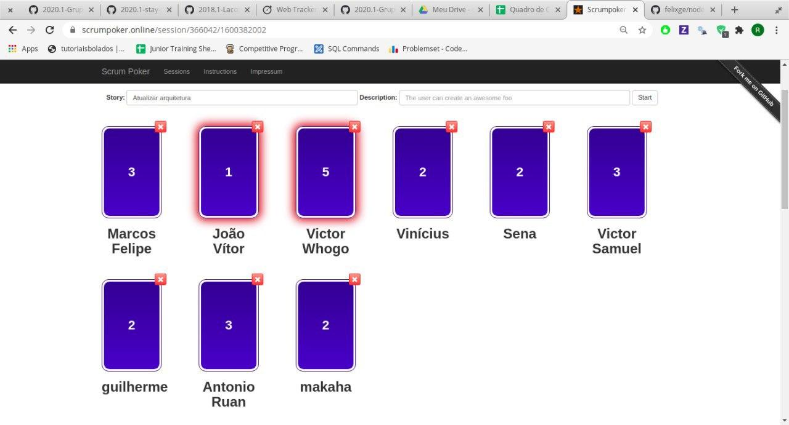
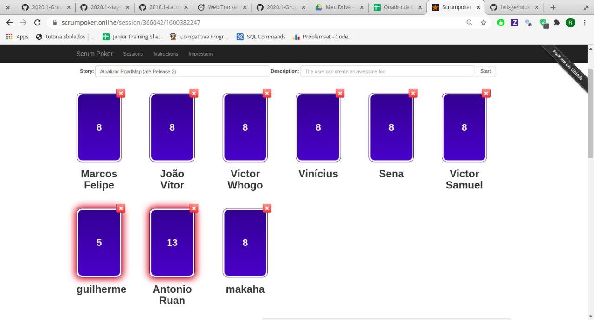
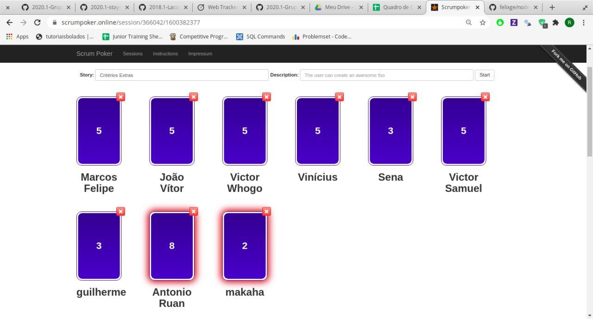
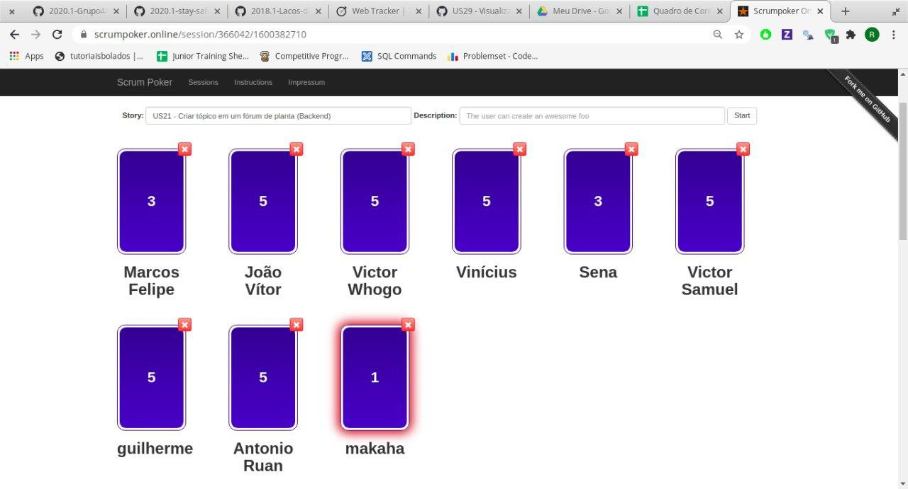
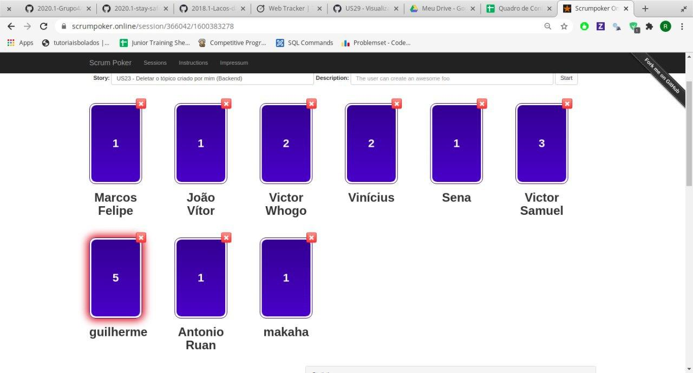
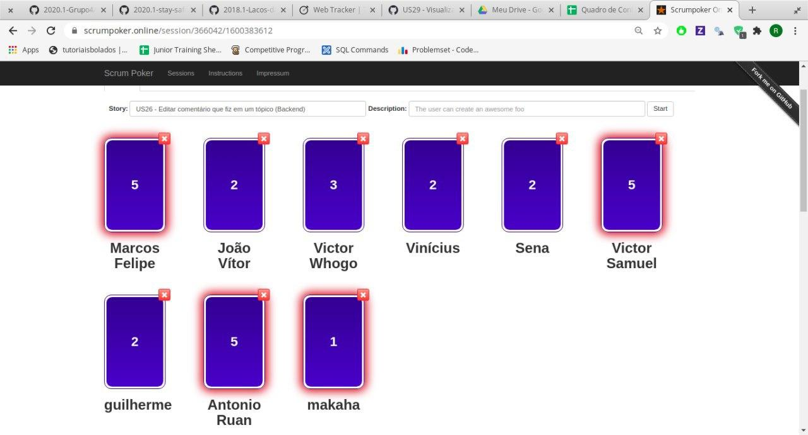

# Planejamento da Sprint 3

**Data de Início:** 17/09/2020

**Data de Término:** 24/09/2020

**Duração:** \* 7 dias

**Pontos Planejados**: 71

**Pontos Adicionados**: 41

**Pontos Totais**: 113

**QTDE Membros Presentes na reunião (17/09)**: 9

**Membros Ausentes**: Marcos Gabriel

---

[1. Pareamentos](#1-pareamentos)

[2. Objetivos da Sprint](#2-objetivos-da-sprint)

[3. Mudanças](#3-mudanças)

[4. Burndown de Risco](#4-burndown-de-risco)

[5. Features da Sprint e Pontuação](#5-features-da-sprint-e-pontuação)

- [5.1 Dívidas técnicas](#51-dívidas-técnicas)
- [5.2 Novas Issues](#52-novas-issues)

---

## 1. Pareamentos

## 2. Objetivos da _Sprint_

- Finalizar CRUDs no Backend e adicionar mais o CRUD de Fórums
- Iniciar o desenvolvimento no frontend das issues anteriormente feitas no backend
- Fazer novas histórias no backend
- Adiantar documentos para Release 1

## 3. Mudanças

- Aqui há uma alteração que será feita durante a sprint
- Os membros estão aparecendo com maior frequencia nas dailies
- O aplicativo vai se chamar GaiaDex
- Cancelamos as issues de treinamento de testes e do react-native por falta de tempo

## 4. Burndown de Risco

| #   | Descrição                                                | Probabilidade do Risco | Tamanho da Perda (dias) | Exposição ao Risco |
| :-- | :------------------------------------------------------- | :--------------------- | :---------------------- | :----------------- |
| R01 | Membro faltar reunião                                    | 15%                    | 1                       | 0,15               |
| R02 | Features má pontuadas                                    | 50%                    | 5                       | 2,5                |
| R03 | Baixa produtividade da equipe                            | 30%                    | 7                       | 2,1                |
| R04 | Mais pontos planejados do que o time é capaz de entregar | 65%                    | 5                       | 3,25               |
| R05 | Dificuldades com a tecnologia de desenvolvimento         | 50%                    | 3                       | 1,5                |
| R06 | Erros na implementação de Features                       | 20%                    | 7                       | 1,7                |
| R07 | Issues mal documentadas                                  | 5%                     | 7                       | 0,35               |
| R08 | Quebra ou furto de equipamentos da equipe                | 10%                    | 7                       | 0,7                |
| R09 | Desistência de algum membro                              | 5%                     | 7                       | 0,35               |
| R10 | Problemas na configuração do ambiente de desenvolvimento | 21%                    | 2                       | 0,42               |
| R11 | Indisponibilidade dos membros de MDS                     | 15%                    | 3                       | 0,45               |
| R12 | Indisponibilidade dos membros de EPS                     | 30%                    | 3                       | 0,9                |
| R13 | Falta de comunicação                                     | 10%                    | 3                       | 0,3                |
|     |                                                          |                        | Exposição:              | -                  |

## 5. Issues da _Sprint_ e Pontuação

EPS

- EAP
- Atualizar arquitetura
- Atualizar RoadMap (até Release 2)
- Critérios Extras
- Gerar todas as issues nos repositórios

MDS

Dupla 1: Arthur e Vitor Samuel

- US15 - Criar tópico em um fórum de planta (Backend)
- US16 - Editar tópico criado por mim (Backend)
- US17 - Deletar o tópico criado por mim (Backend)
- US18 - Upvote e downvote em um tópico (Backend)
- US19 - Criar comentário em um tópico (Backend)
- US20 - Editar comentário que fiz em um tópico (Backend)
- US21 - Remover um comentário que fiz em um tópico (Backend)
- US22 - Upvote e downvote em um comentário (Backend)

Dupla 2: Victor Hugo e Marcos Gabriel

- US04 - Cadastrar minha conta no aplicativo (FrontEnd)
- US07 - Fazer login no aplicativo (FrontEnd)
- US08 - Fazer logout no aplicativo (FrontEnd)
- US11 - Alterar os dados cadastrados na minha conta (FrontEnd)
- US12 - Deletar minha conta (FrontEnd)

Dupla 3: Marcos Felipe e Antonio Ruan

- US23 - Visualizar informações sobre a planta (FrontEnd)

Extra: Vinícius

- Documento de Identidade Visual (com Lyra e João)
- Evolução do protótipo (com o Lyra)e
- Guia de Estilo (com João e Makaha)

### 5.1 Dívidas técnicas

|                                                                       Issue                                                                        | Pontuação |
| :------------------------------------------------------------------------------------------------------------------------------------------------: | :-------: |
|                          [Issue 40 - Evolução do Protótipo](https://github.com/fga-eps-mds/2020.1-Grupo2-wiki/issues/40)                           |     8     |
|     [Issue 05 (backend) - US04 - Cadastrar minha conta no aplicativo(Backend)](https://github.com/fga-eps-mds/2020.1-Grupo2-BackEnd/issues/5)      |     5     |
|         [Issue 06 (backend) - US07 - Fazer login no aplicativo (Backend)](https://github.com/fga-eps-mds/2020.1-Grupo2-FrontEnd/issues/6)          |     5     |
|         [Issue 07 (backend) - US08 - Fazer logout no aplicativo (Backend)](https://github.com/fga-eps-mds/2020.1-Grupo2-BackEnd/issues/7)          |     3     |
| [Issue 08 (backend) - US11 - Alterar os dados cadastrados na minha conta (Backend)](https://github.com/fga-eps-mds/2020.1-Grupo2-BackEnd/issues/8) |     2     |
|            [Issue 10 (backend) - US12 - Deletar minha conta (Backend)](https://github.com/fga-eps-mds/2020.1-Grupo2-BackEnd/issues/10)             |     2     |
|   [Issue 11 (backend) - US23 - Visualizar informações sobre a planta (Backend)](https://github.com/fga-eps-mds/2020.1-Grupo2-BackEnd/issues/11)    |     8     |
|                 [Issue 12 (backend) - Popular banco com PlantNet](https://github.com/fga-eps-mds/2020.1-Grupo2-BackEnd/issues/12)                  |     8     |

### 5.2 Novas issues

### Documentação

[EAP](#) - Votação

Resultado Final - 2

[Guia de Estilo](#) - Votação

- João Vítor - 5
- Makaha - 3
- Lyra - 3
- Ruan - 5
- Victor Hugo - 3
- Vinícius - 5
- Arthur - 5
- Marcos Felipe - 5
- Victor Santos - 3

Resultado Final - 3

[Documento de Identidade Visual](#) - Votação

Resultado Final - 5

[Atualizar arquitetura](#) - Votação

Resultado Final - 2

[Atualizar RoadMap (até Release 2)](#) - Votação

Resultado Final - 8

[Critérios Extras](#) - Votação

Resultado Final - 5

[Gerar todas as issues nos repositórios](#) - Votação

Resultado Final - 5

### Backend

[US15 - Criar tópico em um fórum de planta (Backend)](#) - Votação

Resultado Final - 5

[US16 - Editar tópico criado por mim (Backend)](#) - Votação

Resultado Final - 3

[US17 - Deletar o tópico criado por mim (Backend)](#) - Votação

Resultado Final - 1

[US18 - Upvote e downvote em um tópico (Backend)](#) - Votação

Resultado Final - 2

[US19 - Criar comentário em um tópico (Backend)](#) - Votação

Resultado Final - 3

[US20 - Editar comentário que fiz em um tópico (Backend)](#) - Votação

Resultado Final - 2

[US21 - Remover um comentário que fiz em um tópico (Backend)](#) - Votação

Resultado Final - 2

[US22 - Upvote e downvote em um comentário (Backend)](#) - Votação

Resultado Final - 1

### Frontend

[US04 - Cadastrar minha conta no aplicativo (FrontEnd)](https://github.com/fga-eps-mds/2020.1-grupo2-frontend/issues/4)

- Sem votação, assumimos pontuação 3

[Issue 05 (frontend) - US07 - Fazer login no aplicativo (Frontend)](https://github.com/fga-eps-mds/2020.1-Grupo2-FrontEnd/issues/6) - Votação

- João Vítor - 5
- Makaha - 5
- Lyra - X
- Ruan - 5
- Victor Hugo - 5
- Vinícius - 5
- Arthur - 5
- Marcos Felipe - 5
- Victor Santos - 3

Resultado Final - 5

[Issue 06 (frontend) - US08 - Fazer logout no aplicativo (FrontEnd)](https://github.com/fga-eps-mds/2020.1-Grupo2-FrontEnd/issues/6) - Votação

- João Vítor - 2
- Makaha - 3
- Lyra - 3
- Ruan - 3
- Victor Hugo - 3
- Vinícius - 2
- Arthur - 3
- Marcos Felipe - 3
- Victor Santos - 3

Resultado Final - 3

[Issue 09 (frontend) - US11 - Alterar os dados cadastrados na minha conta (FrontEnd)](https://github.com/fga-eps-mds/2020.1-Grupo2-BackEnd/issues/9) - Votação

- João Vítor - 3
- Makaha - 5
- Lyra - 3
- Ruan - 5
- Victor Hugo - 5
- Vinícius - 3
- Arthur - 3
- Marcos Felipe - 3
- Victor Santos - 5

Resultado Final - 3

[US12 - Deletar minha conta (FrontEnd)](https://github.com/fga-eps-mds/2020.1-Grupo2-FrontEnd/issues/7) - Votação

- João Vítor - 3
- Makaha - 5
- Lyra - 1
- Ruan - 2
- Victor Hugo - 3
- Vinícius - 3
- Arthur - 5
- Marcos Felipe - 3
- Victor Santos - 5

Resultado Final - 5

[US23 - Visualizar informações sobre a planta (Frontend)](https://github.com/fga-eps-mds/2020.1-Grupo2-FrontEnd/issues/8) - Votação

- João Vítor - 5
- Makaha - 3
- Lyra - 13
- Ruan - 3
- Victor Hugo - 3
- Vinícius - 3
- Arthur - 3
- Marcos Felipe - 8
- Victor Santos - 13

Resultado Final - 5
