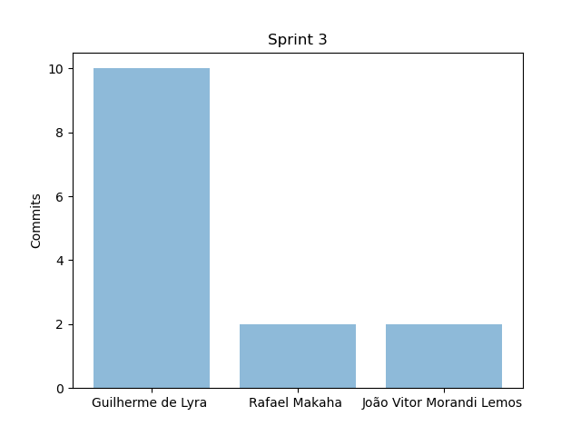
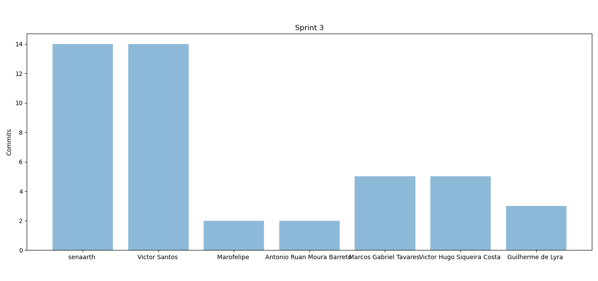
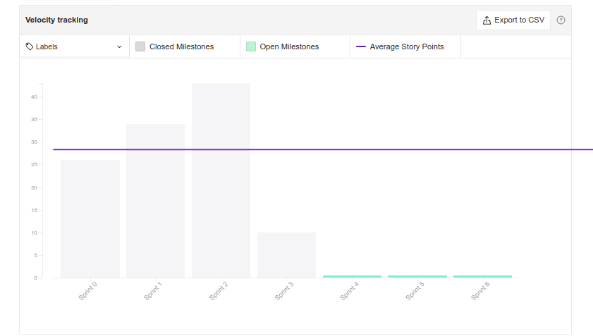
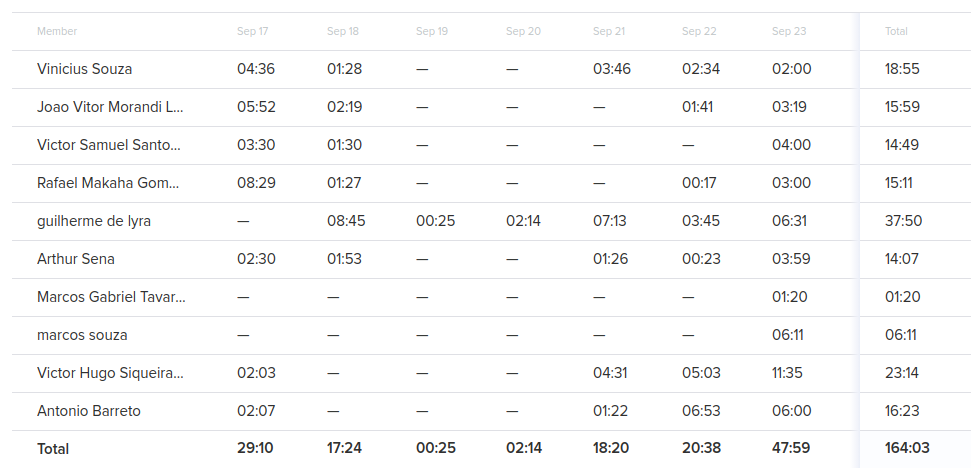
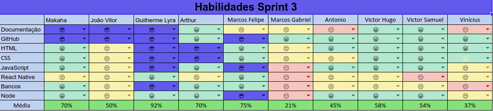

# Resultados da Sprint 3

[1. Indicadores de Qualidade do Processo](#1-indicadores-de-qualidade-do-processo)
  - [1.1 Fechamento da _Sprint_](#11-fechamento-da-sprint)
  - [1.2 _Burndown_](#12-burndown)
  - [1.3 Gráfico de _commits_](#13-gráfico-de-commits)
  - [1.4 _Velocity_](#14-velocity)
  - [1.5 Quadro de Horas](#15-quadro-de-horas)
  - [1.6 Quadro de Conhecimento](#16-quadro-de-conhecimento)
  - [1.7 Revisão da _Sprint_](#17-revisão-da-sprint)
  
[2 Retrospectiva](#2-retrospectiva)
  - [2.1 Análise do _Scrum Master_](#21-análise-do-scrum-master) 

------

## 1. Indicadores de Qualidade do Processo

### 1.1 Fechamento da _Sprint_
| Issue       | Pontos     | Status     |
| :------------- | :----------: | -----------: |
| [Issue 40 - Evolução do Protótipo](https://github.com/fga-eps-mds/2020.1-Grupo2-wiki/issues/40)| 8 | Em Andamento |
| [Issue 05 (backend) - US04 - Cadastrar minha conta no aplicativo(Backend)](https://github.com/fga-eps-mds/2020.1-Grupo2-BackEnd/issues/5)| 5 | Concluído |
| [Issue 06 (backend) - US07 - Fazer login no aplicativo (Backend)](https://github.com/fga-eps-mds/2020.1-Grupo2-FrontEnd/issues/6)| 5 | Não Concluído |
| [Issue 07 (backend) - US08 - Fazer logout no aplicativo (Backend)](https://github.com/fga-eps-mds/2020.1-Grupo2-BackEnd/issues/7)| 3 | Não Concluído |
| [Issue 08 (backend) - US11 - Alterar os dados cadastrados na minha conta (Backend)](https://github.com/fga-eps-mds/2020.1-Grupo2-BackEnd/issues/8) | 2 | Concluído |
| [Issue 10 (backend) - US12 - Deletar minha conta (Backend)](https://github.com/fga-eps-mds/2020.1-Grupo2-BackEnd/issues/10)| 2 | Concluído |
| [Issue 11 (backend) - US23 - Visualizar informações sobre a planta (Backend)](https://github.com/fga-eps-mds/2020.1-Grupo2-BackEnd/issues/11)| 8 | Concluído |
| [Issue 12 (backend) - Popular banco com PlantNet](https://github.com/fga-eps-mds/2020.1-Grupo2-BackEnd/issues/12)| 8 | Concluído |
| [EAP](#) | 2 | Não concluído  |
| [Guia de Estilo](#) | 3 | Não concluído |
| [Documento de Identidade Visual](#) | 5 | Não concluído |
| [Atualizar arquitetura](#) | 2 | Concluído |
| [Atualizar RoadMap (até Release 2)](#) | 8 | Em andamento |
| [Critérios Extras](#) | 5 | Concluído |
| [Gerar todas as issues nos repositórios](#) | 5 | Concluído |
| [US15 - Criar tópico em um fórum de planta (Backend)](#) | 5 | Não Conluído |
| [US16 - Editar tópico criado por mim (Backend)](#) | 3 | Não Concluído |
| [US17 - Deletar o tópico criado por mim (Backend)](#) | 1 | Não Concluído |
| [US18 - Upvote e downvote em um tópico (Backend)](#) | 2 | Não Concluído |
| [US19 - Criar comentário em um tópico (Backend)](#) | 3 | Não Concluído |
| [US20 - Editar comentário que fiz em um tópico (Backend)](#) | 2 | Não Concluído |
| [US21 - Remover um comentário que fiz em um tópico (Backend)](#) | 2 | Não Concluído |
| [Issue 04 (frontend) - US07 - Fazer login no aplicativo (Frontend)](https://github.com/fga-eps-mds/2020.1-Grupo2-FrontEnd/issues/6) | 5 | Não Concluído |
| [Issue 05 (frontend) - US07 - Fazer login no aplicativo (Frontend)](https://github.com/fga-eps-mds/2020.1-Grupo2-FrontEnd/issues/6) | 5 | Não Concluído |
| [Issue 06 (frontend) - US08 - Fazer logout no aplicativo (FrontEnd)](https://github.com/fga-eps-mds/2020.1-Grupo2-FrontEnd/issues/6) | 3 | Não Concluído |
| [Issue 09 (frontend) - US11 - Alterar os dados cadastrados na minha conta (FrontEnd)](https://github.com/fga-eps-mds/2020.1-Grupo2-BackEnd/issues/9) | 3 | Não Concluído |
| [US12 - Deletar minha conta (FrontEnd)](https://github.com/fga-eps-mds/2020.1-Grupo2-FrontEnd/issues/7) | 5 | Não Concluído |
| [US23 - Visualizar informações sobre a planta (Frontend)](https://github.com/fga-eps-mds/2020.1-Grupo2-FrontEnd/issues/8) | 5 | Não Concluído |
| Pontos Totais | 113 | |
| Pontos entregues | 35 |  |

 

Dos 113 pontos planejados, 35 foram entregues. Algumas issues não foram fechadas, pois estão incompletas e serão adicionadas como dívidas técnicas para a próxima sprint.

### 1.2 _Burndown_

### 1.3 Gráfico de _commits_

Abaixo segue o gráfico de _commits_ referente a wiki do projeto.

Abaixo segue o gráfico de _commits_ referente ao backend do projeto.

### 1.4 _Velocity_

### 1.5 Quadro de Horas

### 1.6 Quadro de Conhecimento

 

### 1.7 Revisão da _Sprint_

Nessa _Sprint_ houveram os problemas:

* Muitas issues para MDS, muito acima do que o time foi capaz de entregar
* As issues não foram geradas no repositório, dificultando o trabalho de MDS
* Protótipo ainda não concluído

## 2 Retrospectiva

| Pontos Positivos | Pontos Negativos |
| :------------- | :----------: |
| Primeiros PRs do backend finalmente aceitos | Muita dívida técnica acumulada |

 

### 2.1 Análise do _Scrum Master_

A sprint possuía muitos pontos a serem entregues. Houve muita expectativa em se entregar todos os pontos. Estas falas foram feitas durante o planning, mas o reflexo desta empolgação não foi vista ao longo da sprint em si. Pouquíssimos pontos planejados para MDS foram entregues.

Os membros do time de desenvolvimento apresentaram muitos problemas com as tecnologias utilizadas. Muitos, também, mesmo tendo de replicar as issues já feitas em uma nova visão, não conseguiram entregar suas issues.

Este feedback no burndown de pontos deixa extremamente claro que o planejamento de pontos e issues não está sendo coerente com o volocity do time. Com isso, a gerência fará um replanejamento do roadmap para se adaptar a produtividade do time.