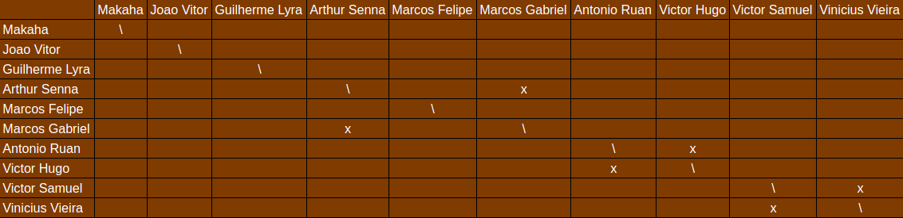
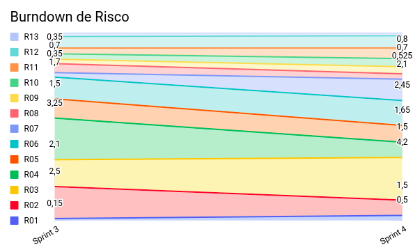

# Planejamento da Sprint 4

**Data de Início:** 24/09/2020  

**Data de Término:** 01/10/2020

**Duração:** * 7 dias

**Pontos Planejados**: 12

**Pontos Adicionados**: 83

**Pontos Totais**: 95

-------

[1. Pareamentos](#1-pareamentos)

[2. Objetivos da Sprint](#2-objetivos-da-sprint)

[3. Mudanças](#3-mudanças)

[4. Burndown de Risco](#4-burndown-de-risco)

[5. Features da Sprint e Pontuação](#5-features-da-sprint-e-pontuação)
* [5.1 Dívidas técnicas](#51-dívidas-técnicas)
* [5.2 Novas Issues](#52-novas-issues)

-------
## 1. Pareamentos

## 2. Objetivos da _Sprint_

Esta sprint tem por objetivo refatorar a visão do produto, bem como atualizar todo e qualquer documento ligada a esta nova visão consolidada.

Paralelamente a isto, haverá o trabalho em issues de dívidas técnicas.

## 3. Mudanças

* Decidimos utilizar essa sprint para sanar todas a dívidas técnicas e refatorar os documentos feitos até então, com base no feedback dado pelo professor Hilmer na reunião realizada dia 25/09, às 10h
* Não houve pontuação para essa sprint, pois ocorreu uma mudança de última hora no planejamento após a reunião com o professor
* A gerência deve se responsabilizar por realizar melhorar o planejamento das issues, ou seja, atualizar o roadmap de produto.

## 4. Burndown de Risco

## 5. Issues da _Sprint_ e Pontuação

### 5.1 Dívidas técnicas

* [Issue 40 - Evolução do Protótipo](https://github.com/fga-eps-mds/2020.1-Grupo2-wiki/issues/40)
* [EAP](#)
* [Guia de Estilo](#)
* [Documento de Identidade Visual](#)
* [Atualizar RoadMap (até Release 2)](#)
* [US15 - Criar tópico em um fórum de planta (Backend)](#) 
* [US16 - Editar tópico criado por mim (Backend)](#)
* [US17 - Deletar o tópico criado por mim (Backend)](#)
* [US18 - Upvote e downvote em um tópico (Backend)](#) 
* [US19 - Criar comentário em um tópico (Backend)](#)
* [US20 - Editar comentário que fiz em um tópico (Backend)](#)
* [US21 - Remover um comentário que fiz em um tópico (Backend)](#)
* [Issue 04 (frontend) - US04 - Cadastrar minha conta no aplicativo (FrontEnd)](https://github.com/fga-eps-mds/2020.1-Grupo2-FrontEnd/issues/4) 
* [Issue 05 (frontend) - US07 - Fazer login no aplicativo (Frontend)](https://github.com/fga-eps-mds/2020.1-Grupo2-FrontEnd/issues/6)
* [Issue 06 (frontend) - US08 - Fazer logout no aplicativo (FrontEnd)](https://github.com/fga-eps-mds/2020.1-Grupo2-FrontEnd/issues/6)
* [Issue 09 (frontend) - US11 - Alterar os dados cadastrados na minha conta (FrontEnd)](https://github.com/fga-eps-mds/2020.1-Grupo2-BackEnd/issues/9)
* [US12 - Deletar minha conta (FrontEnd)](https://github.com/fga-eps-mds/2020.1-Grupo2-FrontEnd/issues/7)
* [US23 - Visualizar informações sobre a planta (Frontend)](https://github.com/fga-eps-mds/2020.1-Grupo2-FrontEnd/issues/8)

### 5.2 Novas issues

* [Refatorar Documento de Visão](#) - 8 pontos
* [Refatorar Documento Suplementar](#) - 2 pontos
* [Refatorar Termo de Abertura do Projeto](#) - 2 pontos

Não votamos nessas issues, EPS definiu as pontuações.