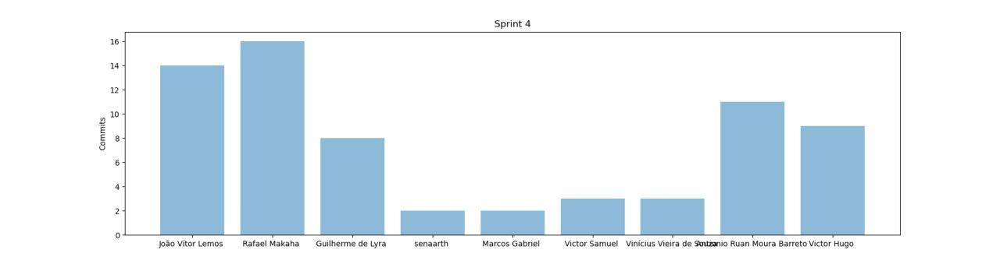
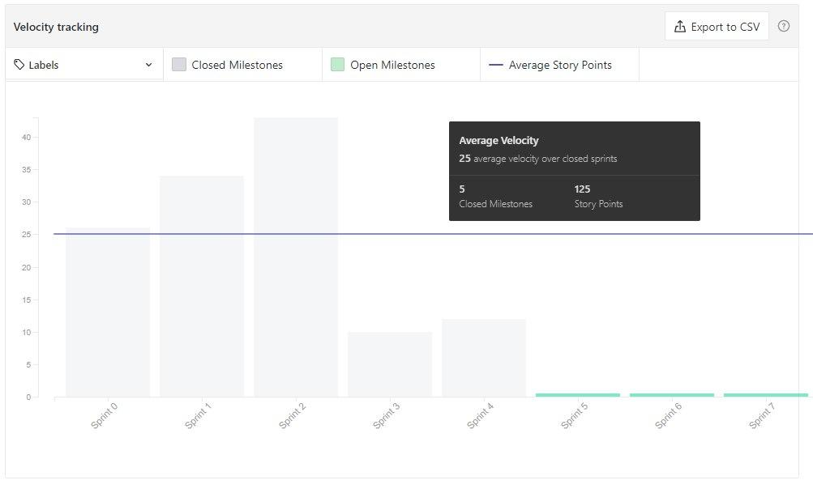
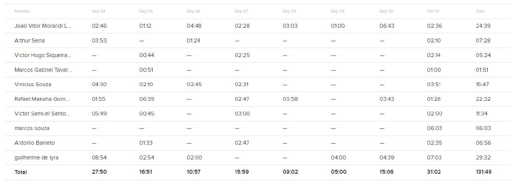
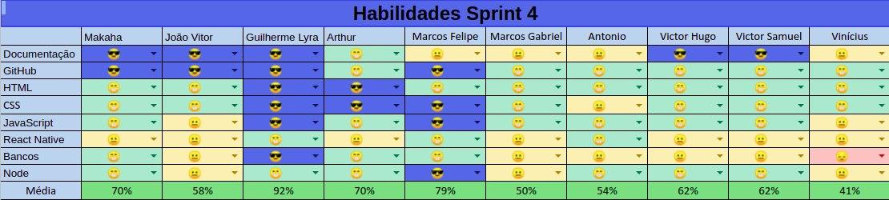

# Resultados da Sprint 4

[1. Indicadores de Qualidade do Processo](#1-indicadores-de-qualidade-do-processo)

- [Resultados da Sprint 4](#resultados-da-sprint-4)
  - [1. Indicadores de Qualidade do Processo](#1-indicadores-de-qualidade-do-processo)
    - [1.1 Fechamento da _Sprint_](#11-fechamento-da-sprint)
    - [1.2 _Burndown_](#12-burndown)
    - [1.3 Gráfico de _commits_](#13-gráfico-de-commits)
    - [1.4 _Velocity_](#14-velocity)
    - [1.5 Quadro de Horas](#15-quadro-de-horas)
    - [1.6 Quadro de Conhecimento](#16-quadro-de-conhecimento)
    - [1.7 Revisão da _Sprint_](#17-revisão-da-sprint)
  - [2 Retrospectiva](#2-retrospectiva)
    - [2.1 Análise do _Scrum Master_](#21-análise-do-scrum-master)

[2 Retrospectiva](#2-retrospectiva)

- [2.1 Análise do _Scrum Master_](#21-análise-do-scrum-master)

---

## 1. Indicadores de Qualidade do Processo

### 1.1 Fechamento da _Sprint_

| issue                                                                                                                                                | pontos |    status     |
| :--------------------------------------------------------------------------------------------------------------------------------------------------- | :----: | :-----------: |
| [Issue 40 - Evolução do Protótipo](https://github.com/fga-eps-mds/2020.1-Grupo2-wiki/issues/40)                                                      |   8    | em andamento  |
| [EAP](https://github.com/fga-eps-mds/2020.1-Grupo2-wiki/issues/58)                                                                                   |   2    | não concluído |
| [Guia de Estilo](https://github.com/fga-eps-mds/2020.1-Grupo2-wiki/issues/59)                                                                        |   3    | não concluído |
| [Documento de Identidade Visual](https://github.com/fga-eps-mds/2020.1-Grupo2-wiki/issues/60)                                                        |   5    |   concluído   |
| [Atualizar RoadMap (até Release 2)](https://github.com/fga-eps-mds/2020.1-Grupo2-wiki/issues/54)                                                     |   8    |   concluído   |
| [US15 - Criar tópico em um fórum de planta (Backend)](https://github.com/fga-eps-mds/2020.1-Grupo2-BackEnd/issues/97)                                |   5    | em andamento  |
| [US16 - Editar tópico criado por mim (Backend)](https://github.com/fga-eps-mds/2020.1-Grupo2-BackEnd/issues/98)                                      |   3    | em andamento  |
| [US17 - Deletar o tópico criado por mim (Backend)](https://github.com/fga-eps-mds/2020.1-Grupo2-BackEnd/issues/99)                                   |   1    | em andamento  |
| [US18 - Upvote e downvote em um tópico (Backend)](https://github.com/fga-eps-mds/2020.1-Grupo2-BackEnd/issues/100)                                   |   2    | em andamento  |
| [US19 - Criar comentário em um tópico (Backend)](https://github.com/fga-eps-mds/2020.1-Grupo2-BackEnd/issues/101)                                    |   3    | em andamento  |
| [US20 - Editar comentário que fiz em um tópico (Backend)](https://github.com/fga-eps-mds/2020.1-Grupo2-BackEnd/issues/102)                           |   2    | em andamento  |
| [US21 - Remover um comentário que fiz em um tópico (Backend)](https://github.com/fga-eps-mds/2020.1-Grupo2-BackEnd/issues/103)                       |   2    | em andamento  |
| [Issue 05 (frontend) - US07 - Fazer login no aplicativo (Frontend)](https://github.com/fga-eps-mds/2020.1-Grupo2-FrontEnd/issues/6)                  |   5    | em andamento  |
| [Issue 06 (frontend) - US08 - Fazer logout no aplicativo (FrontEnd)](https://github.com/fga-eps-mds/2020.1-Grupo2-FrontEnd/issues/6)                 |   5    | em andamento  |
| [Issue 09 (frontend) - US11 - Alterar os dados cadastrados na minha conta (FrontEnd)](https://github.com/fga-eps-mds/2020.1-Grupo2-BackEnd/issues/9) |   3    | em andamento  |
| [US12 - Deletar minha conta (FrontEnd)](https://github.com/fga-eps-mds/2020.1-Grupo2-FrontEnd/issues/7)                                              |   5    | em andamento  |
| [US23 - Visualizar informações sobre a planta (Frontend)](https://github.com/fga-eps-mds/2020.1-Grupo2-FrontEnd/issues/8)                            |   5    | em andamento  |
| [Refatorar Documento de Visão](#)                                                                                                                    |   8    |   concluído   |
| [Refatorar Documento Suplementar](#)                                                                                                                 |   2    |   concluído   |
| [Refatorar Termo de Abertura do Projeto](#)                                                                                                          |   2    |   concluído   |
|                                                                                                                                                      |        |               |
| Pontos Totais                                                                                                                                        |   79   |               |
| Pontos entregues                                                                                                                                     |   25   |               |

 
Dos 79 pontos planejados, 25 foram entregues. Algumas issues não foram fechadas, pois estão incompletas e serão adicionadas como dívidas técnicas para a próxima sprint.

### 1.2 _Burndown_

### 1.3 Gráfico de _commits_

Commits na wiki:

Não houveram novos commits no Backend e Frontend.

### 1.4 _Velocity_

### 1.5 Quadro de Horas

### 1.6 Quadro de Conhecimento

 

### 1.7 Revisão da _Sprint_

- A visão de produto foi consolidada.
- ScrumPoker caiu durante a votação.
- Muitas provas pros alunos de MDS.

## 2 Retrospectiva

| Pontos Positivos                  |        Pontos Negativos        |                                   Pontos a Melhorar                                    |
| :-------------------------------- | :----------------------------: | :------------------------------------------------------------------------------------: |
| Conclusão dos objetivos da sprint | Muita dívida técnica acumulada | comunicação sobre atividades, provas e outros problemas que possam atrapalhar a sprint |
| Pareamentos                       |        semana de provas        |                                                                                        |

 

### 2.1 Análise do _Scrum Master_

A sprint em si foi um sucesso. Os pontos planejados para esta sprint foram entregues corretamente, ou seja, todas as refatorações de documentos planejadas foram concluídas, mostrando uma evolução no planejamento da equipe.

As dívidas técnicas das sprints anteriores permanecem, mas isto não afeta em peso o andamento do projeto com relação ao novo planejamento.

Os pareamentos de EPS em conjunto com MDS está dando bons resultados. MDS está tendo maior contato com a documentação, mas ainda não encontrou um balanço para realização das dívidas técnicas. A gerência replanejou as sprints futuras com o pensamento neste ponto.
