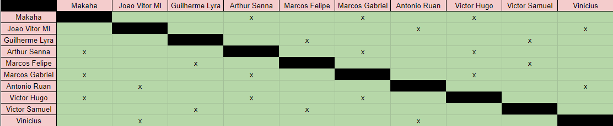
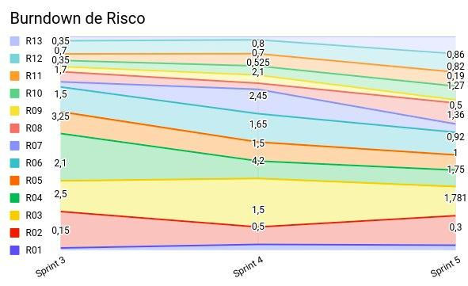

# Planejamento da Sprint 5

**Data de Início:** 01/10/2020

**Data de Término:** 08/10/2020

**Duração:** \* 7 dias

**Pontos Planejados**: 31

**Pontos Adicionados**: 54

**Pontos Totais**: 85

---

[1. Pareamentos](#1-pareamentos)

[2. Objetivos da Sprint](#2-objetivos-da-sprint)

[3. Mudanças](#3-mudanças)

[4. Burndown de Risco](#4-burndown-de-risco)

[5. Features da Sprint e Pontuação](#5-features-da-sprint-e-pontuação)

- [5.1 Dívidas técnicas](#51-dívidas-técnicas)
- [5.2 Novas Issues](#52-novas-issues)

---

## 1. Pareamentos

## 2. Objetivos da _Sprint_

- Finalmente sanar todas dividas tecnicas, preparar a apresentação da Release 1, terminar os documentos planejados pra Release 1.

## 3. Mudanças

- Não houveram mudanças.

## 4. Burndown de Risco

| #   | Descrição                                                | Probabilidade do Risco | Tamanho da Perda (dias) | Exposição ao Risco |
| :-- | :------------------------------------------------------- | :--------------------- | :---------------------- | :----------------- |
| R01 | Membro faltar reunião                                    | 30.00%                 | 1                       | 0,3                |
| R02 | Features má pontuadas                                    | 35.62%                 | 5                       | 1,781              |
| R03 | Baixa produtividade da equipe                            | 25%                    | 7                       | 1,75               |
| R04 | Mais pontos planejados do que o time é capaz de entregar | 20%                    | 5                       | 1                  |
| R05 | Dificuldades com a tecnologia de desenvolvimento         | 30.71%                 | 3                       | 0,92               |
| R06 | Erros na implementação de Features                       | 19.37%                 | 7                       | 1,36               |
| R07 | Issues mal documentadas                                  | 7.15%                  | 7                       | 0,5                |
| R08 | Quebra ou furto de equipamentos da equipe                | 18.12%                 | 7                       | 1,27               |
| R09 | Desistência de algum membro                              | 2.76%                  | 7                       | 0,19               |
| R10 | Problemas na configuração do ambiente de desenvolvimento | 40.62%                 | 2                       | 0,82               |
| R11 | Indisponibilidade dos membros de MDS                     | 28.75%                 | 3                       | 0,86               |
| R12 | Indisponibilidade dos membros de EPS                     | 37.50%                 | 3                       | 1,1                |
| R13 | Falta de comunicação                                     | 35%                    | 3                       | 1,05               |
|     |                                                          |                        | Exposição:              | -                  |

## 5. Issues da _Sprint_ e Pontuação

### 5.1 Dívidas técnicas

- [Issue 40 - Evolução do Protótipo](https://github.com/fga-eps-mds/2020.1-Grupo2-wiki/issues/40) - 8 pontos
- [EAP](https://github.com/fga-eps-mds/2020.1-Grupo2-wiki/issues/58) - 2 pontos
- [Guia de Estilo](https://github.com/fga-eps-mds/2020.1-Grupo2-wiki/issues/59) - 3 pontos
- [US15 - Criar tópico em um fórum de planta (Backend)](https://github.com/fga-eps-mds/2020.1-Grupo2-BackEnd/issues/97) - 5 pontos
- [US16 - Editar tópico criado por mim (Backend)](https://github.com/fga-eps-mds/2020.1-Grupo2-BackEnd/issues/98) - 3 pontos
- [US17 - Deletar o tópico criado por mim (Backend)](https://github.com/fga-eps-mds/2020.1-Grupo2-BackEnd/issues/99) - 1 pontos
- [US18 - Upvote e downvote em um tópico (Backend)](https://github.com/fga-eps-mds/2020.1-Grupo2-BackEnd/issues/100) - 2 pontos
- [US19 - Criar comentário em um tópico (Backend)](https://github.com/fga-eps-mds/2020.1-Grupo2-BackEnd/issues/101) - 3 pontos
- [US20 - Editar comentário que fiz em um tópico (Backend)](https://github.com/fga-eps-mds/2020.1-Grupo2-BackEnd/issues/102) - 2 pontos
- [US21 - Remover um comentário que fiz em um tópico (Backend)](https://github.com/fga-eps-mds/2020.1-Grupo2-BackEnd/issues/103) - 2 pontos
- [Issue 05 (frontend) - US07 - Fazer login no aplicativo (Frontend)](https://github.com/fga-eps-mds/2020.1-Grupo2-FrontEnd/issues/6) - 5 pontos
- [Issue 06 (frontend) - US08 - Fazer logout no aplicativo (FrontEnd)](https://github.com/fga-eps-mds/2020.1-Grupo2-FrontEnd/issues/6) - 5 pontos
- [Issue 09 (frontend) - US11 - Alterar os dados cadastrados na minha conta (FrontEnd)](https://github.com/fga-eps-mds/2020.1-Grupo2-BackEnd/issues/9) - 3 pontos
- [US12 - Deletar minha conta (FrontEnd)](https://github.com/fga-eps-mds/2020.1-Grupo2-FrontEnd/issues/7) - 5 pontos
- [US23 - Visualizar informações sobre a planta (Frontend)](https://github.com/fga-eps-mds/2020.1-Grupo2-FrontEnd/issues/8) - 5 pontos

### 5.2 Novas issues

- [EVM](#) - 5 pontos
- [Plano de Custo](#) - 5 pontos
- [Plano de Qualidade](#) - 8 pontos
- [Apresentação R1](#) - 13 pontos
