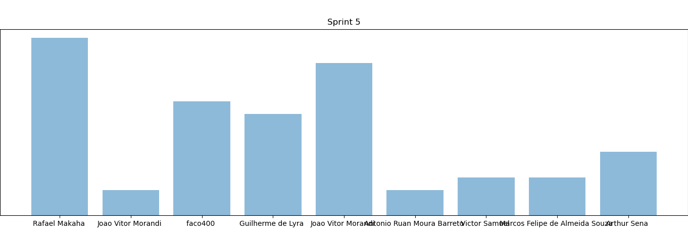
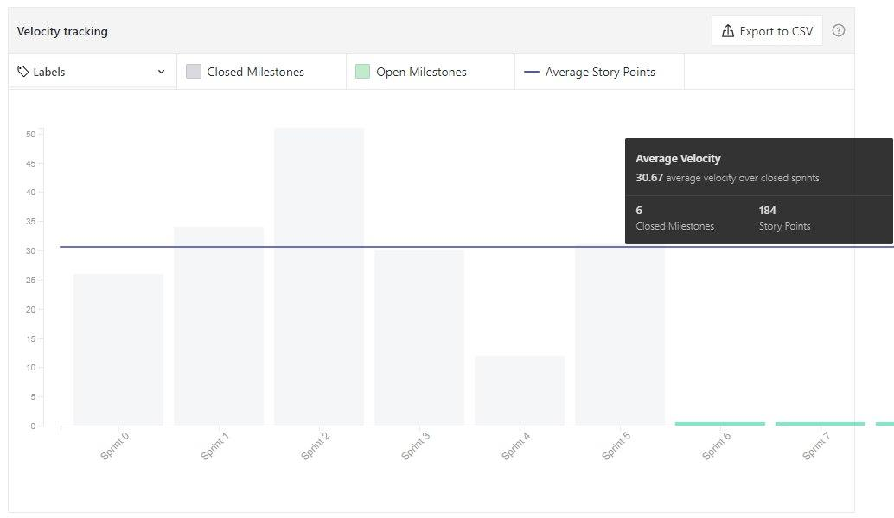
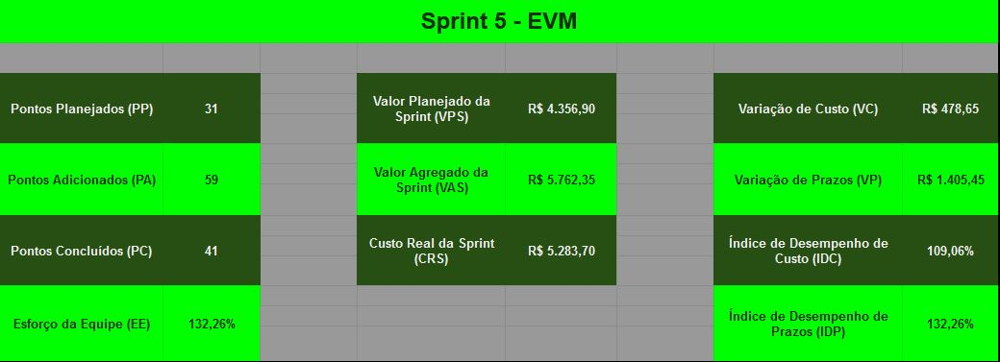

# Resultados da Sprint 5

[1. Indicadores de Qualidade do Processo](#1-indicadores-de-qualidade-do-processo)
  - [1.1 Fechamento da _Sprint_](#11-fechamento-da-sprint)
  - [1.2 _Burndown_](#12-burndown)
  - [1.3 Gráfico de _commits_](#13-gráfico-de-commits)
  - [1.4 _Velocity_](#14-velocity)
  - [1.5 Quadro de Horas](#15-quadro-de-horas)
  - [1.6 Quadro de Conhecimento](#16-quadro-de-conhecimento)
  - [1.7 EVM](#17-evm)
  - [1.8 Revisão da _Sprint_](#18-revisão-da-sprint)
  
[2 Retrospectiva](#2-retrospectiva)
  - [2.1 Análise do _Scrum Master_](#21-análise-do-scrum-master) 

------

## 1. Indicadores de Qualidade do Processo

### 1.1 Fechamento da _Sprint_
| Issue       | Pontos     | Status     |
| :------------- | :----------: | -----------: |
| [Issue 40 - Evolução do Protótipo](https://github.com/fga-eps-mds/2020.1-Grupo2-wiki/issues/40) | 8 | Concluído |
| [EAP](https://github.com/fga-eps-mds/2020.1-Grupo2-wiki/issues/58) | 2 | Concluído |
| [Guia de Estilo](https://github.com/fga-eps-mds/2020.1-Grupo2-wiki/issues/59) | 3 | Em andamento |
| [Issue 97 - US15 - Criar tópico em um fórum de planta (Backend)](https://github.com/fga-eps-mds/2020.1-Grupo2-BackEnd/issues/97) | 5 | Em andamento |
| [Issue US16 - Editar tópico criado por mim (Backend)](https://github.com/fga-eps-mds/2020.1-Grupo2-BackEnd/issues/98) | 3 | Em andamento |
| [US17 - Deletar o tópico criado por mim (Backend)](https://github.com/fga-eps-mds/2020.1-Grupo2-BackEnd/issues/99) | 1 | Em andamento |
| [US18 - Upvote e downvote em um tópico (Backend)](https://github.com/fga-eps-mds/2020.1-Grupo2-BackEnd/issues/100) | 2 | Em andamento |
| [US19 - Criar comentário em um tópico (Backend)](https://github.com/fga-eps-mds/2020.1-Grupo2-BackEnd/issues/101) | 3 | Em andamento |
| [US20 - Editar comentário que fiz em um tópico (Backend)](https://github.com/fga-eps-mds/2020.1-Grupo2-BackEnd/issues/102) | 2 | Em andamento |
| [US21 - Remover um comentário que fiz em um tópico (Backend)](https://github.com/fga-eps-mds/2020.1-Grupo2-BackEnd/issues/103) | 2 | Em andamento |
| [Issue 04 (frontend) - US04 - Cadastrar minha conta no aplicativo (FrontEnd)](https://github.com/fga-eps-mds/2020.1-Grupo2-FrontEnd/issues/4) |   5    | Em andamento |
| [Issue 05 (frontend) - US07 - Fazer login no aplicativo (Frontend)](https://github.com/fga-eps-mds/2020.1-Grupo2-FrontEnd/issues/5) | 5 | Em andamento |
| [Issue 06 (frontend) - US08 - Fazer logout no aplicativo (FrontEnd)](https://github.com/fga-eps-mds/2020.1-Grupo2-FrontEnd/issues/6) | 5 | Em andamento |
| [Issue 09 (frontend) - US11 - Alterar os dados cadastrados na minha conta (FrontEnd)](https://github.com/fga-eps-mds/2020.1-Grupo2-BackEnd/issues/9) | 3 | Em andamento |
| [Issue 07 (frontend) - US12 - Deletar minha conta (FrontEnd)](https://github.com/fga-eps-mds/2020.1-Grupo2-FrontEnd/issues/7) | 5 | Em andamento |
| [Issue 08 (frontend) - US23 - Visualizar informações sobre a planta (Frontend)](https://github.com/fga-eps-mds/2020.1-Grupo2-FrontEnd/issues/8) | 5 | Em andamento |
| [EVM](https://github.com/fga-eps-mds/2020.1-Grupo2-wiki/issues/81) | 5 | Concluído  |
| [Plano de Custo](https://github.com/fga-eps-mds/2020.1-Grupo2-wiki/issues/82) | 5 | Concluído  |
| [Plano de Qualidade](https://github.com/fga-eps-mds/2020.1-Grupo2-wiki/issues/83) | 8 | Concluído  |
| [Apresentação R1](https://github.com/fga-eps-mds/2020.1-Grupo2-wiki/issues/93) | 13 |  Concluído  |
| Pontos Totais | 90 | |
| Pontos entregues | 41 |  |

 

Dos 90 pontos planejados, 41 foram entregues. Algumas issues não foram fechadas, pois estão incompletas e serão adicionadas como dívidas técnicas para a próxima sprint.

### 1.2 _Burndown_

### 1.3 Gráfico de _commits_

Abaixo segue o gráfico de _commits_ referente a wiki do projeto.

### 1.4 _Velocity_

### 1.5 Quadro de Horas

### 1.6 Quadro de Conhecimento

### 1.7 EVM

### 1.8 Revisão da _Sprint_

Nessa _Sprint_ houveram os problemas:

* Um dos membros teve queda de energia em sua residência e ficou impossibilitade de realizar seu pareamento em um dia da semana
* Um dos membros encontrou defeitos em seu computador

## 2 Retrospectiva

| Pontos Positivos | Pontos Negativos |
| :------------- | :----------: |
| Realização da Release 1 | Dívidas técnicas ainda acumuladas |

 

### 2.1 Análise do _Scrum Master_

A Sprint foi voltada para o refino de artefatos voltados a Release 1, bem como a produção da video-apresentação da mesma. Um roteiro da apresentação foi montado e estabelecido um prazo para a realização das gravações. Grande parte destas gravações foram entregues no prazo determinado.

O time se empenhou bem para a realização das issues definidas para esta _Sprint_. Entretanto, houve pouco esforço com relação as dívidas técnicas acumuladas.
