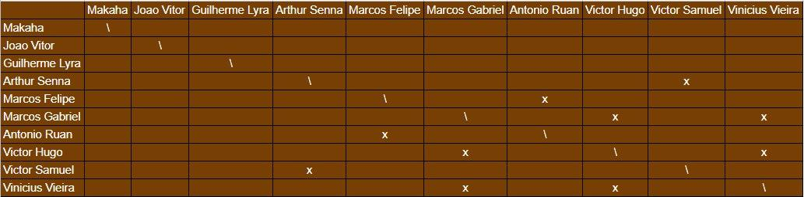
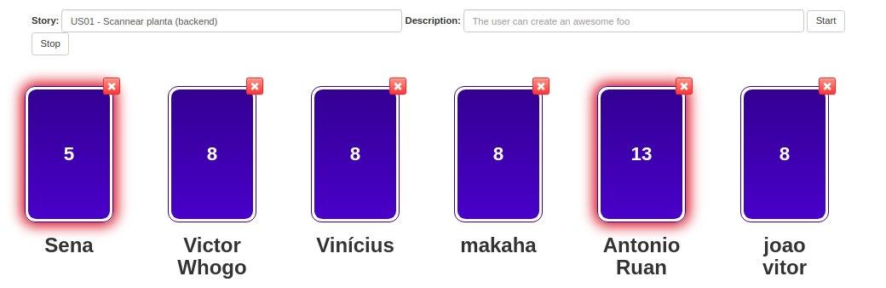
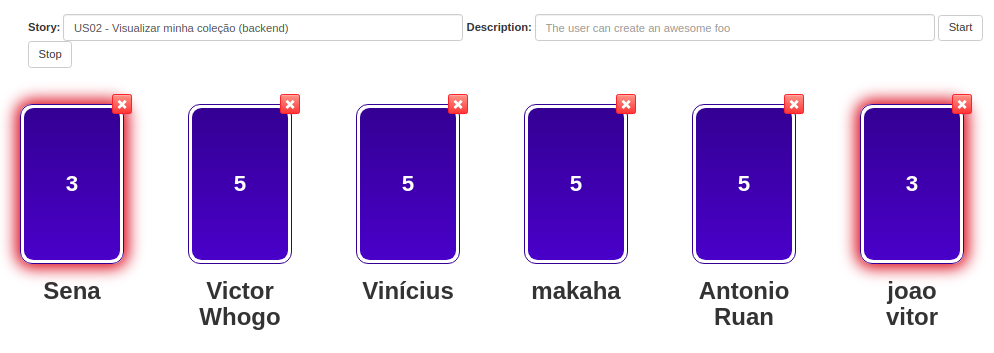
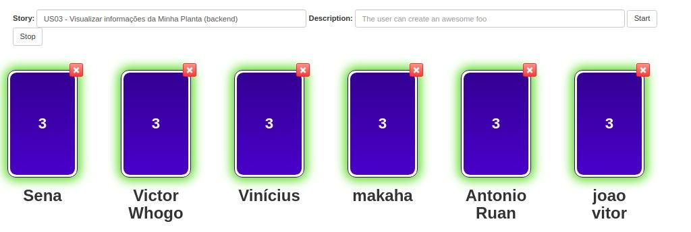

# Planejamento da Sprint 6

**Data de Início:** 08/10/2020  

**Data de Término:** 15/10/2020

**Duração:** * 7 dias

**Pontos Planejados**: 32

**Pontos Adicionados**: 49

**Pontos Totais**: 81

-------

[1. Pareamentos](#1-pareamentos)

[2. Objetivos da Sprint](#2-objetivos-da-sprint)

[3. Mudanças](#3-mudanças)

[4. Burndown de Risco](#4-burndown-de-risco)

[5. Features da Sprint e Pontuação](#5-features-da-sprint-e-pontuação)
* [5.1 Dívidas técnicas](#51-dívidas-técnicas)
* [5.2 Novas Issues](#52-novas-issues)

-------
## 1. Pareamentos

## 2. Objetivos da _Sprint_

Esta _Sprint_ tem por objetivo de definir o pipeline de DevOps, bem como realizar algumas novas features da aplicação.

## 3. Mudanças

* Esta sprint será mais leve na parte de documentação para realizarmos um maior foco no desenvolvimento do código

## 4. Burndown de Risco

## 5. Issues da _Sprint_ e Pontuação

### 5.1 Dívidas técnicas

- [Guia de Estilo](https://github.com/fga-eps-mds/2020.1-Grupo2-wiki/issues/59) - 3 pontos
- [Issue 97 - US15 - Criar tópico em um fórum de planta (Backend)](https://github.com/fga-eps-mds/2020.1-Grupo2-BackEnd/issues/97) - 5 pontos
- [Issue US16 - Editar tópico criado por mim (Backend)](https://github.com/fga-eps-mds/2020.1-Grupo2-BackEnd/issues/98) - 3 pontos
- [US17 - Deletar o tópico criado por mim (Backend)](https://github.com/fga-eps-mds/2020.1-Grupo2-BackEnd/issues/99) - 1 pontos
- [US18 - Upvote e downvote em um tópico (Backend)](https://github.com/fga-eps-mds/2020.1-Grupo2-BackEnd/issues/100) - 2 pontos
- [US19 - Criar comentário em um tópico (Backend)](https://github.com/fga-eps-mds/2020.1-Grupo2-BackEnd/issues/101) - 3 pontos
- [US20 - Editar comentário que fiz em um tópico (Backend)](https://github.com/fga-eps-mds/2020.1-Grupo2-BackEnd/issues/102) - 2 pontos
- [US21 - Remover um comentário que fiz em um tópico (Backend)](https://github.com/fga-eps-mds/2020.1-Grupo2-BackEnd/issues/103) - 2 pontos
- [Issue 04 (frontend) - US04 - Cadastrar minha conta no aplicativo (FrontEnd)](https://github.com/fga-eps-mds/2020.1-Grupo2-FrontEnd/issues/4) - 5 pontos
- [Issue 05 (frontend) - US07 - Fazer login no aplicativo (Frontend)](https://github.com/fga-eps-mds/2020.1-Grupo2-FrontEnd/issues/5) - 5 pontos
- [Issue 06 (frontend) - US08 - Fazer logout no aplicativo (FrontEnd)](https://github.com/fga-eps-mds/2020.1-Grupo2-FrontEnd/issues/6) - 5 pontos
- [Issue 09 (frontend) - US11 - Alterar os dados cadastrados na minha conta (FrontEnd)](https://github.com/fga-eps-mds/2020.1-Grupo2-BackEnd/issues/9) - 3 pontos
- [Issue 07 (frontend) - US12 - Deletar minha conta (FrontEnd)](https://github.com/fga-eps-mds/2020.1-Grupo2-FrontEnd/issues/7) - 5 pontos
- [Issue 08 (frontend) - US23 - Visualizar informações sobre a planta (Frontend)](https://github.com/fga-eps-mds/2020.1-Grupo2-FrontEnd/issues/8) - 5 pontos

### 5.2 Novas issues

[Plano de GCS](https://github.com/fga-eps-mds/2020.1-Grupo2-wiki/issues/94) - Votação

Resultado Final - 8

[Refatorar arquitetura](https://github.com/fga-eps-mds/2020.1-Grupo2-wiki/issues/95) - Votação

* João Vítor - 2
* Makaha - 2
* Lyra - X
* Ruan - 2
* Victor Hugo - 2
* Vinícius - 3
* Arthur - 2
* Marcos Felipe - X
* Victor Santos - X

Resultado Final - 2

[Refatorar critérios de aceitação](https://github.com/fga-eps-mds/2020.1-Grupo2-wiki/issues/96) - Votação

* João Vítor - 3
* Makaha - 3
* Lyra - X
* Ruan - 3
* Victor Hugo - 3
* Vinícius - 3
* Arthur - X
* Marcos Felipe - X
* Victor Santos - X

Resultado Final - 3

[Refatorar o roadmap](https://github.com/fga-eps-mds/2020.1-Grupo2-wiki/issues/97) - Votação

* João Vítor - 2
* Makaha - 2
* Lyra - X
* Ruan - 3
* Victor Hugo - 3
* Vinícius - 3
* Arthur - X
* Marcos Felipe - X
* Victor Santos - X

Resultado Final - 3

[US01 - Scannear planta (backend)](https://github.com/fga-eps-mds/2020.1-Grupo2-BackEnd/issues/83) - Votação

Resultado Final - 8

[US02 - Visualizar minha coleção (backend)](https://github.com/fga-eps-mds/2020.1-Grupo2-BackEnd/issues/84) - Votação

Resultado Final - 5

[US03 - Visualizar informações da Minha Planta (backend) ](https://github.com/fga-eps-mds/2020.1-Grupo2-BackEnd/issues/85) - Votação

Resultado Final - 3