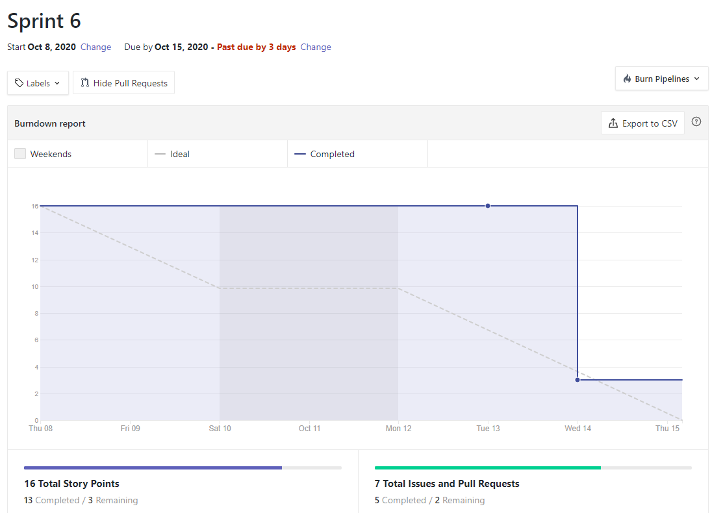
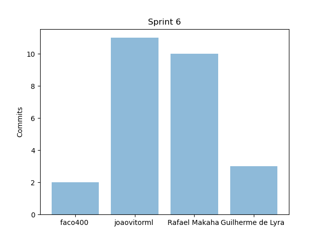
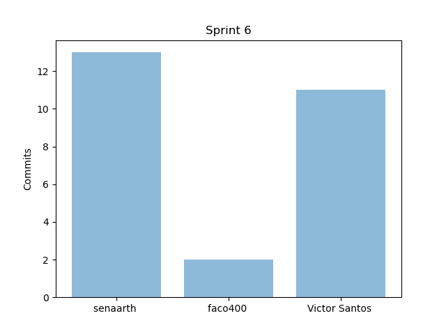
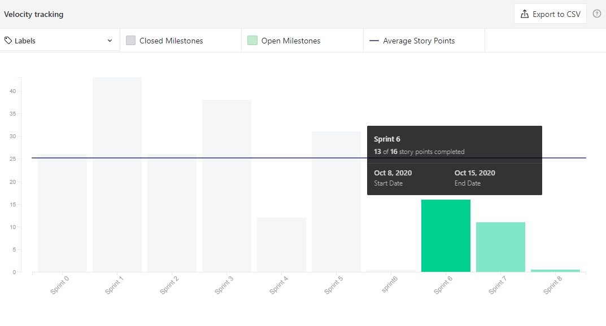
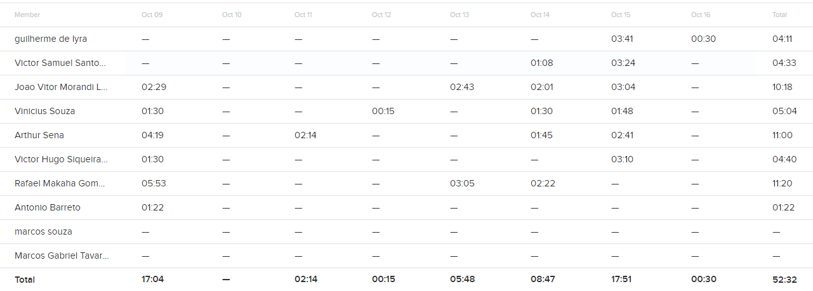
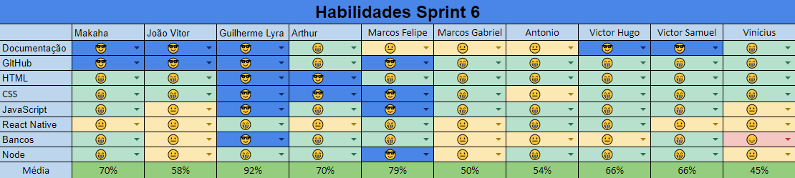

# Resultados da Sprint 6

- [Resultados da Sprint 6](#resultados-da-sprint-6)
  - [1. Indicadores de Qualidade do Processo](#1-indicadores-de-qualidade-do-processo)
    - [1.1 Fechamento da _Sprint_](#11-fechamento-da-sprint)
    - [1.2 _Burndown_](#12-burndown)
    - [1.3 Gráfico de _commits_](#13-gráfico-de-commits)
    - [1.4 _Velocity_](#14-velocity)
    - [1.5 Quadro de Horas](#15-quadro-de-horas)
    - [1.6 Quadro de Conhecimento](#16-quadro-de-conhecimento)
    - [1.7 Revisão da _Sprint_](#17-revisão-da-sprint)
  - [2 Retrospectiva](#2-retrospectiva)
    - [2.1 Análise do _Scrum Master_](#21-análise-do-scrum-master)
  
- [2 Retrospectiva](#2-retrospectiva)
  - [2.1 Análise do _Scrum Master_](#21-análise-do-scrum-master) 

------

## 1. Indicadores de Qualidade do Processo

### 1.1 Fechamento da _Sprint_

| Issue       | Pontos     | Status     |
| :------------- | :----------: | -----------: |
| [Guia de Estilo](https://github.com/fga-eps-mds/2020.1-Grupo2-wiki/issues/59) | 3 pontos | feito |
| [Issue 97 - US15 - Criar tópico em um fórum de planta (Backend)](https://github.com/fga-eps-mds/2020.1-Grupo2-BackEnd/issues/97) | 5 pontos | feito |
| [Issue US16 - Editar tópico criado por mim (Backend)](https://github.com/fga-eps-mds/2020.1-Grupo2-BackEnd/issues/98) | 3 pontos | feito |
| [US17 - Deletar o tópico criado por mim (Backend)](https://github.com/fga-eps-mds/2020.1-Grupo2-BackEnd/issues/99) | 1 pontos | feito |
| [US18 - Upvote e downvote em um tópico (Backend)](https://github.com/fga-eps-mds/2020.1-Grupo2-BackEnd/issues/100) | 2 pontos | feito |
| [US19 - Criar comentário em um tópico (Backend)](https://github.com/fga-eps-mds/2020.1-Grupo2-BackEnd/issues/101) | 3 pontos | feito |
| [US20 - Editar comentário que fiz em um tópico (Backend)](https://github.com/fga-eps-mds/2020.1-Grupo2-BackEnd/issues/102) | 2 pontos | feito |
| [US21 - Remover um comentário que fiz em um tópico (Backend)](https://github.com/fga-eps-mds/2020.1-Grupo2-BackEnd/issues/103) | 2 pontos | feito |
| [Issue 04 (frontend) - US04 - Cadastrar minha conta no aplicativo (FrontEnd)](https://github.com/fga-eps-mds/2020.1-Grupo2-FrontEnd/issues/4) | 5 pontos | iniciado |
| [Issue 05 (frontend) - US07 - Fazer login no aplicativo (Frontend)](https://github.com/fga-eps-mds/2020.1-Grupo2-FrontEnd/issues/5) | 5 pontos | iniciado |
| [Issue 06 (frontend) - US08 - Fazer logout no aplicativo (FrontEnd)](https://github.com/fga-eps-mds/2020.1-Grupo2-FrontEnd/issues/6) | 5 pontos | iniciado |
| [Issue 09 (frontend) - US11 - Alterar os dados cadastrados na minha conta (FrontEnd)](https://github.com/fga-eps-mds/2020.1-Grupo2-BackEnd/issues/9) | 3 pontos | iniciado |
| [Issue 07 (frontend) - US12 - Deletar minha conta (FrontEnd)](https://github.com/fga-eps-mds/2020.1-Grupo2-FrontEnd/issues/7) | 5 pontos | iniciado |
| [Issue 08 (frontend) - US23 - Visualizar informações sobre a planta (Frontend)](https://github.com/fga-eps-mds/2020.1-Grupo2-FrontEnd/issues/8) | 5 pontos | iniciado |
| [Plano de GCS](https://github.com/fga-eps-mds/2020.1-Grupo2-wiki/issues/94) | 8 pontos | feito |
| [Refatorar arquitetura](https://github.com/fga-eps-mds/2020.1-Grupo2-wiki/issues/95) | 2 pontos | feito |
| [Refatorar critérios de aceitação](https://github.com/fga-eps-mds/2020.1-Grupo2-wiki/issues/96) | 3 pontos | nao iniciado |
| [Refatorar o roadmap](https://github.com/fga-eps-mds/2020.1-Grupo2-wiki/issues/97) | 3 pontos | feito |
| [US01 - Scannear planta (backend)](https://github.com/fga-eps-mds/2020.1-Grupo2-BackEnd/issues/83) | 8 pontos | iniciado |
| [US02 - Visualizar minha coleção (backend)](https://github.com/fga-eps-mds/2020.1-Grupo2-BackEnd/issues/84) | 5 pontos | nao iniciado |
| [US03 - Visualizar informações da Minha Planta (backend)](https://github.com/fga-eps-mds/2020.1-Grupo2-BackEnd/issues/85) | 3 pontos | iniciado |

Dos 81 pontos planejados, 39 foram entregues. Algumas issues não foram fechadas, pois estão incompletas e serão adicionadas como dívidas técnicas para a próxima sprint.

### 1.2 _Burndown_

### 1.3 Gráfico de _commits_

Abaixo segue o gráfico de _commits_ referente a wiki do projeto.

Abaixo segue o gráfico de _commits_ referente ao backend do projeto.

### 1.4 _Velocity_

### 1.5 Quadro de Horas

### 1.6 Quadro de Conhecimento

Comentário sobre a evolução dos conhecimentos.

### 1.7 Revisão da _Sprint_

Nessa _Sprint_:

- Alguns membros ficaram felizes por finalizarem suas dividas técnicas e/ou issues planejadas para esta sprint
- A maioria tirou a sprint para recuperar o atraso em relação a outras materias, já que a ultima sprint fora mais exigente por conta da R1
- A chuva impactou na qualidade da sprint de pelo menos 3 MDS:
  - 1 perdeu a fonte do computador por conta de um trovão
  - 2 tiveram o acesso a internet muito prejudicados por conta de energia/internet
- Aula de direção de um membro que outrora estavam programadas para serem realizadas no final do ano, foram antecipadas para este mês - o que impacta em sua disponibilidade

## 2 Retrospectiva

| Pontos Positivos | Pontos a melhorar | Pontos Negativos |
| :------------- | :----------: | :---------: |
| Conclusão de várias dividas tecnicas | planejamento considerar os critérios de aceitação* | Muito trabalho de outras matérias (a citar: embarcados) |
| Muitas issues entregues | Gerar documento de resultado e planejamento em no máximo 1 dia depois da reunião | Planejamento só ficou pronto na segunda |

### 2.1 Análise do _Scrum Master_

A sprint foi planejada de forma a ser mais leve na parte de documentação para que houvesse um foco maior no desenvolvimento do código.

Houve um bom avanço nas dívidas técnicas, mas nem todas foram finalizadas. Muitos dos pontos de dívidas técnicas já estão em estado de revisão, mas ainda não foram revisados.

Fora isso, houve uma sensação generalizada de cansaço, tanto pela exaustão da ultima sprint (5, R1) como pela exigencia de outras materias.
