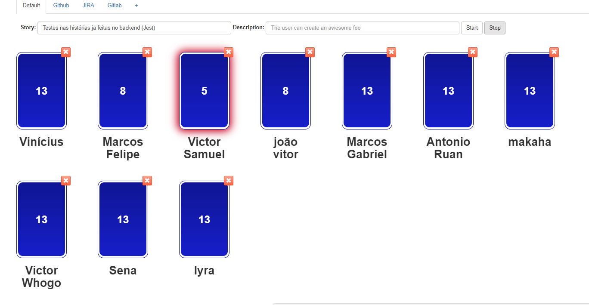
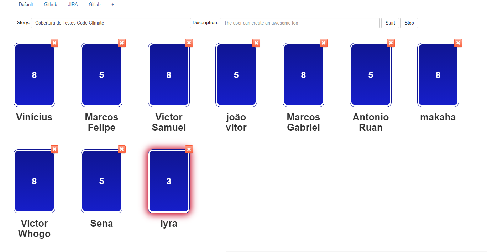
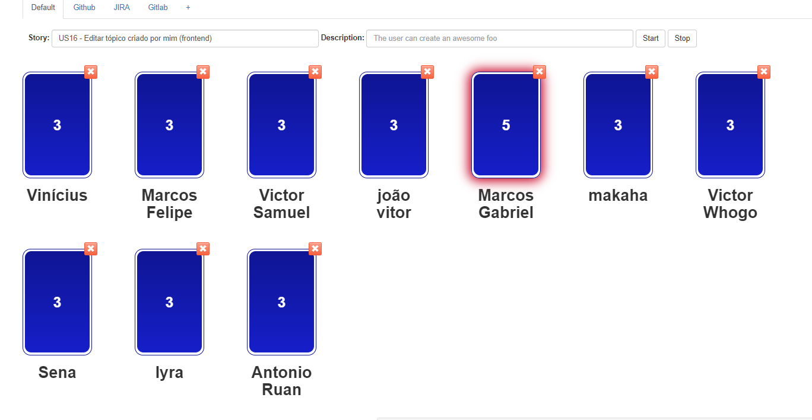
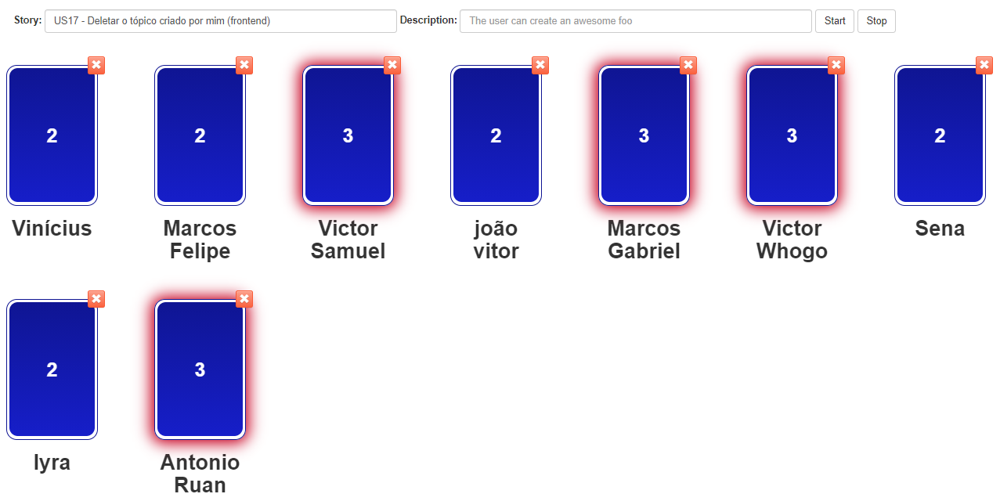

# Planejamento da Sprint 6

**Data de Início:** 15/10/2020  

**Data de Término:** 22/10/2020

**Duração:** * 7 dias

**Pontos Planejados**: 28

**Pontos Adicionados**: 47 + X

**Pontos Totais**: 75 + X

-------

- [Planejamento da Sprint 6](#planejamento-da-sprint-6)
  - [1. Pareamentos](#1-pareamentos)
  - [2. Objetivos da _Sprint_](#2-objetivos-da-sprint)
  - [3. Mudanças](#3-mudanças)
  - [4. Burndown de Risco](#4-burndown-de-risco)
  - [5. Issues da _Sprint_ e Pontuação](#5-issues-da-sprint-e-pontuação)
    - [5.1 Dívidas técnicas](#51-dívidas-técnicas)
    - [5.2 Novas issues](#52-novas-issues)
    - [5.3 Issues pós reunião](#53-issues-pós-reunião)

-------

## 1. Pareamentos

## 2. Objetivos da _Sprint_

Esta sprint terá um foco maior na melhoria da qualidade do código e implementação de testes

## 3. Mudanças

Adição do documento de `Atas da Reuniao`.

## 4. Burndown de Risco

## 5. Issues da _Sprint_ e Pontuação

### 5.1 Dívidas técnicas

- [Issue 04 (frontend) - US04 - Cadastrar minha conta no aplicativo (FrontEnd)](https://github.com/fga-eps-mds/2020.1-Grupo2-FrontEnd/issues/4) - 5 pontos
- [Issue 05 (frontend) - US07 - Fazer login no aplicativo (Frontend)](https://github.com/fga-eps-mds/2020.1-Grupo2-FrontEnd/issues/5) - 5 pontos
- [Issue 06 (frontend) - US08 - Fazer logout no aplicativo (FrontEnd)](https://github.com/fga-eps-mds/2020.1-Grupo2-FrontEnd/issues/6) - 5 pontos
- [Issue 09 (frontend) - US11 - Alterar os dados cadastrados na minha conta (FrontEnd)](https://github.com/fga-eps-mds/2020.1-Grupo2-BackEnd/issues/9) - 3 pontos
- [Issue 07 (frontend) - US12 - Deletar minha conta (FrontEnd)](https://github.com/fga-eps-mds/2020.1-Grupo2-FrontEnd/issues/7) - 5 pontos
- [Issue 08 (frontend) - US23 - Visualizar informações sobre a planta (Frontend)](https://github.com/fga-eps-mds/2020.1-Grupo2-FrontEnd/issues/8) - 5 pontos
- [Refatorar critérios de aceitação](https://github.com/fga-eps-mds/2020.1-Grupo2-wiki/issues/96) - 3 pontos
- [US01 - Scannear planta (backend)](https://github.com/fga-eps-mds/2020.1-Grupo2-BackEnd/issues/83) - 8 pontos
- [US02 - Visualizar minha coleção (backend)](https://github.com/fga-eps-mds/2020.1-Grupo2-BackEnd/issues/84) - 5 pontos
- [US03 - Visualizar informações da Minha Planta (backend)](https://github.com/fga-eps-mds/2020.1-Grupo2-BackEnd/issues/85) - 3 pontos

### 5.2 Novas issues

1. [Testes](https://github.com/fga-eps-mds/2020.1-GaiaDex-BackEnd/issues/113) - Votação

    - 
    - Resultado final - 5

2. [Cobertura de Testes Code Climate](https://github.com/fga-eps-mds/2020.1-GaiaDex-wiki/issues/100)

    - 
    - Resultado final - 8

3. [Configurar Lint com Guia de Estilo](https://github.com/fga-eps-mds/2020.1-GaiaDex-FrontEnd/issues/101)

    - 
    - Resultado final - 3

4. [US15 - Criar tópico em um fórum de planta (frontend)](https://github.com/fga-eps-mds/2020.1-GaiaDex-FrontEnd/issues/85)

    - 
    - Resultado final - 5

5. [US16 - Editar tópico criado por mim (frontend)](https://github.com/fga-eps-mds/2020.1-GaiaDex-FrontEnd/issues/86)

    - 
    - Resultado final - 3

6. [US17 - Deletar o tópico criado por mim (frontend)](https://github.com/fga-eps-mds/2020.1-GaiaDex-FrontEnd/issues/87)

    - 
    - Resultado final - 2

7. [US18 - Upvote e downvote em um tópico (frontend)](https://github.com/fga-eps-mds/2020.1-GaiaDex-FrontEnd/issues/88)

    - 
    - Resultado final - 2

### 5.3 Issues pós reunião

Essas issues foram discutidas entre o grupo, mas por falha de organização não foram debatidas na pontuação. Portanto, as mesmas serão pontuadas ao final da sprint por intermedio de uma avaliação dos membros que trabalharam nas mesmas.

1. [Pesquisa sobre refatoração no Backend](https://github.com/fga-eps-mds/2020.1-GaiaDex-wiki/issues/102) - X pontos
2. [Iniciar doc Post-Mortem](https://github.com/fga-eps-mds/2020.1-GaiaDex-wiki/issues/103) - X pontos
3. [Evolução do Protótipo](https://github.com/fga-eps-mds/2020.1-GaiaDex-wiki/issues/104) - X pontos
4. [Readequar issues do FrontEnd para incluir a distinção entre as fases da entrega](https://github.com/fga-eps-mds/2020.1-GaiaDex-wiki/issues/105) - X pontos
5. [Refatorar Roadmap do FrontEnd para considerar as diferentes etapas da entrega](https://github.com/fga-eps-mds/2020.1-GaiaDex-wiki/issues/106) - X pontos
6. [Automatização do mkdocs](https://github.com/fga-eps-mds/2020.1-GaiaDex-wiki/issues/108) - X pontos
7. [Configuração do Codacy e Codeclimate](https://github.com/fga-eps-mds/2020.1-GaiaDex-wiki/issues/109) - X pontos
8. [Gerar templates de sprints restantes](https://github.com/fga-eps-mds/2020.1-GaiaDex-wiki/issues/112) - X pontos
