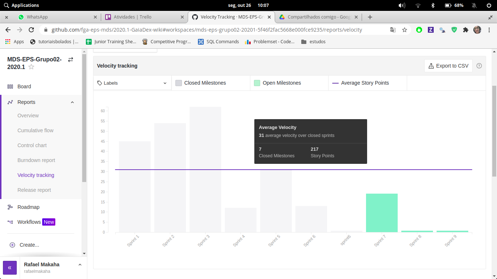

# Resultados da Sprint 7

- [Resultados da Sprint 7](#resultados-da-sprint-7)
  - [1. Indicadores de Qualidade do Processo](#1-indicadores-de-qualidade-do-processo)
    - [1.1 Fechamento da _Sprint_](#11-fechamento-da-sprint)
    - [1.2 _Burndown_](#12-burndown)
    - [1.3 Gráfico de _commits_](#13-gráfico-de-commits)
    - [1.4 _Velocity_](#14-velocity)
    - [1.5 Quadro de Horas](#15-quadro-de-horas)
    - [1.6 Quadro de Conhecimento](#16-quadro-de-conhecimento)
    - [1.7 Revisão da _Sprint_](#17-revisão-da-sprint)
  - [2 Retrospectiva](#2-retrospectiva)
    - [2.1 Análise do _Scrum Master_](#21-análise-do-scrum-master)
  
- [2 Retrospectiva](#2-retrospectiva)
  - [2.1 Análise do _Scrum Master_](#21-análise-do-scrum-master) 

------

## 1. Indicadores de Qualidade do Processo

### 1.1 Fechamento da _Sprint_

| Issue       | Pontos     | Status     |
| :------------- | :----------: | -----------: |
| [Issue 04 (frontend) - US04 - Cadastrar minha conta no aplicativo (FrontEnd)](https://github.com/fga-eps-mds/2020.1-Grupo2-FrontEnd/issues/4) | 5 pontos | iniciado |
| [Issue 05 (frontend) - US07 - Fazer login no aplicativo (Frontend)](https://github.com/fga-eps-mds/2020.1-Grupo2-FrontEnd/issues/5) | 5 pontos | iniciado |
| [Issue 06 (frontend) - US08 - Fazer logout no aplicativo (FrontEnd)](https://github.com/fga-eps-mds/2020.1-Grupo2-FrontEnd/issues/6) | 5 pontos | iniciado |
| [Issue 09 (frontend) - US11 - Alterar os dados cadastrados na minha conta (FrontEnd)](https://github.com/fga-eps-mds/2020.1-Grupo2-BackEnd/issues/9) | 3 pontos | iniciado |
| [Issue 07 (frontend) - US12 - Deletar minha conta (FrontEnd)](https://github.com/fga-eps-mds/2020.1-Grupo2-FrontEnd/issues/7) | 5 pontos | iniciado |
| [Issue 08 (frontend) - US23 - Visualizar informações sobre a planta (Frontend)](https://github.com/fga-eps-mds/2020.1-Grupo2-FrontEnd/issues/8) | 5 pontos | feito |
| [Refatorar critérios de aceitação](https://github.com/fga-eps-mds/2020.1-Grupo2-wiki/issues/96) | 3 pontos | iniciado |
| [US01 - Scannear planta (backend)](https://github.com/fga-eps-mds/2020.1-Grupo2-BackEnd/issues/83) | 8 pontos | iniciado |
| [US02 - Visualizar minha coleção (backend)](https://github.com/fga-eps-mds/2020.1-Grupo2-BackEnd/issues/84) | 5 pontos | não feito |
| [US03 - Visualizar informações da Minha Planta (backend)](https://github.com/fga-eps-mds/2020.1-Grupo2-BackEnd/issues/85) | 3 pontos | iniciado |
| [Testes](https://github.com/fga-eps-mds/2020.1-GaiaDex-BackEnd/issues/113) | 5 pontos | iniciado |
| [Cobertura de Testes Code Climate](https://github.com/fga-eps-mds/2020.1-GaiaDex-wiki/issues/100) | 8 pontos | não feito |
| [Configurar Lint com Guia de Estilo](https://github.com/fga-eps-mds/2020.1-GaiaDex-FrontEnd/issues/101) | 3 pontos | feito |
| [US15 - Criar tópico em um fórum de planta (frontend)](https://github.com/fga-eps-mds/2020.1-GaiaDex-FrontEnd/issues/85) | 5 pontos | não feito |
| [US16 - Editar tópico criado por mim (frontend)](https://github.com/fga-eps-mds/2020.1-GaiaDex-FrontEnd/issues/86) | 3 pontos | não feito |
| [US17 - Deletar o tópico criado por mim (frontend)](https://github.com/fga-eps-mds/2020.1-GaiaDex-FrontEnd/issues/87) | 2 pontos | não feito |
| [US18 - Upvote e downvote em um tópico (frontend)](https://github.com/fga-eps-mds/2020.1-GaiaDex-FrontEnd/issues/88) | 2 pontos | não feito |
| [Pesquisa sobre refatoração no Backend](https://github.com/fga-eps-mds/2020.1-GaiaDex-wiki/issues/102) | X pontos | não feitoo |
| [Iniciar doc Post-Mortem](https://github.com/fga-eps-mds/2020.1-GaiaDex-wiki/issues/103) | X pontos | feito |
| [Evolução do Protótipo](https://github.com/fga-eps-mds/2020.1-GaiaDex-wiki/issues/104) | X pontos | feito |
| [Readequar issues do FrontEnd para incluir a distinção entre as fases da entrega](https://github.com/fga-eps-mds/2020.1-GaiaDex-wiki/issues/105) | X pontos | não feito |
| [Refatorar Roadmap do FrontEnd para considerar as diferentes etapas da entrega](https://github.com/fga-eps-mds/2020.1-GaiaDex-wiki/issues/106) | X pontos | não feito |

Dos 75+X pontos planejados, Y foram entregues. Algumas issues não foram fechadas, pois estão incompletas e serão adicionadas como dívidas técnicas para a próxima sprint.

### 1.2 _Burndown_

Não foram entregues nenhum ponto nesta sprint.

### 1.3 Gráfico de _commits_

Abaixo segue o gráfico de _commits_ referente a wiki do projeto.

### 1.4 _Velocity_

### 1.5 Quadro de Horas

### 1.6 Quadro de Conhecimento

Comentário sobre a evolução dos conhecimentos.

### 1.7 Revisão da _Sprint_

Nessa _Sprint_:

- Pouco trabalho realizado
- Muitas atividades além desta disciplina sobrecarregaram os membros

## 2 Retrospectiva

| Pontos Positivos | Pontos Negativos |
| :------------- | :----------: 
| Riscos sendo calculados na planilha | Ausência de membros nas dailies |
| Criação do documento de Atas da Reunião | Comunicação falha de membros para pedir ajuda |

### 2.1 Análise do _Scrum Master_

Esta _Sprint_ foi bem incomum devido a não haver entrega de nenhum dos pontos planejados dentro do deadline. Alguns Pull Requests foram abertos em Work in Progress, mas nenhum fora finalizado.

Muitas outras disciplinas realizadas pelos membros de ambas equipes sobrecarregaram a semana do time, impedindo uma produtividade maior.