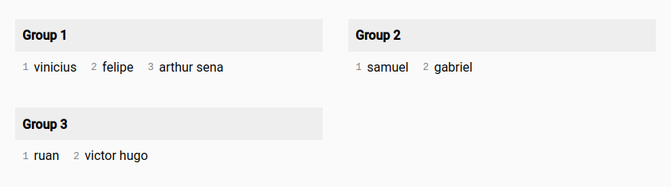
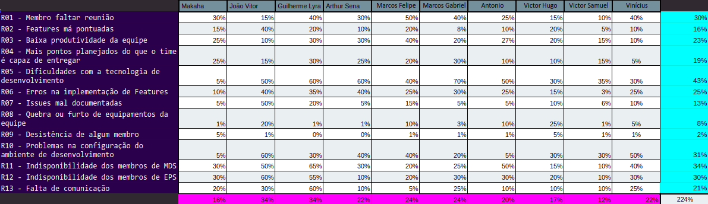

# Planejamento da Sprint 8

**Data de Início:** 22/10/2020  

**Data de Término:** 29/10/2020

**Duração:** * 7 dias

**Pontos Planejados**: 41

**Pontos Adicionados**: 69

**Pontos Totais**: 110

-------

- [Planejamento da Sprint 8](#planejamento-da-sprint-8)
  - [1. Pareamentos](#1-pareamentos)
  - [2. Objetivos da _Sprint_](#2-objetivos-da-sprint)
  - [3. Mudanças](#3-mudanças)
  - [4. Burndown de Risco](#4-burndown-de-risco)
  - [5. Issues da _Sprint_ e Pontuação](#5-issues-da-sprint-e-pontuação)
    - [5.1 Dívidas técnicas](#51-dívidas-técnicas)
    - [5.2 Novas issues](#52-novas-issues)
-------

## 1. Pareamentos

## 2. Objetivos da _Sprint_

## 3. Mudanças

- Aqui há uma alteração que será feita durante a sprint

## 4. Burndown de Risco

## 5. Issues da _Sprint_ e Pontuação

### 5.1 Dívidas técnicas

* [Issue 04 (frontend) - US04 - Cadastrar minha conta no aplicativo (FrontEnd)](https://github.com/fga-eps-mds/2020.1-Grupo2-FrontEnd/issues/4) - 5
* [Issue 05 (frontend) - US07 - Fazer login no aplicativo (Frontend)](https://github.com/fga-eps-mds/2020.1-Grupo2-FrontEnd/issues/5) - 5
* [Issue 06 (frontend) - US08 - Fazer logout no aplicativo (FrontEnd)](https://github.com/fga-eps-mds/2020.1-Grupo2-FrontEnd/issues/6) - 5
* [Issue 09 (frontend) - US11 - Alterar os dados cadastrados na minha conta (FrontEnd)](https://github.com/fga-eps-mds/2020.1-Grupo2-BackEnd/issues/9) - 5
* [Issue 07 (frontend) - US12 - Deletar minha conta (FrontEnd)](https://github.com/fga-eps-mds/2020.1-Grupo2-FrontEnd/issues/7) - 5
* [Refatorar critérios de aceitação](https://github.com/fga-eps-mds/2020.1-Grupo2-wiki/issues/96) - 3
* [US01 - Scannear planta (backend)](https://github.com/fga-eps-mds/2020.1-Grupo2-BackEnd/issues/83) - 8
* [US02 - Visualizar minha coleção (backend)](https://github.com/fga-eps-mds/2020.1-Grupo2-BackEnd/issues/84) - 5
* [US03 - Visualizar informações da Minha Planta (backend)](https://github.com/fga-eps-mds/2020.1-Grupo2-BackEnd/issues/85) - 3
* [Testes](https://github.com/fga-eps-mds/2020.1-GaiaDex-BackEnd/issues/113) - 5
* [Cobertura de Testes Code Climate](https://github.com/fga-eps-mds/2020.1-GaiaDex-wiki/issues/100) - 8
* [US15 - Criar tópico em um fórum de planta (frontend)](https://github.com/fga-eps-mds/2020.1-GaiaDex-FrontEnd/issues/85) - 5
* [US16 - Editar tópico criado por mim (frontend)](https://github.com/fga-eps-mds/2020.1-GaiaDex-FrontEnd/issues/86) - 3
* [US17 - Deletar o tópico criado por mim (frontend)](https://github.com/fga-eps-mds/2020.1-GaiaDex-FrontEnd/issues/87) - 2
* [US18 - Upvote e downvote em um tópico (frontend)](https://github.com/fga-eps-mds/2020.1-GaiaDex-FrontEnd/issues/88) - 2
* [Pesquisa sobre refatoração no Backend](https://github.com/fga-eps-mds/2020.1-GaiaDex-wiki/issues/102) - X
* [Readequar issues do FrontEnd para incluir a distinção entre as fases da entrega](https://github.com/fga-eps-mds/2020.1-GaiaDex-wiki/issues/105) - X
* [Refatorar Roadmap do FrontEnd para considerar as diferentes etapas da entrega](https://github.com/fga-eps-mds/2020.1-GaiaDex-wiki/issues/106) - X

### 5.2 Novas issues

1. [Testes exploratórios](https://github.com/fga-eps-mds/2020.1-GaiaDex-wiki/issues/)- 5

2. [Configurar CI/CD](https://github.com/fga-eps-mds/2020.1-GaiaDex-wiki/issues/) - 13

3. [US01 - Scannear planta (frontend)](https://github.com/fga-eps-mds/2020.1-GaiaDex-FrontEnd/issues/) - 5

4. [US02 - Visualizar minha coleção (frontend)](https://github.com/fga-eps-mds/2020.1-GaiaDex-FrontEnd/issues/) - 5

5. [US03 - Visualizar informações da Minha Planta (frontend)](https://github.com/fga-eps-mds/2020.1-GaiaDex-FrontEnd/issues/) - 8

6. [US27 - Alterar informações da minha planta (frontend)](https://github.com/fga-eps-mds/2020.1-GaiaDex-FrontEnd/issues/) - 5

