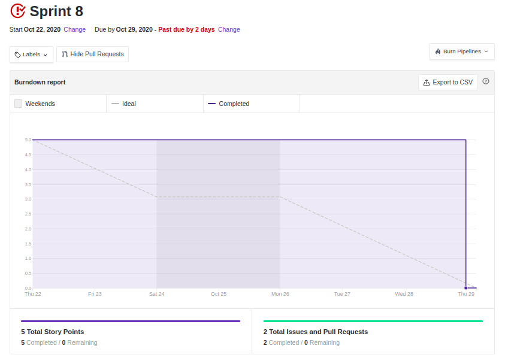
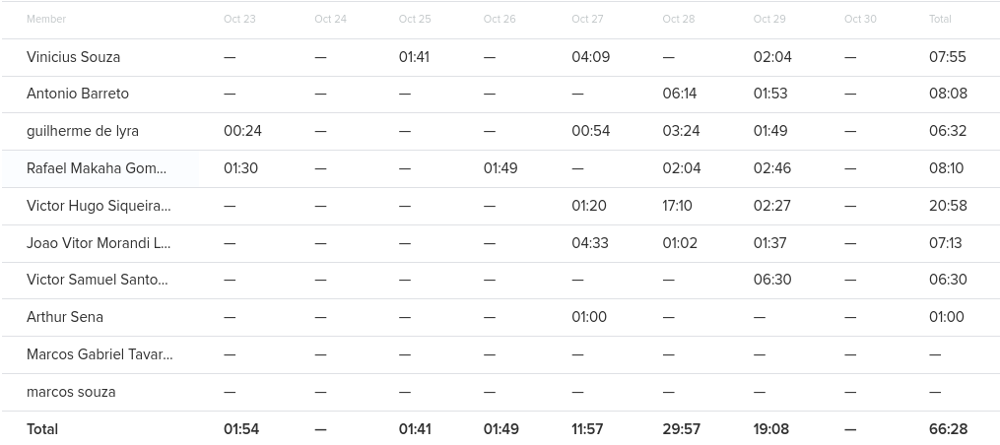
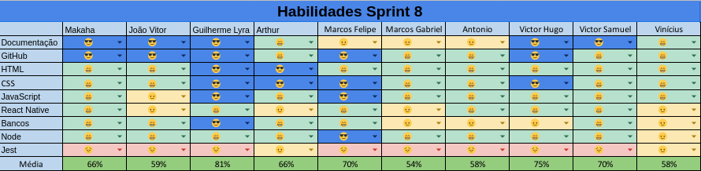

# Resultados da Sprint 8

- [Resultados da Sprint 8](#resultados-da-sprint-8)
  - [1. Indicadores de Qualidade do Processo](#1-indicadores-de-qualidade-do-processo)
    - [1.1 Fechamento da _Sprint_](#11-fechamento-da-sprint)
    - [1.2 _Burndown_](#12-burndown)
    - [1.3 Gráfico de _commits_](#13-gráfico-de-commits)
    - [1.4 _Velocity_](#14-velocity)
    - [1.5 Quadro de Horas](#15-quadro-de-horas)
    - [1.6 Quadro de Conhecimento](#16-quadro-de-conhecimento)
    - [1.7 Revisão da _Sprint_](#17-revisão-da-sprint)
  - [2 Retrospectiva](#2-retrospectiva)
    - [2.1 Análise do _Scrum Master_](#21-análise-do-scrum-master)
  
- [2 Retrospectiva](#2-retrospectiva)
  - [2.1 Análise do _Scrum Master_](#21-análise-do-scrum-master)

------

## 1. Indicadores de Qualidade do Processo

### 1.1 Fechamento da _Sprint_

| Issue       | Pontos     | Status     |
| :------------- | :----------: | -----------: |
| [US04 - Cadastrar minha conta no aplicativo (FrontEnd)](https://github.com/fga-eps-mds/2020.1-Grupo2-FrontEnd/issues/4) | 5 pontos | Em andamento |
| [US07 - Fazer login no aplicativo (Frontend)](https://github.com/fga-eps-mds/2020.1-Grupo2-FrontEnd/issues/5) | 5 pontos | Em andamento |
| [US08 - Fazer logout no aplicativo (FrontEnd)](https://github.com/fga-eps-mds/2020.1-Grupo2-FrontEnd/issues/6) | 5 pontos | Em andamento |
| [US11 - Alterar os dados cadastrados na minha conta (FrontEnd)](https://github.com/fga-eps-mds/2020.1-Grupo2-BackEnd/issues/9) | 5 pontos | Em andamento |
| [US12 - Deletar minha conta (FrontEnd)](https://github.com/fga-eps-mds/2020.1-Grupo2-FrontEnd/issues/7) | 5 pontos | Em andamento |
| [Refatorar critérios de aceitação](https://github.com/fga-eps-mds/2020.1-Grupo2-wiki/issues/96) | 3 pontos | Não concluído |
| [US01 - Scannear planta (backend)](https://github.com/fga-eps-mds/2020.1-Grupo2-BackEnd/issues/83) | 8 pontos | Concluido |
| [US02 - Visualizar minha coleção (backend)](https://github.com/fga-eps-mds/2020.1-Grupo2-BackEnd/issues/84) | 5 pontos | Concluido |
| [US03 - Visualizar informações da Minha Planta (backend)](https://github.com/fga-eps-mds/2020.1-Grupo2-BackEnd/issues/85) | 3 pontos | Em andamento |
| [Testes](https://github.com/fga-eps-mds/2020.1-GaiaDex-BackEnd/issues/113) | 5 pontos | Não concluído |
| [Cobertura de Testes Code Climate](https://github.com/fga-eps-mds/2020.1-GaiaDex-wiki/issues/100) | 8 pontos | Concluido |
| [US15 - Criar tópico em um fórum de planta (frontend)](https://github.com/fga-eps-mds/2020.1-GaiaDex-FrontEnd/issues/85) | 5 pontos | Concluido |
| [US16 - Editar tópico criado por mim (frontend)](https://github.com/fga-eps-mds/2020.1-GaiaDex-FrontEnd/issues/86) | 3 pontos | Não concluído |
| [US17 - Deletar o tópico criado por mim (frontend)](https://github.com/fga-eps-mds/2020.1-GaiaDex-FrontEnd/issues/87) | 2 pontos | Não concluído |
| [US18 - Upvote e downvote em um tópico (frontend)](https://github.com/fga-eps-mds/2020.1-GaiaDex-FrontEnd/issues/88) | 2 pontos | Concluido |
| [Refatorar docs pro novo frontend e backend]() | 13 pontos | Não concluido |
| [Atualizar EVM](https://github.com/fga-eps-mds/2020.1-GaiaDex-wiki/issues/117) | 5 pontos | Concluído |
| [Testes exploratórios](https://github.com/fga-eps-mds/2020.1-GaiaDex-wiki/issues/)| 5 pontos | Não concluído |
| [Configurar CI/CD](https://github.com/fga-eps-mds/2020.1-GaiaDex-wiki/issues/) | 13 pontos | Não concluído |
| [US01 - Scannear planta (frontend)](https://github.com/fga-eps-mds/2020.1-GaiaDex-FrontEnd/issues/) | 5 pontos | Em andamento |
| [US02 - Visualizar minha coleção (frontend)](https://github.com/fga-eps-mds/2020.1-GaiaDex-FrontEnd/issues/) | 5 pontos | Não concluído |
| [US03 - Visualizar informações da Minha Planta (frontend)](https://github.com/fga-eps-mds/2020.1-GaiaDex-FrontEnd/issues/) | 8 pontos | Não concluído |
| [US27 - Alterar informações da minha planta (frontend)](https://github.com/fga-eps-mds/2020.1-GaiaDex-FrontEnd/issues/) | 5 pontos | Não concluído |

Dos 128 pontos planejados, 33 foram entregues. Algumas issues não foram fechadas, pois estão incompletas e serão adicionadas como dívidas técnicas para a próxima sprint.

### 1.2 _Burndown_

### 1.3 Gráfico de _commits_

Abaixo segue o gráfico de _commits_ referente a wiki do projeto.

### 1.4 _Velocity_

### 1.5 Quadro de Horas

### 1.6 Quadro de Conhecimento

Comentário sobre a evolução dos conhecimentos.

### 1.7 Revisão da _Sprint_

Nessa _Sprint_:

- Um dos membros do time de MDS adoeçeu
- Um dos membros do time de MDS teve dificuldades com o ambiente de desenvolvimento do projeto.

## 2 Retrospectiva

### 2.1 Análise do _Scrum Master_

Nesta sprint, os o time de EPS evoluiu bastante nos conhecimentos nas tecnologias utilizadas no projeto. Uma boa parcela das dívidas técnicas foram finalizadas.

Há um receio em meio ao time de EPS de que nem tudo poderá ser entregue de maneira muito refinada ao final do _deadline_ do projeto.