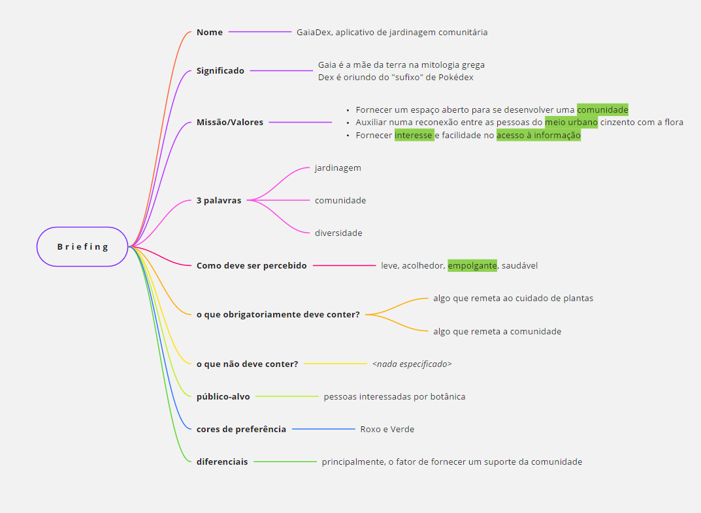
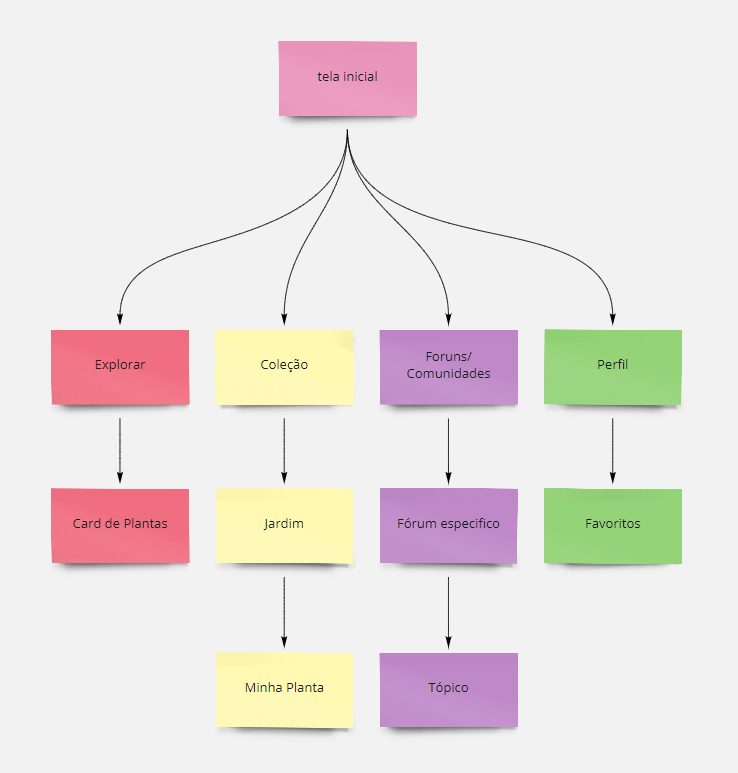
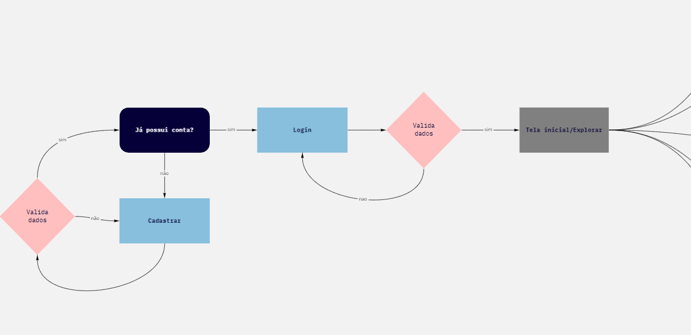

# Identidade Visual

|    data    | versao |                         autor                          |   mudanças feitas    |
| :--------: | :----: | :----------------------------------------------------: | :------------------: |
| 30/09/2020 |  0.1   | [@guilhermedelyra](https://github.com/guilhermedelyra) | criação do documento |

- [Identidade Visual](#identidade-visual)
- [Descrição](#descrição)
  - [Inspirações utilizadas](#inspirações-utilizadas)
  - [Briefing, Arquitetura de informações e Flow](#briefing-arquitetura-de-informações-e-flow)
  - [Tipografia e Escala Tipográfica](#tipografia-e-escala-tipográfica)
  - [Paleta de Cores](#paleta-de-cores)
  - [Componentes utilizados](#componentes-utilizados)

# Descrição

Este documento visa definir todos os aspectos visuais que serão utilizados no projeto, desde a definição de tipografia, paletas etc até a descrição de componentes utilizados.
Um roadmap para auxiliar na construção dessa concepção fora [definido aqui](./roadmap_prototype.md).
O documento de versionamento do protótipo [encontra-se aqui](./../prototipo/prototipo.md).

## Inspirações utilizadas

[Tabela markdown listando as inspirações.](./inspirations.md)
[Você também pode vê-las no Moodboard.](./moodboard.md)

## Briefing, Arquitetura de informações e Flow

| artefato                   | link                                                    | preview                                       |
| -------------------------- | ------------------------------------------------------- | --------------------------------------------- |
| Briefing                   | [acesse aqui](https://miro.com/app/board/o9J_kjsXNFg=/) |                    |
| Arquitetura de informações | [acesse aqui](https://miro.com/app/board/o9J_kjsXNFg=/) |  |
| Flow                       | [acesse aqui](https://miro.com/app/board/o9J_kj34qxc=/) |                        |

## Tipografia e Escala Tipográfica

| elemento | estilo da fonte |
| -------- | --------------- |
|          |                 |

## Paleta de Cores

.

## Componentes utilizados

.
